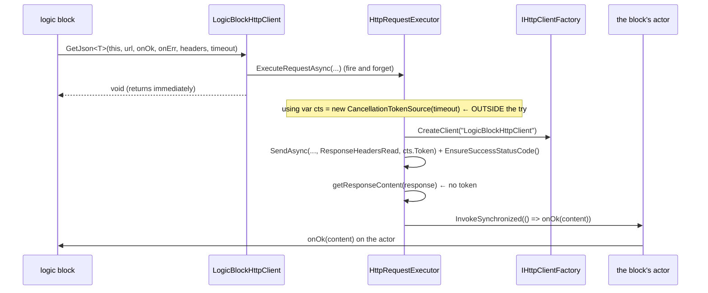

# HTTP area pass — the logic-block HTTP client as a spec page

> Change doc — one in-flight change. The `Spec delta` below is distilled into the current-truth
> pages under `docs/specs/` in the implementation PR, then this doc is archived
> (`pwsh scripts/spec-change.ps1 archive <slug>`). Process: `docs/spec-process.md`. Never put
> change narrative inline in a spec page — it lives here.

## At a glance

### Summary

The fourteenth and last SDD area pass turns `Vion.Dale.Sdk.Http` — the HTTP client a logic block
reaches through DI — into a current-truth spec page with an id-cited test suite. The package has
never been specified: 884 LOC, 8 files, 5 public types, 23 public members, 33 tests and **zero**
citations. The pass states what a block author registers, calls, receives back on the actor and sees
when a request fails; arms the package with the Dale analyzers; and fixes the silent losses the
sweeps found.

### Spec implications

Creates `docs/specs/http.md` (`D1`) — a Tier B page that the sweeps found observable enough to carry
EARS criteria and `trace: enforced`, as `CLI` and `IO` did before it. No existing page changes: no
spec page names the package today (`grep -rn "Sdk.Http\|AddDaleHttpSdk\|ILogicBlockHttpClient"
docs/specs/*.md` → one line, `_findings.md:481`). Rows another page owns are cited, never re-minted:
the dispatcher's self-send and its refusals (`AC-LIFE-006.1/.2/.3/.4`, `AC-LIFE-014.7`), the private
copy per plugin (`AC-PLUG-005.3`), the analyzer's rule (`AC-ANLZ-012.2`) and the arming precedent
(`AC-TKIT-013.1/.2`). `docs/spec-process.md:192` is corrected to say the last pass ran; the ledger's
one inherited line (`_findings.md:481-488`) is annotated in place.

### Decisions

- `D1` — the page is **`docs/specs/http.md`** — the roster reserves `HTTP` (`docs/spec-process.md:36`)
  and the area is one package with one namespace; a longer name would claim a scope the area has not got.
- `D2` — the spine is the coordinator's: **registration and defaults → the eight members as one
  family → the actor hop → the error model as a table → lifetime and disposal → serialization →
  headers → the surface → the test discipline**. It follows the order a block author meets the
  package in, and it puts the error table — the pass's most valuable output for a consumer — where
  a reader arrives having already met the members it names.
- `D3` — the harness is the **existing MSTest project rewritten to cite**: the mocked
  `HttpMessageHandler` as the seam (production composes the real handler through
  `IHttpClientFactory`, so `testing-conventions.md` § 7 holds), a **disposal-counting**
  `HttpResponseMessage` for the leak rows, a **deferred** dispatcher stub (queue the action, drain
  after the executor returned — the honest self-send shape) for the hop rows, a stub throwing
  `RequireActorContext`'s exception for the pre-first-message row, a **gated** `HttpContent` for the
  ResponseHeadersRead rows, `de-DE` for the culture row. **No network, no DevHost, no runtime.** The
  timeout discriminator is a **never-completing handler** (a `TaskCompletionSource` the test never
  completes), never a `Task.Delay` raced against a shorter timeout (`testing-conventions.md` § 16).
- `D4` — the three unmarked exported types are marked **`[InternalApi]`**, not `[PublicApi]` — see
  *Question 4* for the per-type reasoning and the consequence for the manifest.
- `D5` — `CreateExceptionContinuation` is **kept**, not deleted, after row 30's refusal retires its
  only known live path — see *Question 6*.
- `D6` — the double registration is fixed to be **idempotent in the User-Agent** — see *Question 5*.

### Reviewer's questions

1. **(ratified — cite, don't relitigate)** The ownership split the brief states. Rows that cite
   rather than mint: the dispatcher's self-send re-entry and its refusals
   (`AC-LIFE-006.1/.2/.3/.4`, `AC-LIFE-014.7`, and the silent-loss prose at
   `block-lifecycle.md:177-181`), the private copy per plugin (`AC-PLUG-005.3`), the analyzer's rule
   (`AC-ANLZ-012.2`), the surface-and-arming precedent (`AC-TKIT-013.1/.2`). The CLI's own
   hand-rolled `DaleHttpClient` (`Vion.Dale.Cli/Infrastructure/DaleHttpClient.cs`) is `CLI`'s
   (`_findings.md:439`, `cli.md:468`) and the DevHost's HTTP host is `CTRL`'s; neither is this area.
   **OUTCOME: (pending classification)**

2. **(decide-and-document)** `D1`/`D2` — the page name and spine. **OUTCOME: (pending classification)**

3. **(decide-and-document)** `D3` — the harness. **OUTCOME: (pending classification)**

4. **(decide-and-document)** `D4` — **which mark each of the three unmarked exported types gets.**
   The rule is `sdk-surface-conventions.md:240-245`: plumbing that is "public only because the
   TestKits and the runtime live in other assemblies, and no public signature names them" is
   `[InternalApi]`. Here a public signature *does* name two of them —
   `LogicBlockHttpClient(IHttpRequestExecutor, IHttpContentSerializer, ILogger<LogicBlockHttpClient>)`
   at `LogicBlockHttpClient.cs:25`. Per type:
   - **`LogicBlockHttpClient`** → `[InternalApi]`. A block author never names it: they call
     `AddDaleHttpSdk()` (`ServiceCollectionExtensions.cs:26`) and inject `ILogicBlockHttpClient`
     (`Vion.Examples.Energy/.../OpenMeteoService.cs:81`,
     `GeolocationService.cs:36` — both take the interface). The class is public only because
     `AddTransient<ILogicBlockHttpClient, LogicBlockHttpClient>` (`:40`) needs the container's
     default activator to reach a public constructor.
   - **`IHttpRequestExecutor`** and **`IHttpContentSerializer`** → `[InternalApi]`. The one public
     signature naming them is that same activator constructor, which exists for the container and
     not for a block author. They are seams the package composes itself through, and nothing
     documents replacing them.
   The consequence is the reverse of the brief's expectation: `[InternalApi]` types are **not** in
   the manifest (`scripts/generate-api-reference.cjs:116-121` collects `[PublicApi]` only), and the
   three are not in it today, so **the manifest does not move** — no auto-commit onto the PR head,
   no issue in `VION-IoT/documentation` (`releasing.md:112-115`). Marking them `[PublicApi]` instead
   would add three rows to `docs/snapshots/publicapi-manifest.json` and three types to the generated
   API reference, where a block author would read them as things to call. If the operator prefers
   `[PublicApi]`, say so and the relay notes gain the manifest move.
   **OUTCOME: (pending classification)**

5. **(decide-and-document)** `D6` — **the double registration.** `AddDaleHttpSdk` twice appends the
   User-Agent twice (`DefaultRequestHeaders.Add`, `:32`), so the client ships
   `User-Agent: Vion-DALE (info@vion-iot.com) Vion-DALE (info@vion-iot.com)` (probe O) — a value a
   server may reject. The last `configureClient` wins for everything else (probe AA). Recommendation:
   make the User-Agent idempotent (remove-then-add, or a contains check) — a fix, because for the
   single registration every consumer performs today the observable is byte-identical, and no
   consumer registers twice (`git grep -c AddDaleHttpSdk` → the Energy example once). The duplicate
   transient descriptors stay: last-wins is the container's contract, not this package's.
   **OUTCOME: (pending classification)**

6. **(decide-and-document)** `D5` — **`CreateExceptionContinuation`'s fate under
   `sdk-surface-conventions.md:86-101` § 3** ("delete rather than deprecate while that is still
   cheap"). Its only *known* live path today is row 30's out-of-range `timeout`, which faults the
   executor's task before the `try`. Row 30's fix retires that path. Recommendation: **keep it**, and
   say why on the page — every overload still runs statements outside its `try`: the
   `using var cts` disposal at `HttpRequestExecutor.cs:47/:87/:123` and the `finally` blocks at
   `:67-71` and `:109-113`. A `Dispose()` that throws there faults the returned task with nothing
   else to see it, which is the exact silent loss the continuation exists for. It is eight call
   sites and one logger; deleting it trades a net for nothing.
   **OUTCOME: (pending classification)**

7. **(propose-and-wait)** Every change reaching a **signature**, a **default** (30 s, the User-Agent,
   the JSON options, the handler's `UseCookies`), an **exception class a callback receives today**, a
   **loading attribute**, or a **package reference** is a proposal, not a fix — the readers are the
   Energy example, the first consumer's written evaluation, and every future consumer. The rows
   carrying `propose`: **18** (a re-queue before the block's first message), **28n** (normalising the
   ceiling's `TaskCanceledException` to `TimeoutException`), **37p** (making
   `ContentNullAfterDeserializationException` public), **6c** (the pooled handler's shared cookie
   container), **54** (`[assembly: DaleSharedAssembly]`). Each names its reader in its *Why*.
   **OUTCOME: (pending classification)**

8. **(decide-and-document)** **The first consumer's evaluation as a checkpoint.**
   `C:\_gh\logic-block-libraries\docs\notes\2026-09-04-emu-m-center-integration-options.md:66-82` is
   the pass's most valuable reader: the package is used in **zero** source files there
   (`git grep -l "Vion.Dale.Sdk.Http\|HttpClient" -- '*.cs' '*.csproj'` → nothing). Its five
   findings, each confirmed or contradicted against the page's own lines, are in *Consumer sweep —
   the first consumer's evaluation* below. Its asks become ledger lines with the consumer named
   (rows 64a, 64b), never fixes. **OUTCOME: (pending classification)**

9. **(decide-and-document)** **No RFC to absorb** — `docs/rfcs/` does not exist (it went with the
   `TKIT` pass) so there is nothing to sweep and no reference sweep to run. The ledger's one
   inherited line is annotated in place (row 68); `docs/spec-process.md:192` is corrected (row 67);
   **whether and how the `spec-pass` skill, the roster's tier note and `spec-process.md:191-192`
   retire is the operator's, taken after the merge** — this pass names nothing about it.
   **OUTCOME: (pending classification)**

---

## Full design

### Anchor inventory

Enumerated mechanically this session; the counts below are the completeness checklist for the
sweeps. Commands and outputs are pasted under *Self-check* at the end of Phase A.

**Scope (source):** `Vion.Dale.Sdk.Http/` — **8 `.cs` files, 884 LOC**, one namespace
(`Vion.Dale.Sdk.Http`), no folders. Matches the brief.

| Anchor kind | Instances | Where |
| --- | --- | --- |
| `[PublicApi]` marks | 2 | `ILogicBlockHttpClient.cs:12`, `ServiceCollectionExtensions.cs:12` |
| `[InternalApi]` marks | 0 | — |
| Exported types carrying neither | 3 | `LogicBlockHttpClient`, `IHttpRequestExecutor`, `IHttpContentSerializer` |
| `[assembly: PublicApiNamespace]` | 1 | `PublicApiConfig.cs:3` |
| `[assembly: DaleSharedAssembly]` | **0** | — (DigitalIo/AnalogIo/Modbus.Rtu carry one at `AssemblyAttributes.cs:3`, Modbus.Core at `:9`) |
| `[LoggerMessage]` sources | 7 | `HttpRequestExecutor.cs:212,215,218,221,224,227`; `LogicBlockHttpClient.cs:216` |
| Manifest rows for the assembly | 2 types + 1 assembly | `docs/snapshots/publicapi-manifest.json:8,76,77` |
| Exported types / public members | **5 / 23** | probe AB |
| DI registrations | 1 named client + 3 `AddTransient` | `ServiceCollectionExtensions.cs:28,38,39,40` |
| Named-client constant | 1 (`internal const`) | `HttpRequestExecutor.cs:15` |
| Defaults | 2 (User-Agent, 30 s) | `ServiceCollectionExtensions.cs:32,33` |
| `throw new` in the whole package | **1** | `HttpContentSerializer.cs:29` |
| `CreateExceptionContinuation` call sites | 8 | `LogicBlockHttpClient.cs:51,76,99,124,147,169,189,200` |
| `try`/`catch` blocks in the executor | 3 (one per overload) | `:49,:89,:127` |
| `finally` blocks in the executor | **2** (overload 3 has none) | `:67-71`, `:109-113` |
| Null-success-callback guards | **2** (`:94`, `:131`); overload 1 has none | `HttpRequestExecutor.cs:94,131` |
| Null-error-callback guard | 1 | `HttpRequestExecutor.cs:194` |
| `TimeSpan`/`Timeout`/`const`/`default(` lines | 34 | `grep -rn "const \|TimeSpan\|Timeout\|default("` |
| Package references a consumer inherits | 3 | `csproj:27,28,29` |
| `InternalsVisibleTo` | 2 | `csproj:37,38` |

**Drift — the area declares no attributes of its own.** The skill's step 2 asks, for every attribute
in the inventory, whether its `AttributeTargets` are all walked by a reader. This area declares
**none**: it consumes `[PublicApi]`, `[PublicApiNamespace]` and `[LoggerMessage]`, all owned by
`ANLZ`/`INTRO` and the framework. The anchor kind is empty, so it is this checkpoint and not a row.

**Scope (tests):** `Vion.Dale.Sdk.Http.Test/` — 5 files, 976 LOC, **33 `[TestMethod]`s, 32
`[DataRow]`s, 0 citations**. MSTest 4.0.2 + Moq 4.20.72 + `Microsoft.NET.Test.Sdk 18.0.1`;
`IsTestProject`/`IsPackable=false` at `csproj:7-9`. `scripts/test-style-lint.ps1`'s exempt list is
**empty** (`:59-60`, "Empty since the ANLZ pass retired the last entry"), so every test this pass
cites is gated from that commit. No suite outside this project carries the package.

### The mechanism, once

A block author calls `AddDaleHttpSdk()` once at composition
(`Vion.Examples.Energy/.../DependencyInjection.cs:27`) and injects `ILogicBlockHttpClient`. Each of
the eight members returns `void` immediately, having handed the work to a `Task` nobody awaits, and
takes the block itself as `IActorDispatcher`. When the exchange finishes, `HttpRequestExecutor`
hands the callback to `dispatcher.InvokeSynchronized` (`HttpRequestExecutor.cs:204`), which
`LogicBlockBase` turns into a self-send (`LogicBlockBase.cs:172-175` → `RequireActorContext` →
`SendToSelf(new InvokeActionMessage(action))`). So the callback runs on the block's own actor, with
no locking of the block's state — `AC-LIFE-006.1` — and carries neither sender nor headers —
`AC-LIFE-014.7`.

Three things about that picture are the pass's substance. The `CancellationTokenSource` is built
**outside** the `try`, so a `timeout` its constructor refuses loses the request with no callback
(row 30). The self-send can be **refused** — before the block's first message — and
`TryInvokeCallback`'s catch turns that refusal into a log line, so neither callback fires (row 18).
And `getResponseContent` runs with **no token**, so what the per-request `timeout` bounds is the
exchange up to the response headers, not the body (row 45).

### The error model, one class per failure

Every entry probed this session against the shape named in its row; `HttpRequestExecutor.cs:188-190`
is the one place a class is rewritten.

| The failure | What the error callback receives | Probe |
| --- | --- | --- |
| 4xx or 5xx | `HttpRequestException` ("Response status code does not indicate success: 502…") | A, R |
| DNS / socket | `HttpRequestException` | — (`EnsureSuccessStatusCode` is not reached; the handler's own) |
| a per-request `timeout` elapses | `TimeoutException("Timed out after {n} seconds")` | I |
| …and `{n}` is rendered in the **current culture** | `"Timed out after 0,05 seconds"` under `de-DE` | I |
| the client's 30 s ceiling, no per-request `timeout` | `TaskCanceledException` ("…configured HttpClient.Timeout of 0.05 seconds elapsing."), inner `TimeoutException` | C |
| a per-request `timeout` **above** the ceiling | the ceiling wins **and** the class changes to `TaskCanceledException` | D |
| `timeout` = `TimeSpan.Zero` | already cancelled → `TimeoutException("Timed out after 0 seconds")` | U, V |
| `timeout` = `-1 ms` (`Timeout.InfiniteTimeSpan`) | no per-request bound; only the ceiling remains | U, V, N |
| `timeout` outside `[-1 ms, uint.MaxValue-1 ms]` | **nothing** — no callback, no throw, the request silently lost | S, N, U |
| `url` null / empty / whitespace / relative / unparseable | `InvalidOperationException` ("An invalid request URI was provided…") | G |
| `url` with a non-HTTP scheme (`ftp://`) | **not refused** — it reaches the handler | G |
| `SendRequest` with a null `RequestUri` or a null request | a raw `NullReferenceException` **synchronously out of `SendRequest`** | F, Q |
| a 204, or a 200 with an empty body | `System.Text.Json.JsonException` ("The input does not contain any JSON tokens…") | J |
| a body that is the literal `null` | `ContentNullAfterDeserializationException` — **internal**, so uncatchable by name | J |
| a truncated or non-JSON body | `JsonException` | J |
| a body whose casing differs from the DTO's | **no error** — the success callback fires with CLR defaults | J |

### The probes

Every row below whose *Evidence* names a probe letter was run this session against
`Vion.Dale.Sdk.Http` **built from this working tree** (`ProjectReference`, not a package), composed
through the real `AddDaleHttpSdk` with one substitution: an `IHttpClientFactory` returning an
`HttpClient` over a stub `HttpMessageHandler`, so nothing reaches the network. The fixture shape each
probe ran is stated with its result, because a probe is evidence only for the shape it ran:

- **Dispatchers.** `ImmediateDispatcher` runs the action *inline inside* `InvokeSynchronized` — the
  shape in which `TryInvokeCallback`'s catch sees a callback's own exception. `DeferredDispatcher`
  queues the action and drains it after the executor returned — the **honest self-send shape**, and
  the one that shows what a real block sees. `RefusingDispatcher` throws
  `RequireActorContext`'s `InvalidOperationException`.
- **Responses.** `CountingResponse : HttpResponseMessage` counts its own `Dispose` calls.
  `GatedContent : HttpContent` withholds its bytes until released, which is the
  `ResponseHeadersRead` shape.
- **Where a probe's handler ignores the cancellation token, the row says so** — rows 31 and 34 turn
  on exactly that difference.

### Drift checkpoints against the brief

Recorded here rather than diverged from silently. Each is a place the brief's number or reading did
not survive a probe on the row's own shape.

- **The out-of-range `timeout` threshold is ~49.71 days, not ~24.86.** The brief says "any delay over
  ~24.86 days" (`int.MaxValue` ms) throws from the `CancellationTokenSource` constructor. Probe U
  walks the boundary: `int.MaxValue` ms, `int.MaxValue + 1` ms, 24.86 days, 49 days and
  `uint.MaxValue - 1` ms all construct; `uint.MaxValue` ms, 50 days and `TimeSpan.MaxValue` throw
  `ArgumentOutOfRangeException`. The accepted band is `[-1 ms, uint.MaxValue-1 ms]`, and `-2 ms` and
  `TimeSpan.MinValue` throw. **This makes row 30 sharper, not weaker:** `4294967` seconds
  (`uint.MaxValue - 1` ms) is *exactly* `LogicBlockBase.MaxScheduledDelay`
  (`LogicBlockBase.cs:44`) — the bound `AC-LIFE-006.2`'s refusal already enforces, one layer down,
  for the same reason.
- **`TimeSpan.Zero` does not "complete normally".** The brief reads probe N as "`TimeSpan.Zero` and
  `-1 ms` (`Infinite`) complete normally". Probe U shows `new CancellationTokenSource(TimeSpan.Zero)`
  constructs **already cancelled**; probe N's handler ignored the token, which is why its request
  succeeded. Against a handler that honours it (probe V), `TimeSpan.Zero` fails the request
  immediately with `TimeoutException("Timed out after 0 seconds")` — i.e. against every real handler.
  `-1 ms` is unaffected: it is `Timeout.InfiniteTimeSpan` and never cancels.
- **There are three null-callback guards, not two, and only overload 1 lacks one.** The brief says
  "overload 2 guards a null success callback at `:94`, overload 1 does not" and counts "two callback
  guards". Overload **3** guards too (`HttpRequestExecutor.cs:131`), and `HandleException` guards the
  **error** callback (`:194`). The symmetric-side read (skill v13) puts the asymmetry precisely: of
  four callback dispatch sites, one is unguarded.
- **A null success callback on overload 1 is not "swallowed" — it throws on the actor thread.** The
  brief reads probe Q as "a null `dispatcher` or a null `successCallback` on overload 1 is
  swallowed — no throw, no callback". Probe Q's dispatcher ran the action inline, so
  `TryInvokeCallback`'s catch saw the `NullReferenceException`. Probe W runs the same case through
  the deferred dispatcher — the honest self-send shape — and the `NullReferenceException` surfaces
  **at the drain**, on the actor, where this package's catch is long gone. Overloads 2 and 3 queue
  nothing at all. Row 22 is written to the deferred shape.
- **`SendRequest` also NREs on a null `HttpRequestMessage`, not only a null `RequestUri`.** Probe Q:
  `LogicBlockHttpClient.cs:200` dereferences `request.Method` first. Row 35 covers both.
- **The brief's "three prose hits" in the first consumer are two files, five occurrences.**
  `git grep -c "Vion.Dale.Sdk.Http\|AddDaleHttpSdk"` in `C:\_gh\logic-block-libraries` →
  `docs/notes/2026-09-03-emu-m-center-investigation.md:1` and
  `docs/notes/2026-09-04-emu-m-center-integration-options.md:5`. The evaluation the brief names is
  the second, and it is read in full below.
- **Marking the three types does not move the manifest** — see *Question 4*. The brief anticipates
  a manifest move and a `VION-IoT/documentation` issue; under `D4` neither happens.

### Consumer sweep — the first consumer's evaluation

`C:\_gh\logic-block-libraries\docs\notes\2026-09-04-emu-m-center-integration-options.md:66-82`, each
finding against what the page will say:

| The consumer's finding | Verdict | The page's line |
| --- | --- | --- |
| "Zero device precedent anywhere. Its only consumers in the whole SDK are `OpenMeteoService.cs` and `GeolocationService.cs` — outbound internet services, never hardware." | **confirmed** | rows 65, 66 — and the in-repo consumer calls `GetJson<T>` only, against live public endpoints |
| "No TestKit … so no fake harness comparable to `FakeModbusTcpHarness`. `ILogicBlockHttpClient` is mockable, but the byte-level fidelity the Modbus TestKit gives is absent." | **confirmed** | row 64a — a ledger line, owner `HTTP`, the consumer named. `AC-TKIT-013.1` names the five kits; this package is not among them |
| "No link / connection diagnostics — there is no HTTP analogue of `ModbusLink` / `ModbusSocket`." | **confirmed** | row 64b — the package models no link at all: the transport is `IHttpClientFactory`'s pooled handler (probe X) and nothing surfaces its state |
| "No HTTP device family in this repo, and no simulator story." | **out of this area** | the families and `_families/device-simulator` are the consumer repository's; `simulator-authoring.md` is this repo's answer to the second half |
| "The repo would add `AddDaleHttpSdk()` to `Ecocoach.EnergyManagement/DependencyInjection.cs`." | **confirmed, and cheap** | rows 1, 3, 9 — one call, three transient services, one named client, and the three package references at `csproj:27-29` that a plugin then inherits |

The evaluation also states, correctly, "callbacks dispatched back onto the block's actor, 30 s
default timeout, per-request timeout and headers, `SendRequest` as the raw escape hatch". It does
**not** know that a per-request timeout above 30 s is overruled by the ceiling (row 29), that the
per-request timeout does not bound the body read (row 45), or that a failed request leaks its
response (row 42). Those three are the page's answer to a reader who has already done its homework.

---

## The behavior table

**73 rows** — 44 `intended`, 19 `fix`, 5 `propose`, 3 `park`, 2 `out-of-spec`; **27 `⚠`**, **43 GAPs**.
`⚠` marks a `fix` / `park` / `propose` rec; each has a two-line failure sketch below the table.
Evidence is `file:line` read this session, or a probe letter whose fixture shape is stated under
*The probes*.

### Registration and defaults

| # | Behavior (EARS) | Evidence | Test today | Rec | Why |
|---|---|---|---|---|---|
| 1 | WHEN `AddDaleHttpSdk` is called THE SYSTEM SHALL register `ILogicBlockHttpClient`, `IHttpRequestExecutor` and `IHttpContentSerializer` as transient services and a named `HttpClient` for the package's own use. | `ServiceCollectionExtensions.cs:28,38-40` | `ServiceCollectionExtensionsShould.RegisterHttpClientRelatedServices` | intended | the one call a consumer makes; the first consumer's evaluation names it as its whole adoption cost |
| 2 | THE SYSTEM SHALL resolve its `HttpClient` from the factory under a fixed name that no public member exposes. | `HttpRequestExecutor.cs:15` (`internal const`), `:173` | GAP — the test reads the constant through `InternalsVisibleTo` (`csproj:37`) | intended | a consumer wanting to configure the client further must either use `configureClient` or spell the literal; stating it is what tells them the first is the supported way |
| 3 | THE SYSTEM SHALL give that client a 30-second timeout and a `User-Agent` of `Vion-DALE (info@vion-iot.com)`. | `ServiceCollectionExtensions.cs:32,33`; probe L | `ServiceCollectionExtensionsShould.ConfigureHttpClientWithDefaults` | intended | the ceiling every request inherits (row 28) and the identity every server sees |
| 4 | THE SYSTEM SHALL apply its defaults **before** the caller's `configureClient`, so a caller's timeout or `User-Agent` wins. | `ServiceCollectionExtensions.cs:31-36`; probe L (3 s override wins; a replaced UA wins) | partial — `InvokeConfigureClientAction` proves invocation, not order | intended | the only way a consumer changes a default; the order is what makes `configureClient` an override rather than a suggestion |
| 5 | WHEN `AddDaleHttpSdk` is called more than once THE SYSTEM SHALL configure the client's `User-Agent` once. | `ServiceCollectionExtensions.cs:32` (`DefaultRequestHeaders.Add` appends); probe O (`Vion-DALE (…) Vion-DALE (…)`), probe AA (the last `configureClient` wins) | GAP | ⚠ fix | a composed plugin that registers the SDK twice ships a doubled `User-Agent` a server may reject; no consumer registers twice today, so the single-registration observable is unchanged |
| 6a | THE SYSTEM SHALL follow HTTP redirects, up to the platform default of 50, without the caller seeing them. | probe X — the named client's chain is `LifetimeTracking → LoggingScope → Logging → SocketsHttpHandler`, `AllowAutoRedirect=True`, `MaxAutomaticRedirections=50` | GAP | intended | the package adds no handler of its own, so the factory's default primary handler is the whole redirect policy; a consumer chasing a 3xx will not find one |
| 6b | THE SYSTEM SHALL send requests uncompressed unless the caller asks otherwise. | probe X — `AutomaticDecompression=None` | GAP | intended | an inherited default a consumer polling a large JSON endpoint will want to know about |
| 6c | THE SYSTEM SHALL share one cookie container across every request every block in the process makes through the package. | probe X — `SocketsHttpHandler.UseCookies=True` on the single pooled handler | GAP | ⚠ propose | a `Set-Cookie` from one block's server is replayed to another's on the same host; nobody chose this default, and turning it off is a behaviour change with the Energy example as its reader |
| 7 | THE SYSTEM SHALL obtain its client from `IHttpClientFactory` on every request, so handler pooling and rotation are the factory's. | `HttpRequestExecutor.cs:173`; `ServiceCollectionExtensions.cs:28` | GAP | intended | the reason a block may issue requests freely without exhausting sockets; also why row 6c is process-wide |
| 8 | THE SYSTEM SHALL register all three services with a transient lifetime, so each resolution gets a fresh client holding no per-block state. | `ServiceCollectionExtensions.cs:38-40` | `RegisterHttpClientRelatedServices` (asserts `Transient`) | intended | a block author may hold the injected client for the block's life without sharing anything with another block |
| 9 | THE SYSTEM SHALL add `Microsoft.Extensions.Logging`, `System.Text.Json` and `Microsoft.Extensions.Http` to the dependency set of any plugin that takes the package. | `csproj:27-29`; probe AB's referenced-assembly list | GAP | intended | what the first consumer's `Ecocoach.EnergyManagement` inherits by adding one call |
| 10 | THE SYSTEM SHALL ship the package for `netstandard2.1`, so a plugin built against any supported runtime can load it. | `csproj:4,13` | GAP | intended | the same cross-platform plugin constraint the rest of the SDK runtime carries |

### The eight members

| # | Behavior (EARS) | Evidence | Test today | Rec | Why |
|---|---|---|---|---|---|
| 11 | THE SYSTEM SHALL offer eight request members, each returning immediately and each taking the calling block as the dispatcher its callbacks run on. | `ILogicBlockHttpClient.cs:33,62,92,122,152,179,204,227` | the twelve `LogicBlockHttpClientShould` tests | intended | the whole shape of the package: nothing blocks the actor |
| 12 | THE SYSTEM SHALL deserialize the response body for `GetJson`, `PostJson`, `PutJson` and `DeleteJson` and SHALL NOT read it for the members that take no response type. | `LogicBlockHttpClient.cs:45,70,118,163` vs `:94,142,184` | the four `…WithCorrectDeserializer` tests | intended | which member a block author picks is decided by whether they want the body |
| 13 | THE SYSTEM SHALL require a success callback on the four members that carry a response and SHALL accept none on the four that do not. | `ILogicBlockHttpClient.cs:35,65,95,125,155,181,206,229` | `NotInvokeDispatcherWhenSuccessCallbackIsNull` (two of the four bodiless) | intended | a response with nowhere to go is a compile error; a fire-and-forget POST is legal |
| 14 | WHEN a caller uses `SendRequest` THE SYSTEM SHALL send the `HttpRequestMessage` it is given, taking no URL and no headers of its own. | `ILogicBlockHttpClient.cs:227-231`; `HttpRequestExecutor.cs:117-129` | `ExecuteSendRequestWithCorrectParameters` | intended | the escape hatch the first consumer's evaluation names for the `.csv` form; the caller owns method, URI, headers and content |
| 15 | THE SYSTEM SHALL serialize the request body through the configured serializer before dispatching, and dispose that content with the request. | `LogicBlockHttpClient.cs:66,90,114,138`; `HttpRequestExecutor.cs:70,112` | `Execute{Post,Put}…WithCorrectParameters` | intended | the body a block hands over is JSON by the time it leaves, using the consumer's own options (row 46) |
| 16 | THE SYSTEM SHALL send `GET`, `POST`, `PUT` and `DELETE` for the members named after them. | `LogicBlockHttpClient.cs:41,65,89,113,137,159,180` | `SendRequestWithCorrectHttpMethod` (12 rows) | intended | the member name is the method; no member sends `PATCH` except through `SendRequest` |

### The actor hop

| # | Behavior (EARS) | Evidence | Test today | Rec | Why |
|---|---|---|---|---|---|
| 17 | THE SYSTEM SHALL run every callback on the calling block's own actor rather than on the thread the response arrived on. | `HttpRequestExecutor.cs:200-210`; `LogicBlockBase.cs:172-175` | the `InvokeSynchronized` verifications throughout `HttpRequestExecutorShould` | intended | cites `AC-LIFE-006.1` and `AC-LIFE-014.7` — the reason a block needs no locking, and why a callback carries no correlation |
| 18 | WHEN a response arrives before the block has received its first message THE SYSTEM SHALL deliver neither callback and SHALL leave the request's outcome visible only in the log. | probe E — success path and error path alike: `successCallback=False errorCallback=False`, no throw; `HttpRequestExecutor.cs:206-209` swallows `RequireActorContext`'s refusal (`LogicBlockBase.cs:716-721`) | GAP | ⚠ propose | this re-creates one layer up exactly the silent loss `AC-LIFE-006.3` was minted to end (`block-lifecycle.md:177-181`); a re-queue is a behaviour change whose reader is every block that starts a request from its constructor |
| 19 | THE SYSTEM SHALL offer no way to cancel a request once issued. | no `CancellationToken` on any member (`ILogicBlockHttpClient.cs:33-231`) | GAP | intended | the same shape `AC-LIFE-006.4` states for the dispatcher: what is armed runs |
| 20 | WHEN a callback throws THE SYSTEM SHALL not fail the request, and SHALL leave the exception to the actor that ran it. | probe Q (inline dispatcher: `TryInvokeCallback`'s catch at `:206-209` sees it, `dispatcherCalls=1`, no throw to the caller); probe W (deferred dispatcher — the real self-send shape: the exception surfaces at the drain, on the actor) | `NotThrowWhenInvokeSynchronizedThrows` (the inline shape only) | intended | a block author's own bug in a callback is the actor's to handle, and the package's catch only ever covers the *scheduling* of the callback, never its body |
| 21 | THE SYSTEM SHALL deliver callbacks in the order their exchanges finish, imposing no ordering of its own. | probe T — a slow request issued first, a fast one second, callback order `[fast,slow]` | GAP | intended | two requests in flight on one block is the ordinary case for a polling block; nothing serializes them |
| 22 | WHEN a caller passes no success callback to a member that requires one THE SYSTEM SHALL not schedule anything onto the block's actor. | probe W — `GetJson` with a null success callback queues one action that throws `NullReferenceException` at the drain, where `Delete` and `SendRequest` queue **nothing** (`HttpRequestExecutor.cs:94,131` guard; overload 1 does not) | partial — `NotInvokeDispatcherWhenSuccessCallbackIsNull` covers the two guarded overloads and not the unguarded one | ⚠ fix | the guard two of the three dispatch sites already carry; today the third throws inside the block's actor, far from the call that caused it |
| 23 | WHEN a caller passes no dispatcher THE SYSTEM SHALL refuse the call, naming the member. | probe Q — the request **is sent**, then nothing: no callback, no throw; the `NullReferenceException` from `dispatcher.InvokeSynchronized` is swallowed at `HttpRequestExecutor.cs:206-209` | GAP | ⚠ fix | a request that reaches the server and reports nothing back is the worst of both; the refusal is `AC-LIFE-006.2`'s shape at a site that already fails |
| 24 | WHEN a request fails and the caller gave no error callback THE SYSTEM SHALL schedule nothing onto the actor and SHALL record the failure in the log. | `HttpRequestExecutor.cs:194`; probe Q (`dispatcherCalls=0`, no throw) | GAP | intended | the documented contract at `ILogicBlockHttpClient.cs:29` — "Errors are always logged, regardless of whether an error callback is specified" |

### The error model

| # | Behavior (EARS) | Evidence | Test today | Rec | Why |
|---|---|---|---|---|---|
| 25 | WHEN a response carries a non-success status THE SYSTEM SHALL deliver an `HttpRequestException` naming the status. | `HttpRequestExecutor.cs:175`; probes A, R | `InvokeErrorCallbackWithExceptionWhenRequestFails` (3 rows) | intended | the most common failure a block author will handle |
| 26 | WHEN a per-request timeout elapses THE SYSTEM SHALL deliver a `TimeoutException` naming the timeout in seconds. | `HttpRequestExecutor.cs:188-190`; probe I | `InvokeErrorCallbackWithExceptionWhenRequestTimesOut` (3 rows — a § 16 wall-clock race, row 61) | intended | the one place the package rewrites the exception class, and the reason a caller can tell a timeout from a transport failure |
| 27 | THE SYSTEM SHALL render the number in that message in the invariant culture. | probe I — `"Timed out after 0.05 seconds"` under `en-US`, `"Timed out after 0,05 seconds"` under `de-DE`; `HttpRequestExecutor.cs:190` interpolates a `double` | GAP | ⚠ fix | a message a block author greps for, or a support engineer reads out of a gateway log, changes shape with the machine's locale — and the gateways are Swiss-German |
| 28 | WHEN no per-request timeout is given and the client's 30-second ceiling elapses THE SYSTEM SHALL deliver a `TaskCanceledException` whose inner exception is a `TimeoutException`. | probe C — `"The request was canceled due to the configured HttpClient.Timeout of 0.05 seconds elapsing."`, inner `TimeoutException`; `HttpRequestExecutor.cs:188` does not rewrite it because `cts.IsCancellationRequested` is false | GAP | intended | the default path: a block that sets no timeout and hits the ceiling gets a *different class* from one that sets a timeout and hits it |
| 28n | THE SYSTEM SHALL deliver one exception class for every timeout, whatever bound produced it. | as row 28, against row 26 | GAP | ⚠ propose | normalising the ceiling's `TaskCanceledException` to `TimeoutException` changes the class a callback receives today; the reader is any consumer already catching `TaskCanceledException`, and the Energy example's two services catch nothing |
| 29 | THE SYSTEM SHALL bound a request by the smaller of the per-request timeout and the client's ceiling, the per-request timeout never raising it. | probe D — a 30 s per-request timeout under a 50 ms ceiling still fails at the ceiling, as `TaskCanceledException` | GAP | ⚠ fix | the documentation says the opposite at **eleven** sites — `ILogicBlockHttpClient.cs:32,61,91,121,151,178,203,226` and `IHttpRequestExecutor.cs:26,49,67` all read "Request-specific timeout that overrides the `HttpClient`'s default timeout", and the executor interface is public so its docs ship |
| 30 | WHEN a caller passes a timeout longer than a real clock can wait, or more negative than `-1 ms`, THE SYSTEM SHALL refuse the call, naming the member. | probes S (all three overloads: no synchronous throw, `handlerReached=False`, no callback, `dispatcherCalls=0`), N (`-5s` the same), U (the exact band: `[-1 ms, uint.MaxValue-1 ms]` constructs; `uint.MaxValue` ms, 50 days, `TimeSpan.MaxValue`, `-2 ms`, `TimeSpan.MinValue` throw); the `CancellationTokenSource` is built **outside** the `try` at `HttpRequestExecutor.cs:47,87,123` | GAP | ⚠ fix | the request is silently lost — nothing sent, no callback, nothing thrown to the caller, and only `LogUnhandledException` sees it through `CreateExceptionContinuation`; the bound is *identical* to `LogicBlockBase.MaxScheduledDelay` (`:44` — 4294967 s), so this is `AC-LIFE-006.2`'s refusal missing one layer up |
| 31 | WHEN a caller passes a timeout of zero THE SYSTEM SHALL fail the request immediately with a `TimeoutException`. | probe U — `new CancellationTokenSource(TimeSpan.Zero)` constructs **already cancelled**; probe V — against a token-honouring handler, `TimeoutException("Timed out after 0 seconds")` | GAP | intended | the brief read this as "completes normally", which was probe N's token-ignoring handler; against every real handler zero means "already too late" |
| 32 | WHEN a caller passes `-1 ms` THE SYSTEM SHALL apply no per-request bound, leaving only the client's ceiling. | probes U, V, N — `Timeout.InfiniteTimeSpan` never cancels | GAP | intended | the one negative value that is a documented sentinel rather than a mistake; row 30's refusal must not catch it |
| 33 | WHEN a caller passes a URL that is not an absolute URI THE SYSTEM SHALL deliver an `InvalidOperationException` and send nothing. | probe G — null, `""`, `"   "`, `"/relative/path"` and `"not a url"` all give "An invalid request URI was provided…", `handlerReached=False` | GAP | intended | the package adds no URL validation of its own (the whole package holds one `throw new`, `HttpContentSerializer.cs:29`); this is `HttpClient`'s own refusal, and it is the reason a mistyped URL is a callback and not a crash |
| 34 | THE SYSTEM SHALL not refuse a URL for its scheme. | probe G — `ftp://host/file` reaches the handler (the probe's stub answered it; a real `SocketsHttpHandler` refuses the scheme itself) | GAP | intended | a block author debugging a wrong scheme sees the transport's error, not the package's, and the message will name the handler |
| 35 | WHEN a caller passes `SendRequest` a request with no URI, or no request at all, THE SYSTEM SHALL refuse the call, naming the member. | probes F, Q — a raw `NullReferenceException` **synchronously out of `SendRequest`** from `LogicBlockHttpClient.cs:200`; the executor's own `:124` faults its task first, unobserved, and because `:200` throws the continuation is never attached, so nothing is sent and nothing is logged | GAP | ⚠ fix | the one member that throws at its caller instead of calling back, with an exception that names nothing; a named refusal at a site that already fails |
| 36 | WHEN a response-bearing member receives a 204, or a 200 with an empty body, THE SYSTEM SHALL deliver a `JsonException`. | probe J — "The input does not contain any JSON tokens. Expected the input to start with a valid JSON token…" | GAP | intended | not the null exception a reader of `IHttpContentSerializer.cs:20` would expect; a `DELETE` answered 204 is the ordinary case |
| 37 | WHEN a response body deserializes to null THE SYSTEM SHALL deliver an exception naming the type it could not fill. | `HttpContentSerializer.cs:29,47-51`; probe J (a literal `null` body) | `HttpContentSerializerShould.ThrowExceptionWhenJsonDeserializesToNull` | ⚠ fix | the type is **internal** (`:47`), so a consumer can receive it in a callback and cannot name it in a `catch`; the `<exception cref="ContentNullAfterDeserializationException">` tag at `IHttpContentSerializer.cs:20` is a public doc pointing at a type the reader cannot reach — the tag is the fix |
| 37p | THE SYSTEM SHALL let a consumer catch that exception by name. | as row 37 | GAP | ⚠ propose | making the type public adds a manifest row and a supported name; the reader is any consumer that wants to distinguish "the server answered null" from "the server answered rubbish", which today needs a message match |
| 38 | THE SYSTEM SHALL word that exception's message as a sentence. | `HttpContentSerializer.cs:49` — "Content **was as** null after deserialization to type '…'."; probe J | GAP | ⚠ fix | a block author reads this string in the error callback and in the gateway log; the typo has shipped in every release |
| 39 | WHEN a response body is not well-formed JSON THE SYSTEM SHALL deliver a `JsonException`. | probe J — truncated (`{"Value":42,`) and non-JSON (`<html/>`) both | GAP | intended | the failure a block author sees when a server answers an error page with a 200 |
| 40 | WHEN a response body's property names differ from the target type's THE SYSTEM SHALL deliver the deserialized value with those properties at their defaults, reporting no error. | probe J — `{"value":42,"name":"x"}` into a PascalCase type gives `Value=0 Name=<null>` and the success callback fires | GAP | intended | the single most consequential default here: the `<remarks>` at `ServiceCollectionExtensions.cs:21-25` already names `services.Configure<JsonSerializerOptions>` as the escape hatch, and the Energy example's answer is 31 `[JsonPropertyName]` attributes in `OpenMeteoService.cs` |
| 41 | WHEN a response body carries extra properties, or omits some, THE SYSTEM SHALL deliver the value with the omitted ones at their defaults. | probe J | GAP | intended | the same silent-default shape as row 40, and the reason the Energy example null-checks the value it receives (`OpenMeteoService.cs:84-88`) |

### Lifetime and disposal

| # | Behavior (EARS) | Evidence | Test today | Rec | Why |
|---|---|---|---|---|---|
| 42 | WHEN a request fails THE SYSTEM SHALL dispose the response before delivering the error. | probe A — with a disposal-counting response, a 502 through overload 1, 2 or 3 disposes it **zero** times; `EnsureSuccessStatusCode()` (`HttpRequestExecutor.cs:175`) throws inside `SendAsync` before the local reaches the outer `response` at `:52`/`:92`, and overload 3 has no `finally` at all | GAP | ⚠ fix | every failed request leaks its response, and a block polling a failing endpoint fails on a timer; the callbacks' contract is untouched by disposing on the failure path |
| 43 | THE SYSTEM SHALL leave the response handed to a `SendRequest` callback open for that callback to read and dispose, and SHALL not dispose the request the caller supplied. | probe A (overload 3 disposes the response **zero** times on success), probe B (the body is still readable after the actor hop; the caller's request is still usable afterwards); `HttpRequestExecutor.cs:117-146` has no `finally` | GAP | ⚠ fix | today nothing documents who owns either object, so a careful consumer double-disposes and a careless one leaks; the fix is the statement, on the member's own XML doc — disposing someone else's request would be the behaviour change |
| 44 | THE SYSTEM SHALL dispose the response it created before running the callback of a member that deserializes the body. | probe A (overloads 1 and 2 dispose once on success), probe B (`disposals before the hop=1`, and the deserialized value arrives intact) | GAP | intended | harmless, because the body was read into the value before the hop — but a consumer must not expect the response object in those callbacks, and they never receive it |
| 45 | THE SYSTEM SHALL bound a request by its per-request timeout up to the response headers, the body read and the deserialization running outside it. | `HttpRequestExecutor.cs:174` passes the token to `SendAsync` with `HttpCompletionOption.ResponseHeadersRead`; `:53` calls `getResponseContent` with no token; `HttpContentSerializer.cs:26-27` reads and deserializes with none. Probe Y — overload 3's callback reads the body **after** the per-request timeout elapsed and the `using` disposed the source. Probe Z — a content stream that ignores the token completes past a 150 ms timeout (stub-handler shape; a real `SocketsHttpHandler` aborts its own response stream on cancellation) | GAP | ⚠ park | threading the token through the body read changes the exception class on that path, so it is not area-local; the observable — a per-request timeout that does not bound a slow body — belongs in the ledger with the consumer that would meet it, a block streaming a large response |

### Serialization and headers

| # | Behavior (EARS) | Evidence | Test today | Rec | Why |
|---|---|---|---|---|---|
| 46 | THE SYSTEM SHALL serialize and deserialize with the `JsonSerializerOptions` the consumer configured, and with `System.Text.Json`'s defaults when none is configured. | `HttpContentSerializer.cs:17-19,27,37`; the `<remarks>` at `ServiceCollectionExtensions.cs:21-25` | `ApplySerializerOptionsWhenSerializing`, `ApplySerializerOptionsWhenDeserializing` | intended | the documented escape hatch from row 40's silent defaults, and the only knob the package offers over the wire format |
| 47 | THE SYSTEM SHALL send a serialized body as `application/json` with no charset parameter. | `HttpContentSerializer.cs:41` | `SetContentTypeToApplicationJson` | intended | a server that requires `charset=utf-8` will reject it, and no member lets a caller change it except `SendRequest` |
| 48 | THE SYSTEM SHALL serialize a null request body as the JSON literal `null` and send it. | probe Q — `PostJson<Dto>(…, null, …)` throws nothing and the handler is reached; `where TRequest : notnull` (`ILogicBlockHttpClient.cs:99`) is a compile-time constraint a nullable-oblivious call site does not enforce | GAP | intended | the constraint reads like a guarantee and is not one; a block author reaching the package from a nullable-disabled file gets a `null` body on the wire |
| 49 | THE SYSTEM SHALL add the caller's headers to the request without validating them. | `HttpRequestExecutor.cs:156-166` (`TryAddWithoutValidation`) | `SendRequestWithCorrectHeaders` (3 rows) | intended | how a block author sends an `Authorization` header, which is what the first consumer's identity channel would need |
| 50 | WHEN a header cannot be added to the request THE SYSTEM SHALL drop it and send the request. | probe H — `Content-Type` and `Content-Length` (content headers, not request headers) and a malformed name (`"Bad Name"`) are all dropped, the request succeeds, only `LogHeaderAddFailed` (Warning, `HttpRequestExecutor.cs:224`) records it | GAP | intended | a block author setting `Content-Type` through the dictionary gets a request that succeeds without it and no callback saying so; log text is not observable (`testing-conventions.md` § 15), so the Warning is not the contract — the send is |
| 51 | THE SYSTEM SHALL take no header dictionary on `SendRequest`, the caller setting headers on the request itself. | `ILogicBlockHttpClient.cs:227-231` | GAP | intended | the corollary of row 14, and the way past row 50 for a header `TryAddWithoutValidation` refuses on a request-header collection |

### The published surface

| # | Behavior (EARS) | Evidence | Test today | Rec | Why |
|---|---|---|---|---|---|
| 52 | THE SYSTEM SHALL classify every public type the package ships as either published surface or internal plumbing. | probe AB — 5 exported types, 2 marked `[PublicApi]` (`ILogicBlockHttpClient.cs:12`, `ServiceCollectionExtensions.cs:12`), **3 marked with neither** (`LogicBlockHttpClient`, `IHttpRequestExecutor`, `IHttpContentSerializer`), none of the three in `docs/snapshots/publicapi-manifest.json` | GAP | ⚠ fix | the rule at `sdk-surface-conventions.md:240-245`; the marks are `[InternalApi]` per `D4`, and the manifest does not move |
| 53 | THE SYSTEM SHALL judge the package's own declarations with the Dale analyzers, so a public type in its declared published namespace carrying neither mark draws a diagnostic in its build. | `csproj:16-39` has no `Vion.Dale.Sdk.Generators` reference; `sdk-surface-conventions.md:271-279` names this package; `PublicApiConfig.cs:3` declares the namespace with no reader | GAP | ⚠ fix | `DALE014` (`AC-ANLZ-012.2`) has never asked this package for a mark, which is exactly why row 52 was possible; the shape is `Vion.Dale.Sdk.DigitalIo.csproj:43` and the arming proof is `AC-TKIT-013.2`'s (`AnalyzerWiringShould.RunDaleAnalyzersOverTestKits`) |
| 54 | THE SYSTEM SHALL give every plugin one shared `ILogicBlockHttpClient` type identity. | probe AB — no `[assembly: DaleSharedAssembly]`; `AC-PLUG-005.3` (`plugin-loading.md:112-114`) then loads a private copy per plugin | GAP | ⚠ propose | today two plugins' `ILogicBlockHttpClient` are different types, so nothing can pass one across a plugin boundary; adding the attribute is a loading change whose readers are the runtime and every deployed plugin directory |
| 55 | THE SYSTEM SHALL declare its published namespace for the reference generator. | `PublicApiConfig.cs:3`; probe AB (`PublicApiNamespaceAttribute`) | GAP | intended | what puts the two marked types into the generated API reference and the manifest (`generate-api-reference.cjs:6,116-121`) |
| 56 | THE SYSTEM SHALL make its internals visible to its own test project and to the mocking library. | `csproj:37-38` | implicitly, by every test that names `HttpRequestExecutor` or `HttpContentSerializer` | intended | why the harness (`D3`) can compose the executor directly; `DynamicProxyGenAssembly2` is what lets Moq mock an internal type |
| 57 | THE SYSTEM SHALL record an exception that escapes a request's own error handling. | `LogicBlockHttpClient.cs:203-214` and its eight call sites (`:51,76,99,124,147,169,189,200`); after row 30's refusal the remaining live paths are the statements outside each `try` — `using var cts` at `HttpRequestExecutor.cs:47,87,123` and the `finally` blocks at `:67-71,109-113` | GAP | intended | `D5` — considered for deletion under `sdk-surface-conventions.md:86-101` § 3 and kept, because those statements are outside every `catch` and a fault there has nothing else to see it |
| 58 | THE SYSTEM SHALL carry two published types in the API manifest for this assembly. | `docs/snapshots/publicapi-manifest.json:8,76,77` | GAP (CI regenerates and auto-commits, `releasing.md:112-115` — a snapshot is not a gate) | intended | what a consumer reading the generated reference sees, and the set `D4` deliberately leaves unchanged |

### Test discipline

| # | Behavior (EARS) | Evidence | Test today | Rec | Why |
|---|---|---|---|---|---|
| 59 | *(implementation shape)* The suite proves the eight members against a mocked executor and the three executor overloads against a mocked handler. | `LogicBlockHttpClientShould` (12 methods), `HttpRequestExecutorShould` (12), `HttpContentSerializerShould` (6), `ServiceCollectionExtensionsShould` (3) | — | out-of-spec | the seam choice is `testing-conventions.md` § 7's, not a contract; it is recorded so the rewrite keeps it |
| 60 | *(defect)* 33 test methods across 5 files carry **zero** `[TestProperty("spec", …)]` citations. | `grep -rho "AC-[A-Z]*-[0-9]" Vion.Dale.Sdk.Http.Test/*.cs \| wc -l` → 0 | — | ⚠ fix | the whole suite is rewritten to cite (`D3`); `scripts/test-style-lint.ps1`'s exempt list is empty, so every cited test is gated from that commit |
| 61 | *(defect)* The timeout test races a 500 ms handler delay against a 10 ms timeout. | `HttpRequestExecutorShould.cs:178,184,331` | `InvokeErrorCallbackWithExceptionWhenRequestTimesOut` (3 rows) | ⚠ fix | a wall-clock bound standing in for a claim about behaviour (`testing-conventions.md` § 16); the discriminator is a never-completing handler and a completion source the test awaits |
| 62 | *(defect)* The request-capture callback is `async void` inside a swallow-all `catch`. | `HttpRequestExecutorShould.cs:309,322-325` | `SendRequestWithCorrectContent` reads `_actualRequestContent` written on an unawaited continuation | ⚠ fix | the assertion can read a field the capture has not written yet, and the `catch` at `:322-325` would hide the read that failed; the capture must complete before the handler returns |
| 63 | *(defect)* The null-success-callback test covers the two overloads that guard and not the one that does not. | `HttpRequestExecutorShould.cs:284-297` — `[DataRow]`s for `NoResponse` and `ResponseMessage` only | — | ⚠ fix | the missing row is exactly where row 22's defect lives; the merge adds it with row 22's fix |

### Consumers

| # | Behavior (EARS) | Evidence | Test today | Rec | Why |
|---|---|---|---|---|---|
| 64a | *(consumer ask)* The package ships no test kit, so a block author has no fake harness comparable to `FakeModbusTcpHarness`. | `logic-block-libraries/docs/notes/2026-09-04-emu-m-center-integration-options.md:74-77`; `AC-TKIT-013.1` names five kits and this package is not among them | — | ⚠ park | a ledger line with the consumer named, never a fix: a sixth kit is its own change doc, and `ILogicBlockHttpClient` is mockable today |
| 64b | *(consumer ask)* The package surfaces no link or connection diagnostics. | the same note, `:78-79`; the transport is `IHttpClientFactory`'s pooled handler (probe X) and nothing reads its state | — | ⚠ park | a ledger line with the consumer named; an HTTP analogue of `ModbusLink`/`ModbusSocket` is a feature band, not a pass fix |
| 65 | THE SYSTEM SHALL offer no retry, backoff or circuit breaker. | no retry anywhere in `HttpRequestExecutor.cs`; the Energy example builds its own 15-minute cache instead (`OpenMeteoService.cs:64-77`) | GAP | intended | the closest thing to a consumer workaround in the repository, and what a block author must supply themselves |
| 66 | *(scope)* The in-repo consumer calls `GetJson<T>` only, against live public endpoints, with its own null checks and invariant-culture parsing; its test project has no HTTP test. | `Vion.Examples.Energy/.../OpenMeteoService.cs:81`, `GeolocationService.cs:36,50-52`; `csproj:29` pins `Vion.Dale.Sdk.Http 0.11.2`, `:35` swaps under `-p:DaleLocalSource=true` | — | out-of-spec | a Tier C example is a consumer to read, not a test bed — it references a published package, so it cannot prove a same-PR SDK fix |

### Process

| # | Behavior (EARS) | Evidence | Test today | Rec | Why |
|---|---|---|---|---|---|
| 67 | *(doc)* The roster's order line still says `HTTP` remains. | `docs/spec-process.md:192` | — | ⚠ fix | the last pass is this one; the sentence is corrected to say it ran, and nothing else about retirement is touched (*Question 9*) |
| 68 | *(ledger)* The inherited line naming four unarmed packages must say what this pass armed. | `docs/specs/_findings.md:481-488` | — | ⚠ fix | annotated in place in the shape the TKIT pass used, leaving the three Modbus packages to `MODB` |

### ⚠ failure sketches

- **5 (fix)** — a plugin composed from two libraries that each call `AddDaleHttpSdk()` sends
  `User-Agent: Vion-DALE (info@vion-iot.com) Vion-DALE (info@vion-iot.com)`.
  A server validating the header rejects every request from that plugin, and nothing in the package says why.
- **6c (propose)** — block A authenticates to `https://api.example/`; the server sets a session cookie
  on the shared `SocketsHttpHandler`. Block B's unrelated request to the same host now carries A's session.
  *Recommendation: `UseCookies = false` on the primary handler, with `configureClient`'s successor for consumers who want it — a default change, so the operator's call.*
- **18 (propose)** — a block issues a request from its constructor; the response arrives before its first
  message. `RequireActorContext` refuses the self-send, `TryInvokeCallback` logs it, and the block waits forever for a callback that will never come.
  *Recommendation: re-queue the callback until the actor exists, or refuse the request at issue time. Both change behaviour; the reader is every block that starts work in its constructor.*
- **22 (fix)** — `GetJson<T>(this, url, null, onError)` compiles from a nullable-oblivious call site.
  The response arrives, an action is queued to the block's actor, and it throws `NullReferenceException` inside the actor, nowhere near the call that caused it.
- **23 (fix)** — a helper passes a dispatcher it forgot to set. The request reaches the server and
  changes state there; no callback fires, nothing is thrown, and the block reports success because it never heard otherwise.
- **27 (fix)** — a Swiss-German gateway logs `Timed out after 0,05 seconds`. A support query grepping
  for `0.05` finds nothing, and a test pinning the message passes locally and fails in CI (the reverse is the shape CI caught once in 455).
- **28n (propose)** — a block catches `TimeoutException` to back off. It sets no per-request timeout,
  hits the 30 s ceiling, receives `TaskCanceledException` instead, and never backs off.
  *Recommendation: rewrite the ceiling's cancellation to `TimeoutException` as row 26 already does for the per-request bound. It changes a class a callback receives today, so it is the operator's.*
- **29 (fix)** — a block needing a 60-second report sets `timeout: TimeSpan.FromMinutes(1)` on the
  strength of "overrides the `HttpClient`'s default timeout" and gets a `TaskCanceledException` at 30 seconds, every time, from the eleven doc sites that promised otherwise.
- **30 (fix)** — a block computes a timeout and gets `TimeSpan.MaxValue` from an unset configuration
  value. No request is sent, no callback fires, nothing is thrown, and the block's poll loop stops with a single Error log line as the only trace.
- **35 (fix)** — a block builds an `HttpRequestMessage` and sets `RequestUri` from a configuration
  value that is empty. `SendRequest` throws `NullReferenceException` into the caller's handler, where the middleware swallows it: nothing is sent and nothing is logged.
- **37 (fix)** — a consumer reads `<exception cref="ContentNullAfterDeserializationException">` on the
  public `IHttpContentSerializer.DeserializeJsonAsync`, writes `catch (ContentNullAfterDeserializationException)`, and does not compile: the type is internal.
- **37p (propose)** — the same consumer falls back to matching the exception's message text, which
  row 38 is about to change.
  *Recommendation: make the type public with the tag, so the documented name is reachable. It adds a manifest row, so it is the operator's.*
- **38 (fix)** — the message a block author sees reads "Content was as null after deserialization to
  type 'WeatherResponse'."
- **42 (fix)** — a block polls an endpoint that is returning 502 on a 10-second timer. Every response
  is leaked; the handler's connection pool fills, and the failure that eventually surfaces is a socket exhaustion nothing connects to the 502s.
- **43 (fix)** — a consumer's `SendRequest` callback reads the response and disposes it, as one
  should. A second consumer assumes the package disposed it and leaks. Nothing on the member says which is right.
- **45 (park)** — a server answers headers immediately and then stalls the body. The per-request
  timeout is not the bound on that stall — only the client's 30-second ceiling is, and for a `SendRequest` callback reading after the hop, not even that.
- **52 (fix)** — `LogicBlockHttpClient`, `IHttpRequestExecutor` and `IHttpContentSerializer` are
  public, exported, and classified as nothing. A change to any of them moves no snapshot and draws no diagnostic.
- **53 (fix)** — `[assembly: PublicApiNamespace("Vion.Dale.Sdk.Http")]` has had no reader since the
  package was written, which is why row 52 went unnoticed through every release.
- **54 (propose)** — two plugins each hold an `ILogicBlockHttpClient`; the types are not the same
  type, so nothing can be handed across.
  *Recommendation: leave it. The package is used through DI inside one plugin, and nothing in the repository passes its types across a boundary — but the decision belongs on the page, not in the absence of an attribute.*
- **60 / 61 / 62 / 63 (fix)** — the suite proves the package and says nothing about which criterion
  each proof carries; the timeout test can go green on a slow machine for the wrong reason; the capture test can assert an unwritten field; and the one dispatch site without a guard is the one row the null-callback test does not have.
- **64a / 64b (park)** — the first consumer evaluated the package for a real device this month and
  wrote down what stopped it. Both asks are feature bands, and both belong in the ledger with the consumer named so the next reader finds them.
- **67 / 68 (fix)** — the roster says a pass remains that is this one, and the ledger's inherited line
  names four unarmed packages after one of them is armed.

### Unmapped tests

Every one of the 33 test methods maps to a row. The four listed below map only to rows recommending
their own rewrite, and are merge candidates in Phase B rather than deletions:

| Test | Maps to | Disposition in Phase B |
| --- | --- | --- |
| `HttpRequestExecutorShould.SendRequestWithCorrectUri` (3 rows) | rows 11, 14 | merge into one member-family test with the method/content/header cases |
| `HttpRequestExecutorShould.SendRequestWithCorrectContent` (3 rows) | rows 15, 62 | the capture is rewritten to complete before the handler returns (row 62) |
| `HttpRequestExecutorShould.InvokeErrorCallbackWithExceptionWhenRequestTimesOut` (3 rows) | rows 26, 61 | the delay race is replaced by a never-completing handler (row 61) |
| `HttpRequestExecutorShould.NotInvokeDispatcherWhenSuccessCallbackIsNull` (2 rows) | rows 13, 22, 63 | gains its third `[DataRow]` with row 22's guard |

No test in the suite maps to no row, and no test outside the suite carries the package.

---

## Drift checkpoints

> One line per divergence discovered during implementation:
> `YYYY-MM-DD: <what changed and why>`. Never inline in a spec page. A checkpoint that fixes a
> CLASS bug states the sibling sweep (done / N/A / handed off).

- 2026-09-06: the brief's out-of-range `timeout` threshold ("~24.86 days") is wrong; probe U walks
  the boundary and the accepted band is `[-1 ms, uint.MaxValue-1 ms]` (~49.71 days). The upper bound
  is exactly `LogicBlockBase.MaxScheduledDelay` (`:44`, 4294967 s), which sharpens row 30.
- 2026-09-06: the brief's "`TimeSpan.Zero` … completes normally" is probe N's token-ignoring
  handler. Probe U shows the source constructs already cancelled and probe V shows the request fails
  immediately against a token-honouring handler. Row 31 states the cancelling behaviour.
- 2026-09-06: three null-callback guards exist (`HttpRequestExecutor.cs:94,131,194`), not two; only
  overload 1's success callback is unguarded. Sibling sweep: done — all four dispatch sites walked.
- 2026-09-06: a null success callback on overload 1 is not swallowed. Probe W, on the deferred
  (honest self-send) dispatcher, shows the `NullReferenceException` surfacing on the actor. Row 22 is
  written to that shape, not to probe Q's inline one.
- 2026-09-06: `SendRequest` NREs on a null `HttpRequestMessage` as well as a null `RequestUri`
  (`LogicBlockHttpClient.cs:200` dereferences `request.Method` first). Row 35 covers both.
- 2026-09-06: the first consumer's prose hits are 2 files / 5 occurrences, not "three prose hits".
- 2026-09-06: the anchor kind "attributes this area declares" is **empty** — the package declares
  none. Recorded as a checkpoint per the skill, not as a row.
- 2026-09-06: under `D4` the three marks are `[InternalApi]`, so the manifest does **not** move —
  the reverse of the brief's expectation. No auto-commit and no `VION-IoT/documentation` issue.

---

## Spec delta (to distill)

> Minted in Phase B, after the operator's classification.

- _(none yet — Phase A produces the table only)_

---

## Tasks

> Minted in Phase B, after the operator's classification.

- _(none yet — Phase A produces the table only)_

---

## Self-check (Phase A)

Against the anchor inventory and the manifest's entries for the assembly.

**Every public member visited or explicitly out of scope.** Probe AB enumerates 5 exported types and
23 public members:

| Type | Public members | Rows visiting them |
| --- | --- | --- |
| `ILogicBlockHttpClient` | 8 | 11, 12, 13, 14, 15, 16, 19, 22, 23, 24, and every error-model row |
| `LogicBlockHttpClient` | 9 (ctor + 8) | 52 (the mark), 15, 35, 57 (the continuation) |
| `IHttpRequestExecutor` | 3 | 29 (its three doc sites), 52 |
| `IHttpContentSerializer` | 2 | 37 (the `<exception>` tag), 46, 47, 52 |
| `ServiceCollectionExtensions` | 1 | 1, 3, 4, 5, 9, 46 |

**The manifest's two rows for this assembly** (`publicapi-manifest.json:76,77`) are rows 58 and 52.

**The reverse question — which observable behaviours have neither a row nor a criterion?** Asked per
anchor instance:

- the 7 `[LoggerMessage]` sources: **none is a row**, deliberately — log text is not observable
  (`testing-conventions.md` § 15). Rows 24, 30 and 50 name a log line as *the only remaining trace*,
  which is a statement about the absence of a callback, not about the log's text.
- the 8 `CreateExceptionContinuation` call sites: row 57.
- the 2 `finally` blocks and the one overload without one: rows 42, 43, 44.
- the 3 `try` blocks and the `using` outside each: row 30.
- the 34 `TimeSpan`/`Timeout` lines: rows 3, 4, 26–32, 45.
- the 1 `throw new`: rows 37, 38.
- the 3 package references: row 9. The 2 `InternalsVisibleTo`: row 56.
- the named-client constant: row 2. The 4 DI registrations: rows 1, 5, 8.
- `[assembly: PublicApiNamespace]`: rows 53, 55. The absent `[DaleSharedAssembly]`: row 54.

**Asked of this doc's own Reviewer's questions:** every question that describes an observable has a
row — Q4 → row 52, Q5 → row 5, Q6 → row 57, Q7 → rows 18, 28n, 37p, 6c, 54, Q8 → rows 64a, 64b, 65,
66, Q9 → rows 67, 68. Q1, Q2 and Q3 describe ownership, spine and harness, which mint nothing.

**Counts, each pasted with the command that produced it,** are in the Phase A REPORT.
