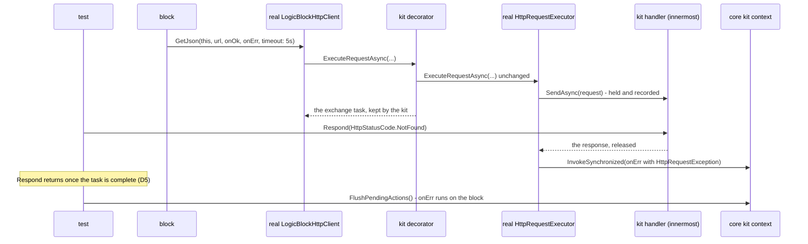

# A hosted HTTP server and a sixth test kit — HTTP gets what Modbus TCP already gives a block author

> Change doc — one in-flight change. The `Spec delta` below is distilled into the current-truth
> pages under `docs/specs/` in the implementation PR, then this doc is archived
> (`pwsh scripts/spec-change.ps1 archive <slug>`). Process: `docs/spec-process.md`. Never put
> change narrative inline in a spec page — it lives here.

## At a glance

### Summary

`Vion.Dale.Sdk.Http` is client-only and ships no kit, so the first consumer hand-rolled both halves:
a raw `HttpListener` simulator face, and a fake `ILogicBlockHttpClient` that bypasses the SDK's
serializer and error mapping. This round gives the package a **hosted HTTP server** shaped like the
hosted Modbus TCP server, and ships **`Vion.Dale.Sdk.Http.TestKit`**, which drives a block's real
client pipeline against scripted answers and wires a fake transport into the real server. It closes
park row `64a` of the archived HTTP pass, and it succeeds if the consumer could delete
`FakeLogicBlockHttpClient.cs` and `EmuMCenterHttpFace.cs`.

### Spec implications

`docs/specs/http.md` gains the server's sections (configuration, lifecycle, the route table, the
wire) and loses its "No test kit" absence (`http.md:384`); `AC-HTTP-001.1` (what the registration
adds), `AC-HTTP-013.1` (the published set) and `AC-HTTP-014.1` (the dependency set) are `MODIFIED`.
`docs/specs/testkit.md` gains an HTTP kit section (a client harness and a server harness), and its
five-kit roster becomes six — `AC-TKIT-013.1`/`.2` range over "the test kits" already, so their tests
gain a `[DataRow]` and their text does not move. The roster is also stated in
`docs/spec-process.md:37`, `CLAUDE.md:31`, `docs/sdk-surface-conventions.md:279,306` and
`docs/specs/analyzers.md:475`, where only the analyzers GAP line's probe tally sits on a criterion.
`SYS-REL-001` gains a name in `scripts/set-version.ps1`. The client's own criteria stand; the one
production change beneath them — the per-request bound measured on a registered clock — is invisible
on the system clock.

### Decisions

Decided here under the brief's (b) class; each names its precedent. Ids are minted after
classification.

- `D1` — **the server lives inside `Vion.Dale.Sdk.Http`, under `Server/`, in namespace
  `Vion.Dale.Sdk.Http.Server`.** `Vion.Dale.Sdk.Modbus.Tcp` keeps its server inside the protocol
  package under `Server/` and declares that namespace published
  (`Vion.Dale.Sdk.Modbus.Tcp/PublicApiConfig.cs:7`). A separate package would be a second
  `AddDale…Sdk` call and a second release-roster line for one protocol. Consequence, accepted:
  `HttpPackageSurfaceShould.PublishOnlyWhatBlockAuthorCalls` (`AC-HTTP-013.1`) reddens by design and
  is `MODIFIED`.
- `D2` — **the listener binds all interfaces by default**, the rule `AC-MODB-011.2` states for the
  hosted Modbus server: a logic-block-hosted server exists to be reached, and a simulator that must
  not be reachable sets loopback. The consumer's loopback-only choice
  (`EmuMCenterHttpFace.cs:23-29`) was forced by its **transport**, not by the rule. Probe P6, this
  workstation, unelevated: `http://+:18089/` and `http://*:18089/` →
  `HttpListenerException: Access is denied.`, while `http://localhost:18089/` and
  `http://127.0.0.1:18089/` start. `D3` removes that cause, so the SDK keeps one binding rule for every
  server it hosts rather than one per transport. The default port is 80, the protocol's standard port,
  as 502 is Modbus's — flagged in *Question 5*, because 80 is privileged on Linux.
- `D3` — **the transport is a `TcpListener` with the package's own bounded HTTP/1.1 exchange — not
  `HttpListener`, and not Kestrel.** Kestrel needs the ASP.NET Core shared framework, which breaks the
  `netstandard2.1` target `AC-HTTP-014.1` pins
  (`HttpPackageSurfaceShould.TargetFrameworkEveryPluginCanLoad`, `:126`) and adds a dependency every
  plugin inherits. `HttpListener` targets `netstandard2.1` but is `http.sys` on Windows, which refuses
  `D2`'s default unelevated (P6) — the failure that pushed the consumer to loopback and then to a
  hidden `GatewayApiPort` knob (the consumer's change doc, drift checkpoint 12). A `TcpListener` on
  `0.0.0.0` starts unelevated (probe P7), is what the Modbus server's reuse-address bind already builds
  on (`AC-MODB-014.4`), and needs no package. The cost is a request parser the package owns, so the
  parser is deliberately small: one request per connection, `Content-Length` bodies only, capped header
  and body sizes (rows 25–30).
- `D4` — **the kit fakes at the innermost `HttpMessageHandler`, as ratified, and observes the
  exchange task of the block's own call by decorating `IHttpRequestExecutor` in the container it
  composes.** The brief's reading holds — every member returns `void` and the executor is registered
  transient — and the transient lifetime is exactly why this works: the client the harness hands the
  block is resolved from the harness's container, so the executor injected into *that* client is the
  decorator, and the task it returns is the one belonging to the block's call. The decorator forwards
  every call to the **real** executor unchanged; nothing about the executor is replaced.
- `D5` — **an answer returns only once its exchange has settled** — the callback handed to the block's
  dispatcher, or the exchange completed with none due. Probes P1–P3 show the exchange runs inline on
  the test's thread once the held response is released (`P1 request reached handler synchronously:
  True`, `P2 callback queued inline after SetResult: True (thread same=True)`, `P3 404 queued inline:
  True`), so an answer finds the task already complete. `D4`'s decorator is what makes that a guarantee
  rather than an observation: where a consumer's own pipeline hops a thread, the answer waits on the
  task it has just released, which can only be waiting on work the kit has already let through. No
  timeout is involved, so `testkit.md`'s "no kit waits on wall time" stands.
- `D6` — **the per-request timeout is measured on the container's `TimeProvider`**, which
  `AddDaleHttpSdk` registers with `TryAdd` exactly as `AddDaleModbusTcpSdk` does
  (`Vion.Dale.Sdk.Modbus.Tcp/ServiceCollectionExtensions.cs:41`). This is the determinism seam for
  time. On the system clock nothing observable moves; under a kit, the context's virtual clock expires
  a held request's bound through the real relabel (`AC-HTTP-008.1`). Probe P4: a source built by
  `TimeProviderTaskExtensions.CreateCancellationTokenSource` over a `FakeTimeProvider` fires on the
  advance that reaches it and not before (`before=False after=True`). Probe P5: it accepts and refuses
  the same band as `new CancellationTokenSource` (`uint.MaxValue-1` ms accepted, `uint.MaxValue` ms
  `ArgumentOutOfRangeException`), so `AC-HTTP-007.2`'s refusal and its premise test are unaffected.
  `Microsoft.Bcl.TimeProvider` already reaches the package through `Vion.Dale.Sdk`
  (`Vion.Dale.Sdk/Vion.Dale.Sdk.csproj:66`), so no `PackageReference` is added.
- `D7` — **the kit is granted `InternalsVisibleTo` by `Vion.Dale.Sdk.Http`**, so it can construct the
  internal executor it decorates and name the client it configures. The brief says a published kit does
  not get such a grant; the core kit does (`Vion.Dale.Sdk/Vion.Dale.Sdk.csproj:23`), and `testkit.md`
  already names that grant as "what standing in for a runtime costs". The HTTP kit's grant joins that
  sentence. A drift checkpoint against the brief records it.
- `D8` — **the server's transport seam is an `[InternalApi]` proxy interface, and the kit's fake
  transport is `internal`.** `IModbusTcpServerProxy` is the precedent for the seam
  (`Server/Implementation/IModbusTcpServerProxy.cs:22`), but its fake is `[PublicApi]` because a test
  pre-populates register buffers through it. An HTTP server's content is its route table, which the
  block owns and the real server holds, so a fake transport has nothing for a test to reach: the
  harness and its client-side view are the whole published surface of the server half.
- `D9` — **`Vion.Examples.Energy`'s test project is not grown this round.** Its HTTP consumers
  (`Services/OpenMeteoService.cs`, `Services/GeolocationService.cs`) are real, but the example
  references **published** packages — "an example that references a published package is a consumer to
  read, not a test bed" (`spec-process.md` § Lane 3 step 3) — so a kit test there cannot build until the
  kit ships, and it belongs to the post-release bump (`docs/releasing.md`). It has no HTTP test today:
  `grep -rin "http" examples/Vion.Examples.Energy/Vion.Examples.Energy.Test/ --include=*.cs
  --include=*.csproj | grep -v /obj/` → no output.

### Reviewer's questions

1. **(a) ratified — cite, don't relitigate.** Both halves in one round (operator, 2026-09-12); lane 3;
   the kit fakes at the innermost handler; kit and server ship together, with both clauses of
   `AC-TKIT-011.1` as the precedent.
   **OUTCOME: (pending classification)**
2. **(b) decide-and-document** — `D1` (where the server lives); `D2` and `D3` (the binding default and
   the transport that lets it hold on Windows); `D4`, `D5` and `D6` (the determinism seam); `D7` (the
   grant); `D8` (the fake transport's visibility); `D9` (the example).
   **OUTCOME: (pending classification)**
3. **(c) propose-and-wait — production-capable or development-only (rows 32, 34).** *Recommendation:
   production-capable, with the standing of the hosted Modbus TCP server, which carries no
   development-only gate either.* Provider faces declare `DevelopmentOnly = true` because they would
   double-publish onto live contract topics (`docs/simulator-authoring.md:46`); a socket server
   publishes onto no topic, so that reason does not transfer. What does transfer is a plain transport's
   limit, stated rather than hidden: no TLS, no authentication, one request per connection, capped
   sizes. A block serving a device-style local API on a gateway is the production case, as a block
   serving Modbus to a building controller is today. A development-only surface would need a gate the
   package cannot place: `DevelopmentOnly` is a declaration on a contract, not on a DI service.
   **OUTCOME: (pending classification)**
4. **(c) propose-and-wait — the routing model (rows 12, 16, 19, 20, 21, 22).** *Recommendation: a
   route table the block publishes inside `Sync`, answered by the transport on its own threads under
   the server lock, plus a bounded log of received requests the block takes inside `Sync` on its own
   cadence.* It is the Modbus server's model with register buffers replaced by responses, and it is
   also exactly the consumer's face ("It serves a SNAPSHOT, published by the simulator. The listener
   answers on its own threads and touches nothing of the simulator's state",
   `EmuMCenterHttpFace.cs:16-22`). It keeps `AC-MODB-013.6`'s rule — no callback into the block from a
   background thread. The alternative is a handler delegate run on the block's actor with the transport
   waiting for its answer: it answers per request, but it parks a socket thread on an actor that may not
   have started (`AC-HTTP-005.2`'s shape, inverted), may be busy or may be stopping, and it needs a
   timeout of its own. A block that needs a computed answer republishes its route; one that must react
   to a `POST` takes the received requests on its next tick, as a Modbus simulator reads a client
   write. Sketch under *The server surface*.
   **OUTCOME: (pending classification)**
5. **(c) propose-and-wait — the fidelity limits the fake handler creates (rows 61, 62, 68).**
   *Recommendation: state every one on the kit's section of `testkit.md`, and keep row `6c` of the
   archived pass declined for production* — the kit replaces the primary handler in **its own
   container only**, so who owns the production handler does not move. Three recommendations ride
   these rows: the kit disables the client's wall-clock ceiling rather than letting it fire on a timer
   thread (row 61); the kit defaults to a virtual clock nothing advances rather than the system clock
   (row 62, a deliberate departure from `AC-TKIT-011.3`'s precedent); and redirects, cookies,
   decompression and `Content-Length` validation are named as not modelled (row 68).
   One flag beside them, not a proposal: the server's default port 80 (`D2`, row 2) is privileged on
   Linux, where a runtime without `CAP_NET_BIND_SERVICE` fails the bind at enable. Say "port 8080" to
   change it.
   **OUTCOME: (pending classification)**

---

## Full design

### How step 3 is read for a greenfield round

§ Lane 3 step 3 extracts existing behaviour, and half of this round has none. The step is read for its
intent — a complete, classified list of what a consumer will observe, before anything is specified —
and each part maps as follows:

- **Anchor inventory** — the hosted Modbus TCP server's and the Modbus TCP kit's published surfaces,
  each with what `modbus.md` and `testkit.md` state about it, plus the HTTP package as it stands and the
  two consumer artifacts. The HTTP surface answers each anchor's question, or a row says why not.
- **Statement sweep** — over the HTTP package as it stands, for anything broken (nothing; see
  *Self-check*), and over the executor and the core kit's context where the kit's seam meets them.
- **Consumer sweep** — the two hand-rolled artifacts and their call sites. Every behaviour they
  implement is a row, and so is every behaviour they had to work around.
- **Edge-value and state-interaction sweeps** — over the surface proposed here.
- **Test today** is `GAP` on every new row, which is expected. **Rec** is `intended` for the proposed
  surface, `propose` for rows the brief's (c) class covers, `park` for what is found and not done, and
  `out-of-spec` for implementation shape. No row is `fix`: nothing in today's package is broken.

### Anchor inventory

Enumerated this session; the commands are under *Self-check*.

**The hosted Modbus TCP server** (`Vion.Dale.Sdk.Modbus.Tcp/Server/`, 7 files). Published:
`ILogicBlockModbusTcpServerFactory` (`Create()`) and `ILogicBlockModbusTcpServer` (`IsEnabled`,
`ListenAddress`, `Port`, four extents, `IsListening`, `ConnectionCount`, `LastClientWriteAt`,
`Sync(Action<>)`, `Sync<T>(Func<>)`, `Dispose`) — manifest `publicapi-manifest.json:127-128`.
`[InternalApi]`: `IModbusTcpServerProxy`, `LogicBlockModbusTcpServerFactory`. What `modbus.md` states
about it, and the question each criterion answers for HTTP:

| Modbus criterion | The question it answers | HTTP row |
| --- | --- | --- |
| `AC-MODB-011.1` configuration while enabled throws | can I reconfigure a live server? | 3 |
| `AC-MODB-011.2` all interfaces, the standard port | where does it listen? | 2 |
| `AC-MODB-011.3` a bind failure propagates, the server stays disabled | what if the port is taken? | 6 |
| `AC-MODB-011.4` disposal stops, reports disabled, is idempotent | what does disposal leave? | 8 |
| `AC-MODB-011.5` a teardown race is swallowed | can teardown throw? | 31 — no third-party library, so no race of its own; a client hanging up is the analogue |
| `AC-MODB-011.6` enable starts, disable stops, a repeat does nothing | is enabling idempotent? | 7 |
| `AC-MODB-012.1`–`.7` extents and wire validation | what is served, what is refused? | 17–20, 25–28, 42 |
| `AC-MODB-013.1`–`.5` `Sync` under the lock, while disabled, re-entrancy, snapshot lifetime | how does a block publish atomically? | 12–15 |
| `AC-MODB-013.6` no callback from a background thread (GAP: an absence) | does the server call me? | 16 |
| `AC-MODB-014.1` any unit identifier | — | no analogue; the `Host` header is not routed on (row 20) |
| `AC-MODB-014.2`, `.3` the third-party library's internals | — | no analogue: no library (`D3`) |
| `AC-MODB-014.4` the reuse-address bind | can a redeploy rebind? | 36 |
| `AC-MODB-014.5` the last client write, stamped | is anyone talking to me? | 23 |
| `ConnectionCount` (no criterion of its own) | how many are connected? | 39 |

**The Modbus TCP kit** (`Vion.Dale.Sdk.Modbus.Tcp.TestKit/`, 8 `.cs` files) — 13 exported types, all
`[PublicApi]`, manifest `:130-142`: `FakeModbusTcpHarness`, `FakeModbusTcpClientProxy` with its
extensions and three event/kind pairs, `SynchronousRequestQueue`, `FakeModbusTcpServerHarness`,
`FakeModbusTcpServerProxy`, `FakeModbusTcpServerClient`. What `testkit.md` states:

| Kit criterion | The question it answers | HTTP row |
| --- | --- | --- |
| `AC-TKIT-010.1`–`.5` the fake client's state, recording, faults and delay | what does the fake hold and record? | 51–55, 58 |
| `AC-TKIT-011.1` a fake proxy and queue into the real client, a fake server proxy into the real server | how much of it is real? | 50, 80 |
| `AC-TKIT-011.2` a factory hand-out; disposal with the container | how do I inject it? | 66, 81 |
| `AC-TKIT-011.3` the system clock unless one is supplied; null refusals | whose clock? | 62 |
| `AC-TKIT-011.4`–`.7` the synchronous queue | when does the callback run? | 56, 57, 59, 60 |
| `AC-TKIT-012.1` a master-side view | how do I act as the peer? | 82 |
| `AC-TKIT-012.2` access refused while not listening | what if the block never enabled? | 83 |
| `AC-TKIT-012.3` stamps from its own clock | what does "last write" read under test? | 84 |
| `AC-TKIT-013.1`–`.3` packable, classified, no framework, armed | what does the package itself promise? | 90 |

**The HTTP package today** (`Vion.Dale.Sdk.Http/`, 9 `.cs` files): 6 exported types — 3 `[PublicApi]`
(`ILogicBlockHttpClient`, `ServiceCollectionExtensions`, `ContentNullAfterDeserializationException`)
and 3 `[InternalApi]` (`LogicBlockHttpClient`, `IHttpRequestExecutor`, `IHttpContentSerializer`);
manifest `:76-78`; one `[assembly: PublicApiNamespace]` (`PublicApiConfig.cs:3`); two
`InternalsVisibleTo` (`Vion.Dale.Sdk.Http.csproj:51-52`); the per-request `CancellationTokenSource`
built at `HttpRequestExecutor.cs:378,420,455` (the three sites `D6` changes); the named-client constant
at `HttpRequestExecutor.cs:261`. The tests pinning the package's shape: `HttpPackageSurfaceShould`,
6 methods.

**The consumer artifacts** (`C:\_gh\logic-block-libraries-emu-m-center-roster-discovery`, branch
`feat/emu-m-center-roster-discovery` at `6573d5ef`):
`Ecocoach.EnergyManagement.Test/LogicBlocks/EmuMCenter/FakeLogicBlockHttpClient.cs` (186 lines) and
`Ecocoach.EnergyManagement.SimulatorLogicBlocks/Subsystems/EmuMCenterHttpFace.cs` (184 lines), both by
`wc -l`. Call sites read: `DiscoveringMeterRosterSource.cs:182-195` (one `GetJson` with
`timeout: FetchTimeout`); `EmuMCenterBlockHarness.cs:50` (the fake beside a mocked Modbus client);
`EmuMCenterDiscoveryShould.cs` (`Respond` at `:119,148,163`, `Fail` at `:202,287`, `FailNotFound` at
`:323`, `RequestedUrls` and `LastTimeout` at `:145-146`); `EmuMCenterSimulator.cs:786-802`
(`EnsureHttpFace`, degrading on a bind failure) and `:350-356` (disposal in `Stopping`); the branch's
change doc `docs/superpowers/specs/archive/2026-09-11-emu-m-center-roster-discovery.md` §§ 6, 7, 14 and
drift checkpoint 12.

**The attribute-targets check finds nothing to check:** this round declares no attribute. The anchor
kind is empty and is recorded here rather than as a row.

### The server surface — the sketch *Question 4* recommends

```csharp
namespace Vion.Dale.Sdk.Http.Server
{
    [PublicApi] public interface ILogicBlockHttpServerFactory { ILogicBlockHttpServer Create(); }

    [PublicApi] public interface ILogicBlockHttpServer : IDisposable
    {
        bool IsEnabled { get; set; }            // false; setting true binds, a bind failure throws (row 6)
        string? ListenAddress { get; set; }     // "0.0.0.0" (D2)
        int Port { get; set; }                  // 80 (D2, Question 5)
        bool IsListening { get; }
        DateTimeOffset? LastRequestAt { get; }  // from the container's TimeProvider (row 23)
        void Sync(Action<IHttpServerSnapshot> access);
        T Sync<T>(Func<IHttpServerSnapshot, T> access);
    }

    [PublicApi] public interface IHttpServerSnapshot
    {
        void SetResponse(HttpMethod method, string path, HttpServerResponse response);
        bool RemoveResponse(HttpMethod method, string path);
        void ClearResponses();
        IReadOnlyList<HttpServerRequest> TakeReceivedRequests();
        int DroppedRequestCount { get; }        // since the last take (row 22)
    }

    [PublicApi] public sealed class HttpServerResponse { /* status, content type, body bytes, headers */ }
    [PublicApi] public sealed class HttpServerRequest  { /* method, path, query, headers, body bytes, arrival */ }
}
```

The consumer's face ports onto it line for line: `TryOpen` becomes `Port = …; try { IsEnabled = true; }
catch { degrade }`; `Publish` becomes one `Sync` that clears and sets a document per unit id and per
serial; `NeverRead` becomes `ClearResponses()`, which answers 404 everywhere; `Lookup`'s path parsing
becomes one route per document; `Dispose` stays `Dispose`.

### The kit — the sketch the determinism seam produces

```csharp
namespace Vion.Dale.Sdk.Http.TestKit
{
    [PublicApi] public sealed class FakeHttpHarness : IDisposable
    {
        public FakeHttpHarness();                           // a virtual clock nothing advances (row 62)
        public FakeHttpHarness(TimeProvider timeProvider);  // pass ctx.TimeProvider
        public ILogicBlockHttpClient Client { get; }
        public IReadOnlyList<FakeHttpRequest> Requests { get; }  // every request, in order
        public int PendingCount { get; }
        public void Respond(string json);                         // 200, application/json
        public void Respond(HttpStatusCode statusCode, string? body = null, string contentType = "application/json");
        public void Fail(Exception exception);                    // a transport failure, delivered unchanged
    }

    [PublicApi] public sealed class FakeHttpRequest        { /* method, URI, headers as sent, body text, content type, timeout */ }
    [PublicApi] public sealed class FakeHttpServerHarness : IDisposable { /* Server, ServerFactory, Client */ }
    [PublicApi] public sealed class FakeHttpServerClient   { /* Send(method, pathAndQuery, body?, headers?) */ }
    [PublicApi] public sealed class FakeHttpServerResponse { /* status, content type, headers, body */ }
}
```

The consumer's fake maps onto it: `RequestedUrls` → `Requests[i].Uri`; `LastTimeout` →
`Requests[^1].Timeout`; `PendingCount` → `PendingCount`; `Respond(json)` → `Respond(json)`; `Fail()` →
`Fail(new HttpRequestException(…))`; `FailNotFound()` → `Respond(HttpStatusCode.NotFound)`, whose
message is now the SDK's own rather than a copy of it. The consumer's tests then drain through the core
kit's context, because a callback now reaches the block through its dispatcher instead of inline.



### Drift checkpoints against the brief

Recorded rather than diverged from silently.

- **`AC-HTTP-014.1`'s dependency test is not an exact set.** The brief says the test pins "the
  **exact** dependency set" and that "a server pulling in a new `PackageReference` reddens it".
  `HttpPackageSurfaceShould.AddDependencyToEveryPluginTakingIt` (`:104`) asserts
  `Assert.Contains(dependency, referenced)` once per `[DataRow]` — it reddens when a named dependency is
  **dropped**, never when one is added. The published-type test *is* exact (a joined string, `:79`),
  and so is the target framework (`:126`). `D6` adds a referenced assembly
  (`Microsoft.Bcl.TimeProvider`) with no `PackageReference`; the criterion's text names the dependency
  kinds, so it is `MODIFIED` and its test gains a `[DataRow]`.
- **A published kit can be granted `InternalsVisibleTo`.** The brief says the SDK's suite reaches the
  concrete executor "through `InternalsVisibleTo`, which a published kit does not get". The core kit is
  granted one (`Vion.Dale.Sdk/Vion.Dale.Sdk.csproj:23`), and `testkit.md` states it. `D7` follows that
  precedent; the brief's conclusion — do not replace the executor wholesale — stands, and `D4` keeps
  it.
- **The roster is stated in more places than the brief's floor, and in more shapes.**
  `grep -rn "five" docs/ CLAUDE.md --include=*.md`, with the archive, the journal, the retro notes and
  the snapshots set aside, finds it at `docs/spec-process.md:37`, `CLAUDE.md:31`,
  `docs/specs/testkit.md:8,290,463`, `docs/sdk-surface-conventions.md:279,306` and
  `docs/specs/analyzers.md:475` — the five files the brief named, with two more lines in two of them.
  Stated **without** the word: `testkit.md:8-11` (the list of package names); `testkit.md:476-477`
  ("the sixteen inside it are MSTest", which a new MSTest project moves to seventeen);
  `sdk-surface-conventions.md:301-306` ("**Eighteen** projects reference `Vion.Dale.Sdk.Generators`",
  which the kit moves to nineteen); `analyzers.md:475` ("eleven of them carry a committed wiring
  probe", which moves to twelve); `TestKitSurfaceShould.cs:22` ("The five packable kits") and its
  `KitAssemblies` list; `AnalyzerWiringShould.cs:84-90` (`ProbedKits`) with two `[DataRow]` sets
  (`:124-129`, `:225-230`); `TestKitSurfaceShould.ReachNoRuntimeBrokerDeviceOrDevelopmentHostFromKitSuite`'s
  project rows (`:166-170`) — a third `[DataRow]` set the brief did not name; the kit references in
  `Vion.Dale.Sdk.TestKit.Test.csproj:29-32`, which its surface tests load; `$sdkPackageIds` in
  `scripts/set-version.ps1:251`; and `Vion.Dale.Sdk.sln`. Found with
  `grep -rln "Modbus.Tcp.TestKit" . | grep -v "/obj/\|/bin/\|\.git/\|\.vs/\|docs/changes/archive\|process-journal\|docs/retro\|examples/"`.
  `.claude/skills/modbus-smoke/SKILL.md` names the Modbus kit as its own subject, not as a roster.
- **The HTTP package's probe property is not the shared one, and stays its own.** The brief's claim
  about the kit family is confirmed: all five kits condition their probe on
  `DaleTestKitAnalyzerWiringProbe` (`grep -rn "AnalyzerWiringProbe" --include=*.csproj`). The
  **package** `Vion.Dale.Sdk.Http` has `DaleHttpAnalyzerWiringProbe` (`Vion.Dale.Sdk.Http.csproj:45`)
  under `AC-HTTP-013.2`; the new kit joins the shared property and the package keeps its own.
- **The existing kits' shape, verified across all five**: `net10.0`, `IsPackable` true, the analyzer
  `ProjectReference` with `OutputItemType="Analyzer"`, and the `[assembly: PublicApiNamespace]` in each
  kit's own `PublicApiConfig.cs` — by the loop under *Self-check*. Only the core kit carries
  `PackageReference`s (`Moq`, `Microsoft.Extensions.TimeProvider.Testing`, DI, logging abstractions);
  the other four take them through it.
- **`docs/specs/_findings.md` carries no HTTP or test-kit line** —
  `grep -n -i "http\|testkit\|test kit" docs/specs/_findings.md` → no output. Confirmed.
- **`docs/specs/http.md:384` is the only stated absence** — `grep -n "No test kit" docs/specs/*.md` →
  `http.md:384` only, and `grep -ic http docs/specs/testkit.md` → `0`. Confirmed.
- **`Vion.Examples.Energy.Test` exercises no HTTP path** — the brief's grep with `obj/` excluded
  returns nothing. Confirmed; `D9`.
- **The per-request bound runs on the wall clock today, and a kit needs it not to.** Not in the brief:
  the brief frames determinism as reaching the task of the block's call, but a held request that carries
  a `timeout` would expire on a real timer thread mid-test (`HttpRequestExecutor.cs:378`), and so would
  the client's 30-second ceiling. `D6` and row 61 are the two answers.
- **A per-request timeout that expires inside `AdvanceTime` can land after that advance.** Not in the
  brief: the core context fires timers when it sets its clock, and it sets the clock to the advance's
  target in a `finally` after its dispatch loop (`LogicBlockTestContext.cs:339-354`). A request bound
  that no queued action's deadline reached therefore expires in that `finally`, and its error callback
  waits for the *next* drive. Row 60.

### Consumer sweep — what the consumer built, and what it worked around

| The consumer's artifact | Evidence | What the SDK does instead | Row |
| --- | --- | --- | --- |
| records every GET's URL and the last timeout | `FakeLogicBlockHttpClient.cs:35,38,55-56` | records every request's method, URI, wire headers, body and timeout | 51 |
| answers oldest first, on the test's word | `:147-154,172-183` | the same | 52 |
| refuses an answer with nothing outstanding | `:174-177` | the same | 55 |
| **deserializes the body itself**, with default options | `:57` | the SDK's configured serializer runs | 53 |
| **hard-codes the platform's 404 message** | `:169` | the SDK's own status mapping runs | 53 |
| runs callbacks **inline**, ignoring the dispatcher | `:57,153,159` | the callback reaches the block through its dispatcher | 57 |
| implements `GetJson` only; the other seven throw | `:30,61-145` | every member works | 50 |
| models no timeout | — | a held request's bound expires on the harness's clock | 59 |
| serves a **snapshot published under a lock**; the listener touches no simulator state | `EmuMCenterHttpFace.cs:16-22,87-95,158-183` | the route table under `Sync` | 12, 16 |
| **loopback prefixes only**, for a Windows URL-ACL reason | `:23-29,63-64` | all interfaces, on a transport with no URL ACL | 2 |
| **catches and degrades on a bind failure**, "like the Modbus face" | `:54-79`; `EmuMCenterSimulator.cs:786-802` | `IsEnabled = true` throws, as the Modbus server's does; degrading stays the block's choice | 6 |
| 404 for an unknown path, and for every path under `NeverRead` | `:136-142,162-165,181` | 404 for a path with no route; `ClearResponses()` | 18 |
| 200 `application/json` with a `Content-Length` | `:144-149` | the same | 17 |
| swallows a client hanging up mid-response | `:122-129` | the same, and other clients go on being served | 31 |
| its own background thread, joined for one second on dispose | `:47-52,98-103` | the server's own accept loop, stopped on disable and on dispose | 7, 8 |
| a hidden `GatewayApiPort` knob, because port 80 needed an ACL unelevated | the consumer's change doc, drift checkpoint 12 | not needed for the ACL; still needed where a Linux runtime cannot bind 80 | *Question 5* |

---

## The behavior table

**81 rows** — 62 `intended`, 11 `propose`, 1 `park`, 7 `out-of-spec`, 0 `fix`; **12 `⚠`**. Row numbers
are grouped by section and not contiguous. `Test today` is `GAP` on every row naming new surface,
which is expected. Evidence is `file:line` read this session, a probe from *Self-check*, or a consumer
artifact.

### The hosted server — configuration and lifecycle

| # | Behavior (EARS) | Evidence | Test today | Rec | Why |
|---|---|---|---|---|---|
| 1 | WHEN `AddDaleHttpSdk` is called THE SYSTEM SHALL also register a server factory whose every `Create()` returns a new, disabled hosted HTTP server. | Modbus precedent `Vion.Dale.Sdk.Modbus.Tcp/ServiceCollectionExtensions.cs:34`; `ILogicBlockModbusTcpServerFactory.cs:16` ("Each instance hosts one server on its own port") | GAP | intended | the one call a block author already makes; a simulator serving two APIs creates two servers |
| 2 | THE SYSTEM SHALL listen on all interfaces and on port 80 unless told otherwise. | `AC-MODB-011.2`; consumer `EmuMCenterHttpFace.cs:23-29,63-64`; probes P6, P7 | GAP | intended | `D2` — one binding rule for every hosted server; the port is *Question 5*'s flag |
| 3 | WHEN a listen address or a port is set while the server is enabled THE SYSTEM SHALL throw an `InvalidOperationException`. | `AC-MODB-011.1`; `LogicBlockModbusTcpServer.cs:239-246` | GAP | intended | a live rebind would drop connections behind the block's back |
| 4 | WHEN a listen address is null, empty, whitespace or not an IP address THE SYSTEM SHALL throw a `FormatException` naming the value. | `LogicBlockModbusTcpServer.cs:76` | GAP | intended | a host name is the likely mistake, and there is no silent way to bind one |
| 5 | WHEN a port outside 1–65535 is set THE SYSTEM SHALL throw a `FormatException` naming the range in the invariant culture. | `LogicBlockModbusTcpServer.cs:17,95` | GAP | intended | port 0 binds an ephemeral port no client can be pointed at, and it is what an unset configuration field holds |
| 6 | WHEN enabling the server cannot bind the listener THE SYSTEM SHALL propagate the failure to the caller and leave the server disabled. | `AC-MODB-011.3`; consumer `EmuMCenterHttpFace.cs:54-79`, `EmuMCenterSimulator.cs:793-797` | GAP | intended | the consumer degrades on it; a block can only choose to degrade if it sees the failure |
| 7 | WHEN the server is enabled THE SYSTEM SHALL start listening on the configured address and port, WHEN it is disabled THE SYSTEM SHALL stop, and WHEN either is repeated THE SYSTEM SHALL do nothing. | `AC-MODB-011.6`; `LogicBlockModbusTcpServer.cs:41-66` | GAP | intended | a server enabled twice is the brief's edge; a block that enables from every tick must be safe |
| 8 | WHEN the server is disposed THE SYSTEM SHALL stop listening, report itself disabled, and stay silent on a second disposal. | `AC-MODB-011.4`; `LogicBlockModbusTcpServer.cs:209-218`; consumer `:98-103` | GAP | intended | a block's `Stopping` disposes, and a restart disposes again |
| 9 | WHEN a disabled server is enabled again THE SYSTEM SHALL listen again with the route table it had. | `AC-MODB-013.2` | GAP | intended | the reconfigure cycle — disable, change the port, enable — must not lose what the block published |
| 10 | WHEN a second server is enabled on an address and port a first server holds THE SYSTEM SHALL fail the second's enable as row 6 states, leaving the first serving. | edge: two `Create()` calls, one port | GAP | intended | two simulator instances on one default port is the likely collision in a topology |
| 11 | THE SYSTEM SHALL report whether the server is listening, independently of whether it is enabled. | `ILogicBlockModbusTcpServer.cs:153` | GAP | intended | the two differ across a failed enable and after disposal, which a health property reads |

### The hosted server — the route table and the received requests

| # | Behavior (EARS) | Evidence | Test today | Rec | Why |
|---|---|---|---|---|---|
| 12 | THE SYSTEM SHALL let a block set, replace and remove the response for a method and a path, and clear every response, only inside a `Sync` callback that runs on the caller's thread holding the server lock, in an action form and a value-returning form. | `AC-MODB-013.1`; consumer `EmuMCenterHttpFace.cs:87-95,158-183` (publish and lookup under one lock) | GAP | ⚠ propose | *Question 4* — atomic against the requests being served, so a republish of three documents is never seen half done |
| 13 | THE SYSTEM SHALL allow `Sync` while the server is disabled. | `AC-MODB-013.2` | GAP | intended | a block seeds its routes before enabling, so the first request is never a spurious 404 |
| 14 | WHEN `IsEnabled` is set or the server is disposed from inside a `Sync` callback, at any nesting depth, THE SYSTEM SHALL throw an `InvalidOperationException`. | `AC-MODB-013.3`, `AC-MODB-013.4`; `LogicBlockModbusTcpServer.cs:248-258` | GAP | intended | stopping joins connection handlers waiting on the lock the callback holds — a permanent deadlock of the actor |
| 15 | WHEN a snapshot is used after the callback it was given to has returned THE SYSTEM SHALL throw an `InvalidOperationException`. | `AC-MODB-013.5`; `LogicBlockModbusTcpServer.cs:276-295` | GAP | intended | a captured snapshot would change the table without the lock |
| 16 | THE SYSTEM SHALL deliver no event or callback to the block from a background thread. | `AC-MODB-013.6` (GAP there: an absence); consumer `:16-22` | GAP | ⚠ propose | *Question 4* — the rule that decides the routing model; as an absence it has no mutation, so it is page prose |
| 17 | WHEN a request arrives for a method and path with a response set THE SYSTEM SHALL answer with that response's status, content type, headers and body, with a `Content-Length`, and with no body where the status forbids one. | consumer `EmuMCenterHttpFace.cs:144-149` | GAP | intended | the whole of what the consumer's face serves |
| 18 | WHEN a request arrives for a path with no response set under any method THE SYSTEM SHALL answer 404 with an empty body. | consumer `:136-142,181` | GAP | intended | the real gateway's answer for a device it never read, and the `NeverRead` knob |
| 19 | WHEN a request arrives for a path that has a response under another method only THE SYSTEM SHALL answer 405 with an `Allow` header naming those methods. | edge: a `POST` to a `GET` route | GAP | ⚠ propose | *Question 4* — a 404 there would tell a client the path does not exist, which is false |
| 20 | THE SYSTEM SHALL match a route on the request's path as its request line carries it, before any query string, compared ordinally and case-sensitively, and on nothing else. | consumer `:135` (`Url.AbsolutePath`), `:167,174` (ordinal comparison) | GAP | ⚠ propose | *Question 4* — the edge values: `/a?x=1` matches `/a`; `/A` and `/a/` do not; the `Host` header is not routed on |
| 21 | THE SYSTEM SHALL record every request it answered — method, path, query, headers, body and arrival instant — and hand each to the block once, in arrival order, when the block takes them inside `Sync`. | the Modbus analogue: a client write lands in the buffers the block reads in `Sync` (`ModbusTcpServerProxy.cs:239-242`); the consumer serves only GETs | GAP | ⚠ propose | *Question 4* — how a block reacts to a `POST` without a callback |
| 22 | WHILE more requests are recorded than the log's capacity THE SYSTEM SHALL drop the oldest, and SHALL report how many it dropped since the block last took them. | edge: a block that serves and never takes | GAP | ⚠ propose | *Question 4* — a log no block drains must not grow without bound on a gateway; the count makes the loss visible |
| 23 | THE SYSTEM SHALL stamp the most recent request's arrival from the container's `TimeProvider`, and report none until a request arrives. | `AC-MODB-014.5`; `ModbusTcpServerProxy.cs:71` | GAP | intended | the silent-client surveillance the Modbus server offers |
| 24 | WHEN a request arrives before the block has set any response THE SYSTEM SHALL answer 404, serving independently of the block's lifecycle. | state interaction: enabled in `Starting`, published on the first tick | GAP | intended | a request before the block is started is the brief's edge; nothing waits on an actor |

### The hosted server — the wire

| # | Behavior (EARS) | Evidence | Test today | Rec | Why |
|---|---|---|---|---|---|
| 25 | WHEN a request carries a `Content-Length` THE SYSTEM SHALL read exactly that many body bytes. | `D3` | GAP | intended | the only body framing the parser accepts |
| 26 | WHEN a request carries a body without a `Content-Length`, or with `Transfer-Encoding: chunked`, THE SYSTEM SHALL answer 411 and record nothing. | `D3`; edge | GAP | intended | a stated limit, instead of a hang waiting for a length that never comes |
| 27 | WHEN a request's line and headers exceed the header cap THE SYSTEM SHALL answer 431, and WHEN its body exceeds the body cap THE SYSTEM SHALL answer 413, recording neither. | `D3`; edge: an oversized or hostile client | GAP | intended | a gateway process must not allocate what a client claims |
| 28 | WHEN a request line or a header is malformed, or names a version other than HTTP/1.0 or HTTP/1.1, THE SYSTEM SHALL answer 400, record nothing, and close the connection. | `D3`; edge | GAP | intended | a refusal from the parser is an answer, never an exception inside the server |
| 29 | THE SYSTEM SHALL answer one request per connection and then close it, sending `Connection: close`. | `D3`; the consumer closes after each response (`:139,149`) | GAP | intended | keep-alive is where a small parser's defects live; clients reconnect |
| 30 | WHEN a client connects and does not complete a request within the read bound THE SYSTEM SHALL close the connection and record nothing. | `D3`; edge: an idle or slow client | GAP | intended | an idle socket must not pin a handler; the bound is wall clock, which the kit's fake transport bypasses (row 85) |
| 31 | WHEN a client disconnects before its response is written THE SYSTEM SHALL go on serving other clients and raise nothing to the block. | consumer `:122-129`; `AC-MODB-011.5`'s analogue | GAP | intended | a client hanging up is not the block's problem |
| 32 | THE SYSTEM SHALL serve plain HTTP only, with no TLS and no authentication. | `D3` | GAP | ⚠ propose | *Question 3* — the limit a production use must be told |
| 33 | THE SYSTEM SHALL answer concurrent connections, each from the route table as it stood when that request was matched. | the lock of row 12 | GAP | intended | two blocks polling one simulator at once |
| 34 | THE SYSTEM SHALL offer the hosted server to any logic block, requiring no development-only declaration. | `docs/simulator-authoring.md:46` (why provider faces are development-only); the Modbus server carries no such gate | GAP | ⚠ propose | *Question 3* — production-capable or development-only |
| 35 | *(scope)* A block that hosts a server holds a socket the development host's stepping cannot see, so a bench over it runs on the wall clock. | `docs/simulator-authoring.md:154-155` | — | out-of-spec | the simulator guide already states this for any socket; the page cites it |
| 36 | THE SYSTEM SHALL bind the listener with the address-reuse option, so a redeploy can rebind a port whose previous socket still lingers. | `AC-MODB-014.4`; `ModbusTcpServerProxy.cs:109` | GAP | intended | the same-version redeploy the Modbus server was fixed for |
| 37 | *(implementation shape)* The transport is a TCP listener with a bounded HTTP/1.1 exchange of the package's own. | `D3`; probes P6, P7 | — | out-of-spec | recorded here; the page states its observable limits (rows 25–30, 32) |
| 38 | THE SYSTEM SHALL ship the server in the same `netstandard2.1` package, adding no package dependency. | `D1`, `D3`; `HttpPackageSurfaceShould.cs:126` | `HttpPackageSurfaceShould.TargetFrameworkEveryPluginCanLoad` | intended | `AC-HTTP-014.1`'s target stays true |
| 39 | *(absence)* The server reports no connection count. | `ILogicBlockModbusTcpServer.cs:158` has one; with one request per connection (row 29) it would almost always read zero | — | out-of-spec | `LastRequestAt` (row 23) is the liveness a block can use; an absence has no mutation |
| 42 | WHEN a route is given a null method, a null or empty path, a path not starting with `/`, a null response, or a response whose status lies outside 100–599, THE SYSTEM SHALL throw an `ArgumentException` naming the argument. | edge | GAP | intended | a mistyped route is refused where it is written, not found later as a 404 on the wire |

### The client kit — `FakeHttpHarness`

| # | Behavior (EARS) | Evidence | Test today | Rec | Why |
|---|---|---|---|---|---|
| 50 | THE SYSTEM SHALL compose the real registration, the real client, executor and serializer and the real error mapping, replacing only the innermost message handler. | ratified constraint 3; consumer `FakeLogicBlockHttpClient.cs:57,169`; `Vion.Dale.Sdk.Http.Test/TestHelpers/HttpFixtures.cs` (`HttpSdk.Compose`) | GAP | intended | the consumer's fake lost exactly the serializer and the mapping |
| 51 | WHEN a block issues a request through the harness's client THE SYSTEM SHALL record its method, absolute URI, headers as sent, body text, content type and per-request timeout before the member returns, and hold it outstanding. | probe P1; consumer `:35,38,55-56`; `EmuMCenterDiscoveryShould.cs:145-146` | GAP | intended | "a fetch happened, against what, with what timeout" is the consumer's first assertion; the headers carry the SDK's own `User-Agent` because the real registration ran |
| 52 | THE SYSTEM SHALL answer outstanding requests oldest first. | consumer `:147-154,172-183` | GAP | intended | "the order a gateway answers in and the order a test reads" |
| 53 | WHEN a test answers with a status and a body THE SYSTEM SHALL deliver them through the SDK's own pipeline, so a non-success status reaches the block as the SDK maps it and a body is deserialized with the configured options. | consumer `:57` (its own deserialization), `:169` (a copied message); `AC-HTTP-006.1`, `AC-HTTP-011.1` | GAP | intended | the reason the kit exists |
| 54 | WHEN a test fails a request with an exception THE SYSTEM SHALL deliver that exception as the SDK delivers a transport failure. | consumer `:157-160`; `AC-HTTP-006.1`'s last clause | GAP | intended | a refused connection, a reset, a DNS failure — the kit wraps nothing, as the SDK wraps nothing |
| 55 | WHEN a test answers or fails a request while none is outstanding THE SYSTEM SHALL throw an `InvalidOperationException` saying none is outstanding. | consumer `:174-177` | GAP | intended | a response scripted for a request never made is the brief's edge; silence would pass a test whose block never fetched |
| 56 | WHEN a test answers or fails a request THE SYSTEM SHALL return only once that exchange has handed its callback to the block's dispatcher, or has completed with none due. | probes P2, P3; `D4`, `D5` | GAP | intended | the brief's hazard — a drain before the exchange completes asserts nothing; this order makes the next drain discriminating |
| 57 | THE SYSTEM SHALL run no callback itself, so every callback reaches the block through the dispatcher the block passed and runs when the test drives the block's context. | consumer `:57,153,159` run callbacks inline; `AC-HTTP-005.1`; `LogicBlockTestContext.cs:538-552` | GAP | intended | the consumer's fake skipped the actor hop, so a callback's effects were visible before any drain |
| 58 | THE SYSTEM SHALL report how many requests are outstanding, and keep every request it recorded, answered or not, in order. | consumer `:41-44` | GAP | intended | answered = recorded − outstanding: the discriminating count the brief asks of every kit test |
| 59 | WHEN an outstanding request's per-request timeout elapses on the harness's clock THE SYSTEM SHALL fail it as the SDK fails an expired per-request bound, and stop holding it. | probe P4; `D6`; `AC-HTTP-008.1` | GAP | intended | a block's timeout path under test, with the SDK's own exception, on virtual time |
| 60 | WHEN a per-request timeout expires in an advance of the block's context that reaches no queued action THE SYSTEM SHALL leave its error callback queued for the next drive. | `LogicBlockTestContext.cs:339-354` (the clock set to the target in the `finally`, after the loop) | GAP | intended | a trap worth stating: `AdvanceTime(5s)` followed by an assertion sees nothing until a flush |
| 61 | THE SYSTEM SHALL not apply the client's own timeout to a request the harness holds. | `HttpClient.Timeout` is a wall-clock timer inside the platform (`AC-HTTP-008.2`) | GAP | ⚠ propose | *Question 5* — held past thirty seconds under a debugger it would fail on a timer thread; disabling it buys determinism with one unmodelled bound |
| 62 | THE SYSTEM SHALL measure a harness on a virtual clock nothing advances unless the caller supplies a clock, and SHALL refuse a null clock. | `AC-TKIT-011.3` (the Modbus client harness defaults to the system clock) | GAP | ⚠ propose | *Question 5* — on the system clock a held request's timeout fires on wall time; "no kit waits on wall time" (`testkit.md:290`) argues for a virtual default |
| 63 | WHEN a test answers a request the block issued through `SendRequest` THE SYSTEM SHALL hand its callback a response carrying the scripted status, content type and body. | `AC-HTTP-004.1`, `AC-HTTP-004.2` | GAP | intended | the escape hatch is the member a device API with a form body needs |
| 64 | THE SYSTEM SHALL open no socket. | `testkit.md:8` ("no runtime, no broker, no device") | GAP | intended | a unit-tier kit |
| 65 | THE SYSTEM SHALL share one record and one outstanding queue across every client its container resolves, and keep them apart from another harness's. | the executor is transient (`ServiceCollectionExtensions.cs:120`) | GAP | intended | two blocks on one harness interleave into one queue in issue order; two harnesses never see each other's |
| 66 | WHEN a harness is disposed with requests outstanding THE SYSTEM SHALL abandon them without scheduling any callback. | `AC-TKIT-011.2`'s disposal; state interaction | GAP | intended | a test ending mid-exchange must not queue a late callback onto a context it no longer drives |
| 67 | WHEN a test answers with a status and no body THE SYSTEM SHALL send an empty body, which a response-bearing member receives as the SDK's absent-body failure. | `AC-HTTP-006.1` ("absent or malformed as `JsonException`") | GAP | intended | the 204-into-`GetJson` case, through the real serializer |
| 68 | THE SYSTEM SHALL not follow a redirect, keep a cookie, decompress a body, or check a `Content-Length` against its body for a request the harness holds. | `Vion.Dale.Sdk.Http.Test/TestHelpers/StubHttpMessageHandler.cs:13-18` (two of them named as seam contract); archived pass row `6c`; `http.md` § The transport policy | GAP | ⚠ propose | *Question 5* — each belongs to the platform's primary handler, which the kit replaces in its own container; a scripted 3xx reaches the block as a non-success status |
| 69 | WHEN a test fails a request with no exception THE SYSTEM SHALL throw an `ArgumentNullException`. | consumer `:157` substitutes one of its own | GAP | intended | a published kit names the failure; a default would put a message into consumer assertions that no transport produces |

### The server kit — `FakeHttpServerHarness`

| # | Behavior (EARS) | Evidence | Test today | Rec | Why |
|---|---|---|---|---|---|
| 80 | THE SYSTEM SHALL wire a fake transport into the real hosted HTTP server, so the route table, the request log and the configuration refusals under test are the SDK's. | `AC-TKIT-011.1`'s second clause; `FakeModbusTcpServerHarness.cs:51-69` | GAP | intended | ratified constraint 4 |
| 81 | THE SYSTEM SHALL hand the server out through a factory for a block that resolves one, and dispose it with its container. | `AC-TKIT-011.2`; `FakeModbusTcpServerHarness.cs:72-92` | GAP | intended | the consumer's simulator takes a factory (`EmuMCenterSimulator.cs:75`) |
| 82 | THE SYSTEM SHALL offer a client-side view that sends a method, a path with its query, headers and a body to the server and returns the server's status, content type, headers and body before it returns. | `AC-TKIT-012.1`; `FakeModbusTcpServerClient.cs` | GAP | intended | the round-trip pin the consumer wanted without a port (`EmuMCenterSimulator.cs:389-396`: "a listener would only add a port to it") |
| 83 | WHEN the client-side view sends while the server is not listening THE SYSTEM SHALL throw an `InvalidOperationException`. | `AC-TKIT-012.2`'s second clause | GAP | intended | a block that never enabled its server must fail its test, not answer it |
| 84 | THE SYSTEM SHALL record a request sent through the client-side view exactly as one arriving on a socket, stamped from the container's clock. | `AC-TKIT-012.3` | GAP | intended | rows 21 and 23 become testable on virtual time |
| 85 | THE SYSTEM SHALL not model the wire — framing, the size caps, malformed requests, connection close, the read bound — through the client-side view. | rows 25–30 live in the transport the fake replaces | GAP | intended | a stated limit; those rows are proven over a real loopback socket in the HTTP package's own suite |
| 86 | *(absence)* The server kit simulates no bind failure. | `FakeModbusTcpServerProxy.cs:61` simulates none either | — | out-of-spec | row 6 is proven over a real socket; an absence mints nothing |

### The published surface, the dependencies and the rosters

| # | Behavior (EARS) | Evidence | Test today | Rec | Why |
|---|---|---|---|---|---|
| 90 | THE SYSTEM SHALL ship `Vion.Dale.Sdk.Http.TestKit` as a packable `net10.0` package that classifies every public type as published surface, declares no assertion or test framework, and is judged by the Dale analyzers through the kits' shared wiring probe. | `AC-TKIT-013.1`, `AC-TKIT-013.2`; the five kits' csprojs; `AnalyzerWiringShould.cs:124-130,225-231`; `TestKitSurfaceShould.cs:34-63` | `TestKitSurfaceShould.ClassifyEveryPublicTypeAsPublishedSurface`, `.DeclareNoAssertionOrTestFramework`, `AnalyzerWiringShould.RunDaleAnalyzersOverTestKits`, `.KeepTestKitProbeOutOfOrdinaryBuild` (five rows each) | intended | the sixth row on each; the criteria's text already ranges over "the test kits" |
| 91 | THE SYSTEM SHALL publish the server factory, the server, its snapshot and its request and response types from the HTTP package, and mark its transport seam as internal plumbing. | `D1`, `D8`; `HttpPackageSurfaceShould.cs:65-79` (the exact published list) | `HttpPackageSurfaceShould.PublishOnlyWhatBlockAuthorCalls`, `.ClassifyEveryPublicTypeAsSurfaceOrPlumbing`, `.ExposeNamedClientOnNoPublicMember` | intended | `MODIFIED` — the exact list reddens by design; the named-client test is re-read against the new types |
| 92 | THE SYSTEM SHALL add the clock abstraction to what a plugin taking the package inherits, alongside logging, JSON and the HTTP factory. | `D6`; `HttpPackageSurfaceShould.cs:104` | `HttpPackageSurfaceShould.AddDependencyToEveryPluginTakingIt` (4 rows) | intended | `MODIFIED` — the criterion names the dependency kinds; a fifth row |
| 93 | THE SYSTEM SHALL keep the package targeting `netstandard2.1`. | `HttpPackageSurfaceShould.cs:126` | `HttpPackageSurfaceShould.TargetFrameworkEveryPluginCanLoad` | intended | unchanged by `D3` |
| 94 | THE SYSTEM SHALL NOT declare the package a shared assembly. | `AC-HTTP-013.3`; the server's types cross no plugin boundary | `HttpPackageSurfaceShould.DeclareNoSharedAssemblyMarker` | intended | unchanged; re-read against the new types and still true |
| 95 | *(build seam)* The HTTP package grants the kit `InternalsVisibleTo`. | `D7`; `Vion.Dale.Sdk/Vion.Dale.Sdk.csproj:23` | — | out-of-spec | a sentence in `testkit.md`'s paragraph on what the kits reach into |
| 96 | THE SYSTEM SHALL name the new kit in the release roster the version script clears. | `SYS-REL-001`; `scripts/set-version.ps1:251` | `TestKitSurfaceShould.NameEveryPackableProjectInReleaseCacheRoster`, `.CountProjectPackableByBuildDefaultAsReleased` | intended | the test derives the packable projects from the build and fails until the roster names the kit |
| 97 | THE SYSTEM SHALL keep the kit's own test suite from reaching a runtime, a broker, a device or the development host. | `TestKitSurfaceShould.cs:166-171` | `TestKitSurfaceShould.ReachNoRuntimeBrokerDeviceOrDevelopmentHostFromKitSuite` (five rows) | intended | the sixth row; the server's wire rows (25–31, 36) live in the HTTP package's own suite, not the kit's |
| 98 | *(snapshot)* The API manifest gains the server's published types and the kit's. | `docs/snapshots/publicapi-manifest.json:76-78,130-142`; `SYS-API-001` | `TestKitSurfaceShould.CarryEveryPublishedKitTypeInApiManifest` | out-of-spec | CI regenerates and commits the manifest on the PR head (`CLAUDE.md` § Working agreement 5); the kit test reads it |
| 99 | THE SYSTEM SHALL register the system clock when `AddDaleHttpSdk` finds none registered, keeping a clock registered before it. | `D6`; `Vion.Dale.Sdk.Modbus.Tcp/ServiceCollectionExtensions.cs:41` | GAP | intended | what lets a kit's clock reach the executor, and lets the full SDK's registration stand |
| 100 | THE SYSTEM SHALL measure a request's per-request timeout on the registered clock. | `D6`; `HttpRequestExecutor.cs:378,420,455`; probes P4, P5 | GAP | intended | the determinism seam for time; on the system clock no observable changes |

### Documentation the round owes

| # | Behavior (EARS) | Evidence | Test today | Rec | Why |
|---|---|---|---|---|---|
| 101 | *(doc)* Every statement of the kit roster names six kits, and every count that a sixth kit moves is moved. | the sites under *Drift checkpoints against the brief* | — | out-of-spec | each site is rewritten to state the rule, or to six; `testkit.md`'s MSTest count to seventeen; the analyzer counts to nineteen and twelve |
| 102 | *(doc)* `http.md` states the server and the kit instead of their absence. | `docs/specs/http.md:5,34,384` | — | intended | the page is titled "when it talks to a server", and its "Not this area" line names only the other HTTP hosts |

### Found and not done

| # | Behavior (EARS) | Evidence | Test today | Rec | Why |
|---|---|---|---|---|---|
| 103 | *(consumer ask, still open)* Neither half surfaces link or connection diagnostics — no HTTP analogue of the Modbus link and socket summaries. | archived pass row `64b`; `http.md:382`; the consumer's note `docs/notes/2026-09-04-emu-m-center-integration-options.md:78-79` | — | ⚠ park | a feature band of its own; this round's server adds `LastRequestAt` and nothing more. The ledger line names the consumer |

### ⚠ failure sketches

- **12, 16, 19, 20, 21, 22 (propose — the routing model)** — a simulator must serve three device
  documents that change on its own tick. Under a callback model, a request arriving mid-tick waits on
  the actor, one arriving before `Ready()` has nowhere to go, and the socket thread needs a timeout of
  its own to fail. Under the route table, the answer is whatever the last `Sync` published.
  *Recommendation: the route table under `Sync` with a bounded request log, 405 on a method mismatch,
  and ordinal path matching before the query — as sketched under* The server surface.
- **32 (propose)** — a block serving a local API on a gateway is reachable by anything on that network,
  in clear text, unauthenticated. *Recommendation: state it on the page as the limit, as the Modbus
  server's plain transport is; TLS is a change of its own when a consumer needs it.*
- **34 (propose)** — the surface ships to every consumer. Marked development-only it would need a gate
  the package cannot place; unmarked, a production block can serve. *Recommendation: production-capable,
  with row 32's limits stated.*
- **61 (propose)** — a developer steps through a block under a debugger for forty seconds with a request
  held. The client's ceiling fires on a timer thread, the exchange fails behind the test's back, and the
  next `Respond` finds nothing outstanding. *Recommendation: the kit's container sets the client's
  timeout to infinite, and the page says a block's ceiling path is not testable through the kit.*
- **62 (propose)** — a test built without passing a clock holds a request with a five-second timeout and
  runs slowly on a loaded CI agent. On the system clock the bound fires on wall time and the test flakes.
  *Recommendation: default to a standalone virtual clock, so a timeout expires only when a test advances
  a clock it passed.*
- **68 (propose)** — a block whose device redirects `http://` to `https://` passes against the kit (a
  scripted 3xx arrives as a non-success status) and follows the redirect in production; a device that
  relies on a session cookie works in production and fails against the kit. *Recommendation: name all
  four limits on the kit's section, and keep archived row `6c` declined — the kit owns the primary
  handler in its own container only.*
- **103 (park)** — a commissioner cannot tell from a block's properties whether its HTTP device has been
  reachable in the last hour. A ledger line under `## HTTP`, owner `HTTP`, naming the consumer's note.

### Tests in scope, mapped

Every existing test the round touches maps to a row.

| Test | Row |
| --- | --- |
| `HttpPackageSurfaceShould.ExposeNamedClientOnNoPublicMember` | 91 |
| `HttpPackageSurfaceShould.ClassifyEveryPublicTypeAsSurfaceOrPlumbing` | 91 |
| `HttpPackageSurfaceShould.PublishOnlyWhatBlockAuthorCalls` | 91 |
| `HttpPackageSurfaceShould.DeclareNoSharedAssemblyMarker` | 94 |
| `HttpPackageSurfaceShould.AddDependencyToEveryPluginTakingIt` | 92 |
| `HttpPackageSurfaceShould.TargetFrameworkEveryPluginCanLoad` | 38, 93 |
| `AnalyzerWiringShould.RunDaleAnalyzersOverTestKits` | 90 |
| `AnalyzerWiringShould.KeepTestKitProbeOutOfOrdinaryBuild` | 90 |
| `TestKitSurfaceShould.ClassifyEveryPublicTypeAsPublishedSurface` | 90 |
| `TestKitSurfaceShould.DeclareNoAssertionOrTestFramework` | 90 |
| `TestKitSurfaceShould.CarryEveryPublishedKitTypeInApiManifest` | 98 |
| `TestKitSurfaceShould.NameEveryPackableProjectInReleaseCacheRoster` | 96 |
| `TestKitSurfaceShould.CountProjectPackableByBuildDefaultAsReleased` | 96 |
| `TestKitSurfaceShould.ReachNoRuntimeBrokerDeviceOrDevelopmentHostFromKitSuite` | 97 |
| `HttpRequestExecutorShould`'s two executor constructions (`:920`, `:941`) | 100 — they gain a clock argument; their assertions do not move |

**Unmapped tests: none.**

---

## Relay notes for the PR body

> Written as each change lands. The PR body quotes this section verbatim and nothing else.

_(none yet — nothing has landed; the doc is at the classification gate)_

---

## Drift checkpoints

> One line per divergence discovered during implementation:
> `YYYY-MM-DD: <what changed and why>`. Never inline in a spec page. A checkpoint that fixes a
> CLASS bug states the sibling sweep (done / N/A / handed off).

- 2026-09-12: the corrections to the brief found at extraction are recorded under *Drift checkpoints
  against the brief* in the Full design, because they precede any implementation.

---

## Spec delta (to distill)

> The machine-readable change, one line per id. Grammar:
> `<OP> <ID> -> <target> : <payload>`
>
> Minted after the operator's classification (§ Lane 3 step 5), with the consolidation map beside it.

_(minted after classification)_

---

## Self-check (step 3)

**Every anchor instance visited or explicitly out of scope.** The hosted Modbus server's published
members and plumbing types, and its criteria `AC-MODB-011.*`, `013.*` and `014.*`: each row of the first
inventory table. The Modbus TCP kit's 13 published types and `AC-TKIT-010.*`–`013.*`: each row of the
second. The HTTP package's 6 exported types: rows 91–94 and 99–100, with `D4` and `D7` for the two
internals the kit touches (`IHttpRequestExecutor`'s implementation, the named client);
`IHttpContentSerializer` and `LogicBlockHttpClient` are used unchanged. The consumer's two artifacts:
every member, by the *Consumer sweep* table — the fake's eight interface members, three answer helpers
and three state properties; the face's `TryOpen`, `Publish`, `Dispose`, `Serve`, `Answer` and `Lookup`.

**The reverse question — which observable behaviours of the proposed surface have neither a row nor a
decision?** Asked per anchor instance: `ConnectionCount` → row 39; `AC-MODB-011.5`'s teardown race →
row 31; `AC-MODB-014.1`'s unit identifier → row 20's "the `Host` header is not routed on";
`AC-MODB-014.2` and `.3` → no library, no analogue; the Modbus kit's `SynchronousRequestQueue` and its
hold-and-drain (`AC-TKIT-011.5`) → no analogue needed, since rows 51 and 56 hold every request by
construction; `AC-TKIT-010.5`'s configured delay → rows 59 and 60, where time is the executor's own
bound rather than a fake's delay. Asked of this doc's Reviewer's questions: Q3 → rows 32, 34; Q4 → rows
12, 16, 19–22; Q5 → rows 61, 62, 68 and the port in row 2.

**No `fix` row, and why.** The statement sweep read `HttpRequestExecutor.cs`, `LogicBlockHttpClient.cs`,
`HttpContentSerializer.cs`, `ServiceCollectionExtensions.cs` and
`ContentNullAfterDeserializationException.cs` end to end this session, against `http.md`. Nothing is
broken; the one production change there (`D6`) is a seam, not a defect.

**Probes.** A scratch console project outside the repository, referencing `Vion.Dale.Sdk.Http.csproj`
from this working tree and `Microsoft.Extensions.TimeProvider.Testing 10.0.0`, composed through the real
`AddDaleHttpSdk` with the named client's primary handler replaced by one that holds each request on a
`TaskCompletionSource` created with default options and honours its token; the dispatcher a list that
queues. Output, pasted:

```text
P1 request reached handler synchronously: True
P2 callback queued inline after SetResult: True (thread same=True)
P3 404 queued inline: True
ok 42
err2 HttpRequestException: Response status code does not indicate success: 404 (Not Found).
P4 fake-clock CTS: before=False after=True
P5 uint.Max refused ArgumentOutOfRangeException
P5b uint.Max-1 accepted
P6 http://+:18089/ FAILED HttpListenerException: Access is denied.
P6 http://*:18089/ FAILED HttpListenerException: Access is denied.
P6 http://localhost:18089/ started
P6 http://127.0.0.1:18089/ started
P7 TcpListener 0.0.0.0 started
```

The shapes: P1–P3 ran `GetJson` with `timeout: TimeSpan.FromSeconds(5)`, answered 200 then 404; P4 a
five-second source over a `FakeTimeProvider`, advanced four seconds then one; P5 `TimeProvider.System`
at the two band edges; P6 and P7 on Windows 11, unelevated. P6 is evidence for Windows only: on Linux
`HttpListener` is a managed implementation with no URL ACL.

**Counts, each with the command that produced it:**

- rows by recommendation: ``grep -E '^\| [0-9]+ \|' docs/changes/2026-09-12-http-server-and-testkit.md | awk -F'|' '{print $6}' | sort | uniq -c`` — pasted in the step-3 REPORT
- the consumer artifacts: `wc -l` → `186 …/FakeLogicBlockHttpClient.cs`, `184 …/EmuMCenterHttpFace.cs`
- HTTP package files: `find Vion.Dale.Sdk.Http -name "*.cs" -not -path "*/obj/*" | wc -l` → 9
- Modbus TCP server files: `find Vion.Dale.Sdk.Modbus.Tcp/Server -name "*.cs" | wc -l` → 7
- Modbus TCP kit files: `find Vion.Dale.Sdk.Modbus.Tcp.TestKit -name "*.cs" -not -path "*/obj/*" | wc -l` → 8
- Modbus TCP kit manifest rows: `grep -c "Modbus.Tcp.TestKit\." docs/snapshots/publicapi-manifest.json` → 13
- `HttpPackageSurfaceShould` methods: `grep -c "TestMethod" Vion.Dale.Sdk.Http.Test/HttpPackageSurfaceShould.cs` → 6
- executor constructions in the HTTP suite: `grep -rn "new HttpRequestExecutor(" Vion.Dale.Sdk.Http.Test | wc -l` → 2
- the kits' shape: `for k in *TestKit; do grep -n "TargetFramework\|IsPackable\|Generators.csproj" $k/$k.csproj; grep assembly $k/PublicApiConfig.cs; done` → five × (`net10.0`, `true`, the analyzer reference, one namespace)
