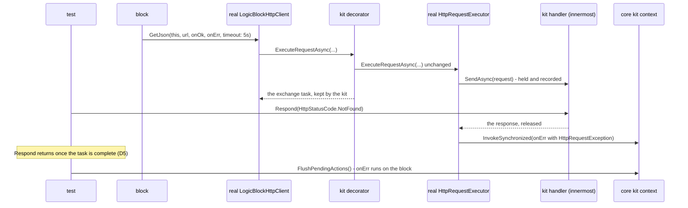

# A hosted HTTP server and a sixth test kit — HTTP gets what Modbus TCP already gives a block author

> Change doc — one in-flight change. The `Spec delta` below is distilled into the current-truth
> pages under `docs/specs/` in the implementation PR, then this doc is archived
> (`pwsh scripts/spec-change.ps1 archive <slug>`). Process: `docs/spec-process.md`. Never put
> change narrative inline in a spec page — it lives here.

## At a glance

### Summary

`Vion.Dale.Sdk.Http` is client-only and ships no kit, so the first consumer hand-rolled both halves:
a raw `HttpListener` simulator face, and a fake `ILogicBlockHttpClient` that bypasses the SDK's
serializer and error mapping. This round gives the package a **hosted HTTP server** shaped like the
hosted Modbus TCP server, and ships **`Vion.Dale.Sdk.Http.TestKit`**, which drives a block's real
client pipeline against scripted answers and wires a fake transport into the real server. It closes
park row `64a` of the archived HTTP pass, and it succeeds if the consumer could delete
`FakeLogicBlockHttpClient.cs` and `EmuMCenterHttpFace.cs`.

### Spec implications

`docs/specs/http.md` gains three sections for the hosted server — configuration and lifecycle
(`AC-HTTP-015.*`), responses and requests (`AC-HTTP-016.*`) and the wire (`AC-HTTP-017.*`) — one
criterion for the clock a per-request timeout is measured on (`AC-HTTP-008.3`), and a reworded
`AC-HTTP-014.1` that names the clock among a plugin's inherited dependencies (`MODIFIED`). Its "No test
kit" absence is gone and a plain-HTTP limit stands in its place. `AC-HTTP-001.1` and `AC-HTTP-013.1` keep
their text: the first never claimed to be the whole registration, and the second's test carries the new
published set in its expectation, not in the criterion. `docs/specs/testkit.md` gains an HTTP kit section
(`AC-TKIT-014.*` for the client harness, `AC-TKIT-015.*` for the server harness) and names six kits;
`AC-TKIT-013.1`/`.2` range over "the test kits" already, so their tests gain a sixth `[DataRow]` and their
text does not move. The roster is also restated in `docs/spec-process.md:37`, `CLAUDE.md:31`,
`docs/sdk-surface-conventions.md` and `docs/specs/analyzers.md`, and `SYS-REL-001`'s roster in
`scripts/set-version.ps1` names the kit. `docs/specs/_findings.md` gains one park line.

### Decisions

Decided here under the brief's (b) class; each names its precedent. Ids are minted after
classification.

- `D1` — **the server lives inside `Vion.Dale.Sdk.Http`, under `Server/`, in namespace
  `Vion.Dale.Sdk.Http.Server`.** `Vion.Dale.Sdk.Modbus.Tcp` keeps its server inside the protocol
  package under `Server/` and declares that namespace published
  (`Vion.Dale.Sdk.Modbus.Tcp/PublicApiConfig.cs:7`). A separate package would be a second
  `AddDale…Sdk` call and a second release-roster line for one protocol. Consequence, accepted:
  `HttpPackageSurfaceShould.PublishOnlyWhatBlockAuthorCalls` (`AC-HTTP-013.1`) reddens by design and
  is `MODIFIED`.
- `D2` — **the listener binds all interfaces by default**, the rule `AC-MODB-011.2` states for the
  hosted Modbus server: a logic-block-hosted server exists to be reached, and a simulator that must
  not be reachable sets loopback. The consumer's loopback-only choice
  (`EmuMCenterHttpFace.cs:23-29`) was forced by its **transport**, not by the rule. Probe P6, this
  workstation, unelevated: `http://+:18089/` and `http://*:18089/` →
  `HttpListenerException: Access is denied.`, while `http://localhost:18089/` and
  `http://127.0.0.1:18089/` start. `D3` removes that cause, so the SDK keeps one binding rule for every
  server it hosts rather than one per transport. **The default port is 8080** (operator override of
  row 2 at the classification gate; the step-3 doc proposed 80). The reason is collision, not privilege:
  this repository already defaults the hosted Modbus server to 502, which is privileged too, and nothing
  has hit it. What makes 80 the wrong default is that it is the port everything else on a host wants.
  *(Address half reversed by the operator, 2026-09-13: the default is loopback. The Modbus rule rests on a
  protocol with no transport security by nature; this server serves plaintext by choice through a parser
  the package wrote. Port 8080 stands — Amendment 1 checkpoint, item 1.)*
- `D3` — **the transport is a `TcpListener` with the package's own bounded HTTP/1.1 exchange — not
  `HttpListener`, and not Kestrel.** Kestrel needs the ASP.NET Core shared framework, which breaks the
  `netstandard2.1` target `AC-HTTP-014.1` pins
  (`HttpPackageSurfaceShould.TargetFrameworkEveryPluginCanLoad`, `:126`) and adds a dependency every
  plugin inherits. `HttpListener` targets `netstandard2.1` but is `http.sys` on Windows, which refuses
  `D2`'s default unelevated (P6) — the failure that pushed the consumer to loopback and then to a
  hidden `GatewayApiPort` knob (the consumer's change doc, drift checkpoint 12). A `TcpListener` on
  `0.0.0.0` starts unelevated (probe P7), is what the Modbus server's reuse-address bind already builds
  on (`AC-MODB-014.4`), and needs no package. The cost is a request parser the package owns, so the
  parser is deliberately small: one request per connection, `Content-Length` bodies only, capped header
  and body sizes (rows 25–30).
- `D4` — **the kit fakes at the innermost `HttpMessageHandler`, as ratified, and observes the
  exchange task of the block's own call by decorating `IHttpRequestExecutor` in the container it
  composes.** The brief's reading holds — every member returns `void` and the executor is registered
  transient — and the transient lifetime is exactly why this works: the client the harness hands the
  block is resolved from the harness's container, so the executor injected into *that* client is the
  decorator, and the task it returns is the one belonging to the block's call. The decorator forwards
  every call to the **real** executor unchanged; nothing about the executor is replaced.
- `D5` — **an answer returns only once its exchange has settled** — the callback handed to the block's
  dispatcher, or the exchange completed with none due. Probes P1–P3 show the exchange runs inline on
  the test's thread once the held response is released (`P1 request reached handler synchronously:
  True`, `P2 callback queued inline after SetResult: True (thread same=True)`, `P3 404 queued inline:
  True`), so an answer finds the task already complete. `D4`'s decorator is what makes that a guarantee
  rather than an observation: where a consumer's own pipeline hops a thread, the answer waits on the
  task it has just released, which can only be waiting on work the kit has already let through. No
  timeout is involved, so `testkit.md`'s "no kit waits on wall time" stands.
- `D6` — **the per-request timeout is measured on the container's `TimeProvider`**, which
  `AddDaleHttpSdk` registers with `TryAdd` exactly as `AddDaleModbusTcpSdk` does
  (`Vion.Dale.Sdk.Modbus.Tcp/ServiceCollectionExtensions.cs:41`). This is the determinism seam for
  time. On the system clock nothing observable moves; under a kit, the context's virtual clock expires
  a held request's bound through the real relabel (`AC-HTTP-008.1`). Probe P4: a source built by
  `TimeProviderTaskExtensions.CreateCancellationTokenSource` over a `FakeTimeProvider` fires on the
  advance that reaches it and not before (`before=False after=True`). Probe P5: it accepts and refuses
  the same band as `new CancellationTokenSource` (`uint.MaxValue-1` ms accepted, `uint.MaxValue` ms
  `ArgumentOutOfRangeException`), so `AC-HTTP-007.2`'s refusal and its premise test are unaffected.
  `Microsoft.Bcl.TimeProvider` already reaches the package through `Vion.Dale.Sdk`
  (`Vion.Dale.Sdk/Vion.Dale.Sdk.csproj:66`), so no `PackageReference` is added.
- `D7` — **the kit is granted `InternalsVisibleTo` by `Vion.Dale.Sdk.Http`**, so it can construct the
  internal executor it decorates and name the client it configures. The brief says a published kit does
  not get such a grant; the core kit does (`Vion.Dale.Sdk/Vion.Dale.Sdk.csproj:23`), and `testkit.md`
  already names that grant as "what standing in for a runtime costs". The HTTP kit's grant joins that
  sentence. A drift checkpoint against the brief records it.
- `D8` — **the server's transport seam is an `[InternalApi]` proxy interface, and the kit's fake
  transport is `internal`.** `IModbusTcpServerProxy` is the precedent for the seam
  (`Server/Implementation/IModbusTcpServerProxy.cs:22`), but its fake is `[PublicApi]` because a test
  pre-populates register buffers through it. An HTTP server's content is its route table, which the
  block owns and the real server holds, so a fake transport has nothing for a test to reach: the
  harness and its client-side view are the whole published surface of the server half. *(Implemented
  one step narrower: the seam is `internal`, not `[InternalApi]` — see Drift checkpoints, 2026-09-13.)*
- `D9` — **reversed at the classification gate: the kit is demonstrated against
  `Vion.Examples.Energy`'s two HTTP consumers in this round** (`Services/OpenMeteoService.cs`,
  `Services/GeolocationService.cs`), built against the working tree with `-p:DaleLocalSource=true`. They
  are the only committed, real, untested consumers of the surface the kit fakes — neither has a test
  today: `grep -rin "http" examples/Vion.Examples.Energy/Vion.Examples.Energy.Test/ --include=*.cs
  --include=*.csproj | grep -v /obj/` → no output. The step-3 doc had declined it because the example
  references published packages; how the tests land without a published kit is a drift checkpoint.

### Reviewer's questions

1. **(a) ratified — cite, don't relitigate.** Both halves in one round (operator, 2026-09-12); lane 3;
   the kit fakes at the innermost handler; kit and server ship together, with both clauses of
   `AC-TKIT-011.1` as the precedent.
   **OUTCOME: ratified as cited (amendment `amend-VION-212-dale-sdk-classification.md`).**
2. **(b) decide-and-document** — `D1` (where the server lives); `D2` and `D3` (the binding default and
   the transport that lets it hold on Windows); `D4`, `D5` and `D6` (the determinism seam); `D7` (the
   grant); `D8` (the fake transport's visibility); `D9` (the example).
   **OUTCOME: accepted, with two changes from the classification — `D2`'s default port is 8080, not 80
   (row 2 overridden), and `D9` is reversed: the Energy example's two HTTP services are covered in this
   round.**
3. **(c) propose-and-wait — production-capable or development-only (rows 32, 34).** *Recommendation:
   production-capable, with the standing of the hosted Modbus TCP server, which carries no
   development-only gate either.* Provider faces declare `DevelopmentOnly = true` because they would
   double-publish onto live contract topics (`docs/simulator-authoring.md:46`); a socket server
   publishes onto no topic, so that reason does not transfer. What does transfer is a plain transport's
   limit, stated rather than hidden: no TLS, no authentication, one request per connection, capped
   sizes. A block serving a device-style local API on a gateway is the production case, as a block
   serving Modbus to a building controller is today. A development-only surface would need a gate the
   package cannot place: `DevelopmentOnly` is a declaration on a contract, not on a DI service.
   **OUTCOME: accepted — production-capable, on the operator's decision and not on the Modbus
   precedent.** The precedent does not transfer: Modbus TCP has no encryption and no authentication *in
   the protocol*, so an unauthenticated Modbus server is the protocol's nature, while for HTTP both are
   the norm and their absence is a choice. The Modbus reference stays only where it carries — the
   binding rule (row 2). **Row 32 is accepted with a condition: the plaintext-and-no-authentication
   limit is stated in the XML documentation of the published server type, where a block author meets
   it, and not only on the page.**
4. **(c) propose-and-wait — the routing model (rows 12, 16, 19, 20, 21, 22).** *Recommendation: a
   route table the block publishes inside `Sync`, answered by the transport on its own threads under
   the server lock, plus a bounded log of received requests the block takes inside `Sync` on its own
   cadence.* It is the Modbus server's model with register buffers replaced by responses, and it is
   also exactly the consumer's face ("It serves a SNAPSHOT, published by the simulator. The listener
   answers on its own threads and touches nothing of the simulator's state",
   `EmuMCenterHttpFace.cs:16-22`). It keeps `AC-MODB-013.6`'s rule — no callback into the block from a
   background thread. The alternative is a handler delegate run on the block's actor with the transport
   waiting for its answer: it answers per request, but it parks a socket thread on an actor that may not
   have started (`AC-HTTP-005.2`'s shape, inverted), may be busy or may be stopping, and it needs a
   timeout of its own. A block that needs a computed answer republishes its route; one that must react
   to a `POST` takes the received requests on its next tick, as a Modbus simulator reads a client
   write. Sketch under *The server surface*.
   **OUTCOME: accepted as recommended.**
5. **(c) propose-and-wait — the fidelity limits the fake handler creates (rows 61, 62, 68).**
   *Recommendation: state every one on the kit's section of `testkit.md`, and keep row `6c` of the
   archived pass declined for production* — the kit replaces the primary handler in **its own
   container only**, so who owns the production handler does not move. Three recommendations ride
   these rows: the kit disables the client's wall-clock ceiling rather than letting it fire on a timer
   thread (row 61); the kit defaults to a virtual clock nothing advances rather than the system clock
   (row 62); and redirects, cookies,
   decompression and `Content-Length` validation are named as not modelled (row 68).
   One flag beside them, not a proposal: the server's default port 80 (`D2`, row 2) is privileged on
   Linux, where a runtime without `CAP_NET_BIND_SERVICE` fails the bind at enable. Say "port 8080" to
   change it.
   **OUTCOME: accepted — rows 61, 62 and 68 as recommended, and archived row `6c` stays declined for
   production; the port flag became an override (8080, for collision rather than privilege — `D2`).
   Row 62 is better founded than its step-3 *Why* said: it is not a departure from `AC-TKIT-011.3` but
   closer to a correction of it. `testkit.md` § Time states that no kit waits on wall time and that there
   is no timeout anywhere in the kit packages, which makes a virtual default the kits' own rule and the
   Modbus client harness's system-clock default the outlier.**

---

## Full design

### How step 3 is read for a greenfield round

§ Lane 3 step 3 extracts existing behaviour, and half of this round has none. The step is read for its
intent — a complete, classified list of what a consumer will observe, before anything is specified —
and each part maps as follows:

- **Anchor inventory** — the hosted Modbus TCP server's and the Modbus TCP kit's published surfaces,
  each with what `modbus.md` and `testkit.md` state about it, plus the HTTP package as it stands and the
  two consumer artifacts. The HTTP surface answers each anchor's question, or a row says why not.
- **Statement sweep** — over the HTTP package as it stands, for anything broken (nothing; see
  *Self-check*), and over the executor and the core kit's context where the kit's seam meets them.
- **Consumer sweep** — the two hand-rolled artifacts and their call sites. Every behaviour they
  implement is a row, and so is every behaviour they had to work around.
- **Edge-value and state-interaction sweeps** — over the surface proposed here.
- **Test today** is `GAP` on every new row, which is expected. **Rec** is `intended` for the proposed
  surface, `propose` for rows the brief's (c) class covers, `park` for what is found and not done, and
  `out-of-spec` for implementation shape. No row is `fix`: nothing in today's package is broken.

### Anchor inventory

Enumerated this session; the commands are under *Self-check*.

**The hosted Modbus TCP server** (`Vion.Dale.Sdk.Modbus.Tcp/Server/`, 7 files). Published:
`ILogicBlockModbusTcpServerFactory` (`Create()`) and `ILogicBlockModbusTcpServer` (`IsEnabled`,
`ListenAddress`, `Port`, four extents, `IsListening`, `ConnectionCount`, `LastClientWriteAt`,
`Sync(Action<>)`, `Sync<T>(Func<>)`, `Dispose`) — manifest `publicapi-manifest.json:127-128`.
`[InternalApi]`: `IModbusTcpServerProxy`, `LogicBlockModbusTcpServerFactory`. What `modbus.md` states
about it, and the question each criterion answers for HTTP:

| Modbus criterion | The question it answers | HTTP row |
| --- | --- | --- |
| `AC-MODB-011.1` configuration while enabled throws | can I reconfigure a live server? | 3 |
| `AC-MODB-011.2` all interfaces, the standard port | where does it listen? | 2 |
| `AC-MODB-011.3` a bind failure propagates, the server stays disabled | what if the port is taken? | 6 |
| `AC-MODB-011.4` disposal stops, reports disabled, is idempotent | what does disposal leave? | 8 |
| `AC-MODB-011.5` a teardown race is swallowed | can teardown throw? | 31 — no third-party library, so no race of its own; a client hanging up is the analogue |
| `AC-MODB-011.6` enable starts, disable stops, a repeat does nothing | is enabling idempotent? | 7 |
| `AC-MODB-012.1`–`.7` extents and wire validation | what is served, what is refused? | 17–20, 25–28, 42 |
| `AC-MODB-013.1`–`.5` `Sync` under the lock, while disabled, re-entrancy, snapshot lifetime | how does a block publish atomically? | 12–15 |
| `AC-MODB-013.6` no callback from a background thread (GAP: an absence) | does the server call me? | 16 |
| `AC-MODB-014.1` any unit identifier | — | no analogue; the `Host` header is not routed on (row 20) |
| `AC-MODB-014.2`, `.3` the third-party library's internals | — | no analogue: no library (`D3`) |
| `AC-MODB-014.4` the reuse-address bind | can a redeploy rebind? | 36 |
| `AC-MODB-014.5` the last client write, stamped | is anyone talking to me? | 23 |
| `ConnectionCount` (no criterion of its own) | how many are connected? | 39 |

**The Modbus TCP kit** (`Vion.Dale.Sdk.Modbus.Tcp.TestKit/`, 8 `.cs` files) — 13 exported types, all
`[PublicApi]`, manifest `:130-142`: `FakeModbusTcpHarness`, `FakeModbusTcpClientProxy` with its
extensions and three event/kind pairs, `SynchronousRequestQueue`, `FakeModbusTcpServerHarness`,
`FakeModbusTcpServerProxy`, `FakeModbusTcpServerClient`. What `testkit.md` states:

| Kit criterion | The question it answers | HTTP row |
| --- | --- | --- |
| `AC-TKIT-010.1`–`.5` the fake client's state, recording, faults and delay | what does the fake hold and record? | 51–55, 58 |
| `AC-TKIT-011.1` a fake proxy and queue into the real client, a fake server proxy into the real server | how much of it is real? | 50, 80 |
| `AC-TKIT-011.2` a factory hand-out; disposal with the container | how do I inject it? | 66, 81 |
| `AC-TKIT-011.3` the system clock unless one is supplied; null refusals | whose clock? | 62 |
| `AC-TKIT-011.4`–`.7` the synchronous queue | when does the callback run? | 56, 57, 59, 60 |
| `AC-TKIT-012.1` a master-side view | how do I act as the peer? | 82 |
| `AC-TKIT-012.2` access refused while not listening | what if the block never enabled? | 83 |
| `AC-TKIT-012.3` stamps from its own clock | what does "last write" read under test? | 84 |
| `AC-TKIT-013.1`–`.3` packable, classified, no framework, armed | what does the package itself promise? | 90 |

**The HTTP package today** (`Vion.Dale.Sdk.Http/`, 9 `.cs` files): 6 exported types — 3 `[PublicApi]`
(`ILogicBlockHttpClient`, `ServiceCollectionExtensions`, `ContentNullAfterDeserializationException`)
and 3 `[InternalApi]` (`LogicBlockHttpClient`, `IHttpRequestExecutor`, `IHttpContentSerializer`);
manifest `:76-78`; one `[assembly: PublicApiNamespace]` (`PublicApiConfig.cs:3`); two
`InternalsVisibleTo` (`Vion.Dale.Sdk.Http.csproj:51-52`); the per-request `CancellationTokenSource`
built at `HttpRequestExecutor.cs:378,420,455` (the three sites `D6` changes); the named-client constant
at `HttpRequestExecutor.cs:261`. The tests pinning the package's shape: `HttpPackageSurfaceShould`,
6 methods.

**The consumer artifacts** (`C:\_gh\logic-block-libraries-emu-m-center-roster-discovery`, branch
`feat/emu-m-center-roster-discovery` at `6573d5ef`):
`Ecocoach.EnergyManagement.Test/LogicBlocks/EmuMCenter/FakeLogicBlockHttpClient.cs` (186 lines) and
`Ecocoach.EnergyManagement.SimulatorLogicBlocks/Subsystems/EmuMCenterHttpFace.cs` (184 lines), both by
`wc -l`. Call sites read: `DiscoveringMeterRosterSource.cs:182-195` (one `GetJson` with
`timeout: FetchTimeout`); `EmuMCenterBlockHarness.cs:50` (the fake beside a mocked Modbus client);
`EmuMCenterDiscoveryShould.cs` (`Respond` at `:119,148,163`, `Fail` at `:202,287`, `FailNotFound` at
`:323`, `RequestedUrls` and `LastTimeout` at `:145-146`); `EmuMCenterSimulator.cs:786-802`
(`EnsureHttpFace`, degrading on a bind failure) and `:350-356` (disposal in `Stopping`); the branch's
change doc `docs/superpowers/specs/archive/2026-09-11-emu-m-center-roster-discovery.md` §§ 6, 7, 14 and
drift checkpoint 12.

**The attribute-targets check finds nothing to check:** this round declares no attribute. The anchor
kind is empty and is recorded here rather than as a row.

### The server surface — the sketch *Question 4* recommends

```csharp
namespace Vion.Dale.Sdk.Http.Server
{
    [PublicApi] public interface ILogicBlockHttpServerFactory { ILogicBlockHttpServer Create(); }

    [PublicApi] public interface ILogicBlockHttpServer : IDisposable
    {
        bool IsEnabled { get; set; }            // false; setting true binds, a bind failure throws (row 6)
        string? ListenAddress { get; set; }     // "0.0.0.0" (D2) — "127.0.0.1" since Amendment 1
        int Port { get; set; }                  // 8080 (D2)
        bool IsListening { get; }
        DateTimeOffset? LastRequestAt { get; }  // from the container's TimeProvider (row 23)
        void Sync(Action<IHttpServerSnapshot> access);
        T Sync<T>(Func<IHttpServerSnapshot, T> access);
    }

    [PublicApi] public interface IHttpServerSnapshot
    {
        void SetResponse(HttpMethod method, string path, HttpServerResponse response);
        bool RemoveResponse(HttpMethod method, string path);
        void ClearResponses();
        IReadOnlyList<HttpServerRequest> TakeReceivedRequests();
        int DroppedRequestCount { get; }        // since the last take (row 22)
    }

    [PublicApi] public sealed class HttpServerResponse { /* status, content type, body bytes, headers */ }
    [PublicApi] public sealed class HttpServerRequest  { /* method, path, query, headers, body bytes, arrival */ }
}
```

The consumer's face ports onto it line for line: `TryOpen` becomes `Port = …; try { IsEnabled = true; }
catch { degrade }`; `Publish` becomes one `Sync` that clears and sets a document per unit id and per
serial; `NeverRead` becomes `ClearResponses()`, which answers 404 everywhere; `Lookup`'s path parsing
becomes one route per document; `Dispose` stays `Dispose`.

### The kit — the sketch the determinism seam produces

```csharp
namespace Vion.Dale.Sdk.Http.TestKit
{
    [PublicApi] public sealed class FakeHttpHarness : IDisposable
    {
        public FakeHttpHarness();                           // a virtual clock nothing advances (row 62)
        public FakeHttpHarness(TimeProvider timeProvider);  // pass ctx.TimeProvider
        public ILogicBlockHttpClient Client { get; }
        public IReadOnlyList<FakeHttpRequest> Requests { get; }  // every request, in order
        public int PendingCount { get; }
        public void Respond(string json);                         // 200, application/json
        public void Respond(HttpStatusCode statusCode, string? body = null, string contentType = "application/json");
        public void Fail(Exception exception);                    // a transport failure, delivered unchanged
    }

    [PublicApi] public sealed class FakeHttpRequest        { /* method, URI, headers as sent, body text, content type, timeout */ }
    [PublicApi] public sealed class FakeHttpServerHarness : IDisposable { /* Server, ServerFactory, Client */ }
    [PublicApi] public sealed class FakeHttpServerClient   { /* Send(method, pathAndQuery, body?, headers?) */ }
    [PublicApi] public sealed class FakeHttpServerResponse { /* status, content type, headers, body */ }
}
```

The consumer's fake maps onto it: `RequestedUrls` → `Requests[i].Uri`; `LastTimeout` →
`Requests[^1].Timeout`; `PendingCount` → `PendingCount`; `Respond(json)` → `Respond(json)`; `Fail()` →
`Fail(new HttpRequestException(…))`; `FailNotFound()` → `Respond(HttpStatusCode.NotFound)`, whose
message is now the SDK's own rather than a copy of it. The consumer's tests then drain through the core
kit's context, because a callback now reaches the block through its dispatcher instead of inline.



### Drift checkpoints against the brief

Recorded rather than diverged from silently.

- **`AC-HTTP-014.1`'s dependency test is not an exact set.** The brief says the test pins "the
  **exact** dependency set" and that "a server pulling in a new `PackageReference` reddens it".
  `HttpPackageSurfaceShould.AddDependencyToEveryPluginTakingIt` (`:104`) asserts
  `Assert.Contains(dependency, referenced)` once per `[DataRow]` — it reddens when a named dependency is
  **dropped**, never when one is added. The published-type test *is* exact (a joined string, `:79`),
  and so is the target framework (`:126`). `D6` adds a referenced assembly
  (`Microsoft.Bcl.TimeProvider`) with no `PackageReference`; the criterion's text names the dependency
  kinds, so it is `MODIFIED` and its test gains a `[DataRow]`.
- **A published kit can be granted `InternalsVisibleTo`.** The brief says the SDK's suite reaches the
  concrete executor "through `InternalsVisibleTo`, which a published kit does not get". The core kit is
  granted one (`Vion.Dale.Sdk/Vion.Dale.Sdk.csproj:23`), and `testkit.md` states it. `D7` follows that
  precedent; the brief's conclusion — do not replace the executor wholesale — stands, and `D4` keeps
  it.
- **The roster is stated in more places than the brief's floor, and in more shapes.**
  `grep -rn "five" docs/ CLAUDE.md --include=*.md`, with the archive, the journal, the retro notes and
  the snapshots set aside, finds it at `docs/spec-process.md:37`, `CLAUDE.md:31`,
  `docs/specs/testkit.md:8,290,463`, `docs/sdk-surface-conventions.md:279,306` and
  `docs/specs/analyzers.md:475` — the five files the brief named, with two more lines in two of them.
  Stated **without** the word: `testkit.md:8-11` (the list of package names); `testkit.md:476-477`
  ("the sixteen inside it are MSTest", which a new MSTest project moves to seventeen);
  `sdk-surface-conventions.md:301-306` ("**Eighteen** projects reference `Vion.Dale.Sdk.Generators`",
  which the kit moves to nineteen); `analyzers.md:475` ("eleven of them carry a committed wiring
  probe", which moves to twelve); `TestKitSurfaceShould.cs:22` ("The five packable kits") and its
  `KitAssemblies` list; `AnalyzerWiringShould.cs:84-90` (`ProbedKits`) with two `[DataRow]` sets
  (`:124-129`, `:225-230`); `TestKitSurfaceShould.ReachNoRuntimeBrokerDeviceOrDevelopmentHostFromKitSuite`'s
  project rows (`:166-170`) — a third `[DataRow]` set the brief did not name; the kit references in
  `Vion.Dale.Sdk.TestKit.Test.csproj:29-32`, which its surface tests load; `$sdkPackageIds` in
  `scripts/set-version.ps1:251`; and `Vion.Dale.Sdk.sln`. Found with
  `grep -rln "Modbus.Tcp.TestKit" . | grep -v "/obj/\|/bin/\|\.git/\|\.vs/\|docs/changes/archive\|process-journal\|docs/retro\|examples/"`.
  `.claude/skills/modbus-smoke/SKILL.md` names the Modbus kit as its own subject, not as a roster.
- **The HTTP package's probe property is not the shared one, and stays its own.** The brief's claim
  about the kit family is confirmed: all five kits condition their probe on
  `DaleTestKitAnalyzerWiringProbe` (`grep -rn "AnalyzerWiringProbe" --include=*.csproj`). The
  **package** `Vion.Dale.Sdk.Http` has `DaleHttpAnalyzerWiringProbe` (`Vion.Dale.Sdk.Http.csproj:45`)
  under `AC-HTTP-013.2`; the new kit joins the shared property and the package keeps its own.
- **The existing kits' shape, verified across all five**: `net10.0`, `IsPackable` true, the analyzer
  `ProjectReference` with `OutputItemType="Analyzer"`, and the `[assembly: PublicApiNamespace]` in each
  kit's own `PublicApiConfig.cs` — by the loop under *Self-check*. Only the core kit carries
  `PackageReference`s (`Moq`, `Microsoft.Extensions.TimeProvider.Testing`, DI, logging abstractions);
  the other four take them through it.
- **`docs/specs/_findings.md` carries no HTTP or test-kit line** —
  `grep -n -i "http\|testkit\|test kit" docs/specs/_findings.md` → no output. Confirmed.
- **`docs/specs/http.md:384` is the only stated absence** — `grep -n "No test kit" docs/specs/*.md` →
  `http.md:384` only, and `grep -ic http docs/specs/testkit.md` → `0`. Confirmed.
- **`Vion.Examples.Energy.Test` exercises no HTTP path** — the brief's grep with `obj/` excluded
  returns nothing. Confirmed; `D9`.
- **The per-request bound runs on the wall clock today, and a kit needs it not to.** Not in the brief:
  the brief frames determinism as reaching the task of the block's call, but a held request that carries
  a `timeout` would expire on a real timer thread mid-test (`HttpRequestExecutor.cs:378`), and so would
  the client's 30-second ceiling. `D6` and row 61 are the two answers.
- **A per-request timeout that expires inside `AdvanceTime` can land after that advance.** Not in the
  brief: the core context fires timers when it sets its clock, and it sets the clock to the advance's
  target in a `finally` after its dispatch loop (`LogicBlockTestContext.cs:339-354`). A request bound
  that no queued action's deadline reached therefore expires in that `finally`, and its error callback
  waits for the *next* drive. Row 60.

### Consumer sweep — what the consumer built, and what it worked around

| The consumer's artifact | Evidence | What the SDK does instead | Row |
| --- | --- | --- | --- |
| records every GET's URL and the last timeout | `FakeLogicBlockHttpClient.cs:35,38,55-56` | records every request's method, URI, wire headers, body and timeout | 51 |
| answers oldest first, on the test's word | `:147-154,172-183` | the same | 52 |
| refuses an answer with nothing outstanding | `:174-177` | the same | 55 |
| **deserializes the body itself**, with default options | `:57` | the SDK's configured serializer runs | 53 |
| **hard-codes the platform's 404 message** | `:169` | the SDK's own status mapping runs | 53 |
| runs callbacks **inline**, ignoring the dispatcher | `:57,153,159` | the callback reaches the block through its dispatcher | 57 |
| implements `GetJson` only; the other seven throw | `:30,61-145` | every member works | 50 |
| models no timeout | — | a held request's bound expires on the harness's clock | 59 |
| serves a **snapshot published under a lock**; the listener touches no simulator state | `EmuMCenterHttpFace.cs:16-22,87-95,158-183` | the route table under `Sync` | 12, 16 |
| **loopback prefixes only**, for a Windows URL-ACL reason | `:23-29,63-64` | all interfaces, on a transport with no URL ACL *(loopback by default since Amendment 1; all interfaces on the block's word)* | 2 |
| **catches and degrades on a bind failure**, "like the Modbus face" | `:54-79`; `EmuMCenterSimulator.cs:786-802` | `IsEnabled = true` throws, as the Modbus server's does; degrading stays the block's choice | 6 |
| 404 for an unknown path, and for every path under `NeverRead` | `:136-142,162-165,181` | 404 for a path with no route; `ClearResponses()` | 18 |
| 200 `application/json` with a `Content-Length` | `:144-149` | the same | 17 |
| swallows a client hanging up mid-response | `:122-129` | the same, and other clients go on being served | 31 |
| its own background thread, joined for one second on dispose | `:47-52,98-103` | the server's own accept loop, stopped on disable and on dispose | 7, 8 |
| a hidden `GatewayApiPort` knob, because port 80 needed an ACL unelevated | the consumer's change doc, drift checkpoint 12 | not needed for the ACL; the server defaults to 8080 and a simulator sets the port its bench configures | `D2` |

---

## The behavior table

**81 rows** — 62 `intended`, 11 `propose`, 1 `park`, 7 `out-of-spec`, 0 `fix`; **12 `⚠`**. Row numbers
are grouped by section and not contiguous. `Test today` is `GAP` on every row naming new surface,
which is expected. Evidence is `file:line` read this session, a probe from *Self-check*, or a consumer
artifact.

### The hosted server — configuration and lifecycle

| # | Behavior (EARS) | Evidence | Test today | Rec | Why |
|---|---|---|---|---|---|
| 1 | WHEN `AddDaleHttpSdk` is called THE SYSTEM SHALL also register a server factory whose every `Create()` returns a new, disabled hosted HTTP server. | Modbus precedent `Vion.Dale.Sdk.Modbus.Tcp/ServiceCollectionExtensions.cs:34`; `ILogicBlockModbusTcpServerFactory.cs:16` ("Each instance hosts one server on its own port") | GAP | intended | the one call a block author already makes; a simulator serving two APIs creates two servers |
| 2 | THE SYSTEM SHALL listen on all interfaces and on port 8080 unless told otherwise. *(Amendment 1: on loopback — operator decision.)* | `AC-MODB-011.2` (the binding rule); consumer `EmuMCenterHttpFace.cs:23-29,63-64`; probes P6, P7 | GAP | intended | `D2` — one binding rule for every hosted server; 8080 because 80 is the port everything else on a host wants (operator override) |
| 3 | WHEN a listen address or a port is set while the server is enabled THE SYSTEM SHALL throw an `InvalidOperationException`. | `AC-MODB-011.1`; `LogicBlockModbusTcpServer.cs:239-246` | GAP | intended | a live rebind would drop connections behind the block's back |
| 4 | WHEN a listen address is null, empty, whitespace or not an IP address THE SYSTEM SHALL throw a `FormatException` naming the value. | `LogicBlockModbusTcpServer.cs:76` | GAP | intended | a host name is the likely mistake, and there is no silent way to bind one |
| 5 | WHEN a port outside 1–65535 is set THE SYSTEM SHALL throw a `FormatException` naming the range in the invariant culture. | `LogicBlockModbusTcpServer.cs:17,95` | GAP | intended | port 0 binds an ephemeral port no client can be pointed at, and it is what an unset configuration field holds |
| 6 | WHEN enabling the server cannot bind the listener THE SYSTEM SHALL propagate the failure to the caller and leave the server disabled. | `AC-MODB-011.3`; consumer `EmuMCenterHttpFace.cs:54-79`, `EmuMCenterSimulator.cs:793-797` | GAP | intended | the consumer degrades on it; a block can only choose to degrade if it sees the failure |
| 7 | WHEN the server is enabled THE SYSTEM SHALL start listening on the configured address and port, WHEN it is disabled THE SYSTEM SHALL stop, and WHEN either is repeated THE SYSTEM SHALL do nothing. | `AC-MODB-011.6`; `LogicBlockModbusTcpServer.cs:41-66` | GAP | intended | a server enabled twice is the brief's edge; a block that enables from every tick must be safe |
| 8 | WHEN the server is disposed THE SYSTEM SHALL stop listening, report itself disabled, and stay silent on a second disposal. | `AC-MODB-011.4`; `LogicBlockModbusTcpServer.cs:209-218`; consumer `:98-103` | GAP | intended | a block's `Stopping` disposes, and a restart disposes again |
| 9 | WHEN a disabled server is enabled again THE SYSTEM SHALL listen again with the route table it had. | `AC-MODB-013.2` | GAP | intended | the reconfigure cycle — disable, change the port, enable — must not lose what the block published |
| 10 | WHEN a second server is enabled on an address and port a first server holds THE SYSTEM SHALL fail the second's enable as row 6 states, leaving the first serving. | edge: two `Create()` calls, one port | GAP | intended | two simulator instances on one default port is the likely collision in a topology |
| 11 | THE SYSTEM SHALL report whether the server is listening, independently of whether it is enabled. | `ILogicBlockModbusTcpServer.cs:153` | GAP | intended | the two differ across a failed enable and after disposal, which a health property reads |

### The hosted server — the route table and the received requests

| # | Behavior (EARS) | Evidence | Test today | Rec | Why |
|---|---|---|---|---|---|
| 12 | THE SYSTEM SHALL let a block set, replace and remove the response for a method and a path, and clear every response, only inside a `Sync` callback that runs on the caller's thread holding the server lock, in an action form and a value-returning form. | `AC-MODB-013.1`; consumer `EmuMCenterHttpFace.cs:87-95,158-183` (publish and lookup under one lock) | GAP | ⚠ propose | *Question 4* — atomic against the requests being served, so a republish of three documents is never seen half done |
| 13 | THE SYSTEM SHALL allow `Sync` while the server is disabled. | `AC-MODB-013.2` | GAP | intended | a block seeds its routes before enabling, so the first request is never a spurious 404 |
| 14 | WHEN `IsEnabled` is set or the server is disposed from inside a `Sync` callback, at any nesting depth, THE SYSTEM SHALL throw an `InvalidOperationException`. | `AC-MODB-013.3`, `AC-MODB-013.4`; `LogicBlockModbusTcpServer.cs:248-258` | GAP | intended | stopping joins connection handlers waiting on the lock the callback holds — a permanent deadlock of the actor |
| 15 | WHEN a snapshot is used after the callback it was given to has returned THE SYSTEM SHALL throw an `InvalidOperationException`. | `AC-MODB-013.5`; `LogicBlockModbusTcpServer.cs:276-295` | GAP | intended | a captured snapshot would change the table without the lock |
| 16 | THE SYSTEM SHALL deliver no event or callback to the block from a background thread. | `AC-MODB-013.6` (GAP there: an absence); consumer `:16-22` | GAP | ⚠ propose | *Question 4* — the rule that decides the routing model; as an absence it has no mutation, so it is page prose |
| 17 | WHEN a request arrives for a method and path with a response set THE SYSTEM SHALL answer with that response's status, content type, headers and body, with a `Content-Length`, and with no body where the status forbids one. *(Headers clause dropped at implementation — Drift checkpoints.)* | consumer `EmuMCenterHttpFace.cs:144-149` | GAP | intended | the whole of what the consumer's face serves |
| 18 | WHEN a request arrives for a path with no response set under any method THE SYSTEM SHALL answer 404 with an empty body. | consumer `:136-142,181` | GAP | intended | the real gateway's answer for a device it never read, and the `NeverRead` knob |
| 19 | WHEN a request arrives for a path that has a response under another method only THE SYSTEM SHALL answer 405 with an `Allow` header naming those methods. | edge: a `POST` to a `GET` route | GAP | ⚠ propose | *Question 4* — a 404 there would tell a client the path does not exist, which is false |
| 20 | THE SYSTEM SHALL match a route on the request's path as its request line carries it, before any query string, compared ordinally and case-sensitively, and on nothing else. | consumer `:135` (`Url.AbsolutePath`), `:167,174` (ordinal comparison) | GAP | ⚠ propose | *Question 4* — the edge values: `/a?x=1` matches `/a`; `/A` and `/a/` do not; the `Host` header is not routed on |
| 21 | THE SYSTEM SHALL record every request it answered — method, path, query, headers, body and arrival instant — and hand each to the block once, in arrival order, when the block takes them inside `Sync`. | the Modbus analogue: a client write lands in the buffers the block reads in `Sync` (`ModbusTcpServerProxy.cs:239-242`); the consumer serves only GETs | GAP | ⚠ propose | *Question 4* — how a block reacts to a `POST` without a callback |
| 22 | WHILE more requests are recorded than the log's capacity THE SYSTEM SHALL drop the oldest, and SHALL report how many it dropped since the block last took them. | edge: a block that serves and never takes | GAP | ⚠ propose | *Question 4* — a log no block drains must not grow without bound on a gateway; the count makes the loss visible *(the count alone did not deliver this — 256 entries of up to the 1 MiB body cap; Amendment 1 added a body-byte budget)* |
| 23 | THE SYSTEM SHALL stamp the most recent request's arrival from the container's `TimeProvider`, and report none until a request arrives. | `AC-MODB-014.5`; `ModbusTcpServerProxy.cs:71` | GAP | intended | the silent-client surveillance the Modbus server offers |
| 24 | WHEN a request arrives before the block has set any response THE SYSTEM SHALL answer 404, serving independently of the block's lifecycle. | state interaction: enabled in `Starting`, published on the first tick | GAP | intended | a request before the block is started is the brief's edge; nothing waits on an actor |

### The hosted server — the wire

| # | Behavior (EARS) | Evidence | Test today | Rec | Why |
|---|---|---|---|---|---|
| 25 | WHEN a request carries a `Content-Length` THE SYSTEM SHALL read exactly that many body bytes. | `D3` | GAP | intended | the only body framing the parser accepts |
| 26 | WHEN a request carries a body without a `Content-Length`, or with `Transfer-Encoding: chunked`, THE SYSTEM SHALL answer 411 and record nothing. *(Narrowed to a declared transfer encoding — Drift checkpoints.)* | `D3`; edge | GAP | intended | a stated limit, instead of a hang waiting for a length that never comes |
| 27 | WHEN a request's line and headers exceed the header cap THE SYSTEM SHALL answer 431, and WHEN its body exceeds the body cap THE SYSTEM SHALL answer 413, recording neither. | `D3`; edge: an oversized or hostile client | GAP | intended | a gateway process must not allocate what a client claims |
| 28 | WHEN a request line or a header is malformed, or names a version other than HTTP/1.0 or HTTP/1.1, THE SYSTEM SHALL answer 400, record nothing, and close the connection. | `D3`; edge | GAP | intended | a refusal from the parser is an answer, never an exception inside the server |
| 29 | THE SYSTEM SHALL answer one request per connection and then close it, sending `Connection: close`. | `D3`; the consumer closes after each response (`:139,149`) | GAP | intended | keep-alive is where a small parser's defects live; clients reconnect |
| 30 | WHEN a client connects and does not complete a request within the read bound THE SYSTEM SHALL close the connection and record nothing. | `D3`; edge: an idle or slow client | GAP | intended | an idle socket must not pin a handler; the bound is wall clock, which the kit's fake transport bypasses (row 85) |
| 31 | WHEN a client disconnects before its response is written THE SYSTEM SHALL go on serving other clients and raise nothing to the block. | consumer `:122-129`; `AC-MODB-011.5`'s analogue | GAP | intended | a client hanging up is not the block's problem |
| 32 | THE SYSTEM SHALL serve plain HTTP only, with no TLS and no authentication. | `D3` | GAP | ⚠ propose | *Question 3* — the limit a production use must be told |
| 33 | THE SYSTEM SHALL answer concurrent connections, each from the route table as it stood when that request was matched. | the lock of row 12 | GAP | intended | two blocks polling one simulator at once |
| 34 | THE SYSTEM SHALL offer the hosted server to any logic block, requiring no development-only declaration. | `docs/simulator-authoring.md:46` (why provider faces are development-only — a reason a socket does not share) | GAP | ⚠ propose | *Question 3* — production-capable on the operator's decision; plain, unauthenticated HTTP is a choice here rather than the protocol's nature, so row 32's limit is stated on the published type |
| 35 | *(scope)* A block that hosts a server holds a socket the development host's stepping cannot see, so a bench over it runs on the wall clock. | `docs/simulator-authoring.md:154-155` | — | out-of-spec | the simulator guide already states this for any socket; the page cites it |
| 36 | THE SYSTEM SHALL bind the listener with the address-reuse option, so a redeploy can rebind a port whose previous socket still lingers. | `AC-MODB-014.4`; `ModbusTcpServerProxy.cs:109` | GAP | intended | the same-version redeploy the Modbus server was fixed for |
| 37 | *(implementation shape)* The transport is a TCP listener with a bounded HTTP/1.1 exchange of the package's own. | `D3`; probes P6, P7 | — | out-of-spec | recorded here; the page states its observable limits (rows 25–30, 32) |
| 38 | THE SYSTEM SHALL ship the server in the same `netstandard2.1` package, adding no package dependency. | `D1`, `D3`; `HttpPackageSurfaceShould.cs:126` | `HttpPackageSurfaceShould.TargetFrameworkEveryPluginCanLoad` | intended | `AC-HTTP-014.1`'s target stays true |
| 39 | *(absence)* The server reports no connection count. | `ILogicBlockModbusTcpServer.cs:158` has one; with one request per connection (row 29) it would almost always read zero | — | out-of-spec | `LastRequestAt` (row 23) is the liveness a block can use; an absence has no mutation |
| 42 | WHEN a route is given a null method, a null or empty path, a path not starting with `/`, a null response, or a response whose status lies outside 100–599 *(200–599 since Amendment 1: a 1xx is never a final response)*, THE SYSTEM SHALL throw an `ArgumentException` naming the argument. | edge | GAP | intended | a mistyped route is refused where it is written, not found later as a 404 on the wire |

### The client kit — `FakeHttpHarness`

| # | Behavior (EARS) | Evidence | Test today | Rec | Why |
|---|---|---|---|---|---|
| 50 | THE SYSTEM SHALL compose the real registration, the real client, executor and serializer and the real error mapping, replacing only the innermost message handler. | ratified constraint 3; consumer `FakeLogicBlockHttpClient.cs:57,169`; `Vion.Dale.Sdk.Http.Test/TestHelpers/HttpFixtures.cs` (`HttpSdk.Compose`) | GAP | intended | the consumer's fake lost exactly the serializer and the mapping |
| 51 | WHEN a block issues a request through the harness's client THE SYSTEM SHALL record its method, absolute URI, headers as sent, body text, content type and per-request timeout before the member returns, and hold it outstanding. | probe P1; consumer `:35,38,55-56`; `EmuMCenterDiscoveryShould.cs:145-146` | GAP | intended | "a fetch happened, against what, with what timeout" is the consumer's first assertion; the headers carry the SDK's own `User-Agent` because the real registration ran |
| 52 | THE SYSTEM SHALL answer outstanding requests oldest first. | consumer `:147-154,172-183` | GAP | intended | "the order a gateway answers in and the order a test reads" |
| 53 | WHEN a test answers with a status and a body THE SYSTEM SHALL deliver them through the SDK's own pipeline, so a non-success status reaches the block as the SDK maps it and a body is deserialized with the configured options. | consumer `:57` (its own deserialization), `:169` (a copied message); `AC-HTTP-006.1`, `AC-HTTP-011.1` | GAP | intended | the reason the kit exists |
| 54 | WHEN a test fails a request with an exception THE SYSTEM SHALL deliver that exception as the SDK delivers a transport failure. | consumer `:157-160`; `AC-HTTP-006.1`'s last clause | GAP | intended | a refused connection, a reset, a DNS failure — the kit wraps nothing, as the SDK wraps nothing |
| 55 | WHEN a test answers or fails a request while none is outstanding THE SYSTEM SHALL throw an `InvalidOperationException` saying none is outstanding. | consumer `:174-177` | GAP | intended | a response scripted for a request never made is the brief's edge; silence would pass a test whose block never fetched |
| 56 | WHEN a test answers or fails a request THE SYSTEM SHALL return only once that exchange has handed its callback to the block's dispatcher, or has completed with none due. | probes P2, P3; `D4`, `D5` | GAP | intended | the brief's hazard — a drain before the exchange completes asserts nothing; this order makes the next drain discriminating |
| 57 | THE SYSTEM SHALL run no callback itself, so every callback reaches the block through the dispatcher the block passed and runs when the test drives the block's context. | consumer `:57,153,159` run callbacks inline; `AC-HTTP-005.1`; `LogicBlockTestContext.cs:538-552` | GAP | intended | the consumer's fake skipped the actor hop, so a callback's effects were visible before any drain |
| 58 | THE SYSTEM SHALL report how many requests are outstanding, and keep every request it recorded, answered or not, in order. | consumer `:41-44` | GAP | intended | answered = recorded − outstanding: the discriminating count the brief asks of every kit test |
| 59 | WHEN an outstanding request's per-request timeout elapses on the harness's clock THE SYSTEM SHALL fail it as the SDK fails an expired per-request bound, and stop holding it. | probe P4; `D6`; `AC-HTTP-008.1` | GAP | intended | a block's timeout path under test, with the SDK's own exception, on virtual time |
| 60 | WHEN a per-request timeout expires in an advance of the block's context that reaches no queued action THE SYSTEM SHALL leave its error callback queued for the next drive. | `LogicBlockTestContext.cs:339-354` (the clock set to the target in the `finally`, after the loop) | GAP | intended | a trap worth stating: `AdvanceTime(5s)` followed by an assertion sees nothing until a flush |
| 61 | THE SYSTEM SHALL not apply the client's own timeout to a request the harness holds. | `HttpClient.Timeout` is a wall-clock timer inside the platform (`AC-HTTP-008.2`) | GAP | ⚠ propose | *Question 5* — held past thirty seconds under a debugger it would fail on a timer thread; disabling it buys determinism with one unmodelled bound |
| 62 | THE SYSTEM SHALL measure a harness on a virtual clock nothing advances unless the caller supplies a clock, and SHALL refuse a null clock. | `testkit.md:290` ("No kit waits on wall time. There is no timeout anywhere"); `AC-TKIT-011.3` (the Modbus client harness defaults to the system clock) | GAP | ⚠ propose | *Question 5* — the kits' own stated rule; the Modbus harness's system-clock default is the outlier, not this |
| 63 | WHEN a test answers a request the block issued through `SendRequest` THE SYSTEM SHALL hand its callback a response carrying the scripted status, content type and body. | `AC-HTTP-004.1`, `AC-HTTP-004.2` | GAP | intended | the escape hatch is the member a device API with a form body needs |
| 64 | THE SYSTEM SHALL open no socket. | `testkit.md:8` ("no runtime, no broker, no device") | GAP | intended | a unit-tier kit |
| 65 | THE SYSTEM SHALL share one record and one outstanding queue across every client its container resolves, and keep them apart from another harness's. | the executor is transient (`ServiceCollectionExtensions.cs:120`) | GAP | intended | two blocks on one harness interleave into one queue in issue order; two harnesses never see each other's |
| 66 | WHEN a harness is disposed with requests outstanding THE SYSTEM SHALL abandon them without scheduling any callback. | `AC-TKIT-011.2`'s disposal; state interaction | GAP | intended | a test ending mid-exchange must not queue a late callback onto a context it no longer drives |
| 67 | WHEN a test answers with a status and no body THE SYSTEM SHALL send an empty body, which a response-bearing member receives as the SDK's absent-body failure. | `AC-HTTP-006.1` ("absent or malformed as `JsonException`") | GAP | intended | the 204-into-`GetJson` case, through the real serializer |
| 68 | THE SYSTEM SHALL not follow a redirect, keep a cookie, decompress a body, or check a `Content-Length` against its body for a request the harness holds. | `Vion.Dale.Sdk.Http.Test/TestHelpers/StubHttpMessageHandler.cs:13-18` (two of them named as seam contract); archived pass row `6c`; `http.md` § The transport policy | GAP | ⚠ propose | *Question 5* — each belongs to the platform's primary handler, which the kit replaces in its own container; a scripted 3xx reaches the block as a non-success status |
| 69 | WHEN a test fails a request with no exception THE SYSTEM SHALL throw an `ArgumentNullException`. | consumer `:157` substitutes one of its own | GAP | intended | a published kit names the failure; a default would put a message into consumer assertions that no transport produces |

### The server kit — `FakeHttpServerHarness`

| # | Behavior (EARS) | Evidence | Test today | Rec | Why |
|---|---|---|---|---|---|
| 80 | THE SYSTEM SHALL wire a fake transport into the real hosted HTTP server, so the route table, the request log and the configuration refusals under test are the SDK's. | `AC-TKIT-011.1`'s second clause; `FakeModbusTcpServerHarness.cs:51-69` | GAP | intended | ratified constraint 4 |
| 81 | THE SYSTEM SHALL hand the server out through a factory for a block that resolves one, and dispose it with its container. | `AC-TKIT-011.2`; `FakeModbusTcpServerHarness.cs:72-92` | GAP | intended | the consumer's simulator takes a factory (`EmuMCenterSimulator.cs:75`) |
| 82 | THE SYSTEM SHALL offer a client-side view that sends a method, a path with its query, headers and a body to the server and returns the server's status, content type, headers and body before it returns. | `AC-TKIT-012.1`; `FakeModbusTcpServerClient.cs` | GAP | intended | the round-trip pin the consumer wanted without a port (`EmuMCenterSimulator.cs:389-396`: "a listener would only add a port to it") |
| 83 | WHEN the client-side view sends while the server is not listening THE SYSTEM SHALL throw an `InvalidOperationException`. | `AC-TKIT-012.2`'s second clause | GAP | intended | a block that never enabled its server must fail its test, not answer it |
| 84 | THE SYSTEM SHALL record a request sent through the client-side view exactly as one arriving on a socket, stamped from the container's clock. | `AC-TKIT-012.3` | GAP | intended | rows 21 and 23 become testable on virtual time |
| 85 | THE SYSTEM SHALL not model the wire — framing, the size caps, malformed requests, connection close, the read bound — through the client-side view. | rows 25–30 live in the transport the fake replaces | GAP | intended | a stated limit; those rows are proven over a real loopback socket in the HTTP package's own suite |
| 86 | *(absence)* The server kit simulates no bind failure. | `FakeModbusTcpServerProxy.cs:61` simulates none either | — | out-of-spec | row 6 is proven over a real socket; an absence mints nothing |

### The published surface, the dependencies and the rosters

| # | Behavior (EARS) | Evidence | Test today | Rec | Why |
|---|---|---|---|---|---|
| 90 | THE SYSTEM SHALL ship `Vion.Dale.Sdk.Http.TestKit` as a packable `net10.0` package that classifies every public type as published surface, declares no assertion or test framework, and is judged by the Dale analyzers through the kits' shared wiring probe. | `AC-TKIT-013.1`, `AC-TKIT-013.2`; the five kits' csprojs; `AnalyzerWiringShould.cs:124-130,225-231`; `TestKitSurfaceShould.cs:34-63` | `TestKitSurfaceShould.ClassifyEveryPublicTypeAsPublishedSurface`, `.DeclareNoAssertionOrTestFramework`, `AnalyzerWiringShould.RunDaleAnalyzersOverTestKits`, `.KeepTestKitProbeOutOfOrdinaryBuild` (five rows each) | intended | the sixth row on each; the criteria's text already ranges over "the test kits" |
| 91 | THE SYSTEM SHALL publish the server factory, the server, its snapshot and its request and response types from the HTTP package, and mark its transport seam as internal plumbing. | `D1`, `D8`; `HttpPackageSurfaceShould.cs:65-79` (the exact published list) | `HttpPackageSurfaceShould.PublishOnlyWhatBlockAuthorCalls`, `.ClassifyEveryPublicTypeAsSurfaceOrPlumbing`, `.ExposeNamedClientOnNoPublicMember` | intended | `MODIFIED` — the exact list reddens by design; the named-client test is re-read against the new types |
| 92 | THE SYSTEM SHALL add the clock abstraction to what a plugin taking the package inherits, alongside logging, JSON and the HTTP factory. | `D6`; `HttpPackageSurfaceShould.cs:104` | `HttpPackageSurfaceShould.AddDependencyToEveryPluginTakingIt` (4 rows) | intended | `MODIFIED` — the criterion names the dependency kinds; a fifth row |
| 93 | THE SYSTEM SHALL keep the package targeting `netstandard2.1`. | `HttpPackageSurfaceShould.cs:126` | `HttpPackageSurfaceShould.TargetFrameworkEveryPluginCanLoad` | intended | unchanged by `D3` |
| 94 | THE SYSTEM SHALL NOT declare the package a shared assembly. | `AC-HTTP-013.3`; the server's types cross no plugin boundary | `HttpPackageSurfaceShould.DeclareNoSharedAssemblyMarker` | intended | unchanged; re-read against the new types and still true |
| 95 | *(build seam)* The HTTP package grants the kit `InternalsVisibleTo`. | `D7`; `Vion.Dale.Sdk/Vion.Dale.Sdk.csproj:23` | — | out-of-spec | a sentence in `testkit.md`'s paragraph on what the kits reach into |
| 96 | THE SYSTEM SHALL name the new kit in the release roster the version script clears. | `SYS-REL-001`; `scripts/set-version.ps1:251` | `TestKitSurfaceShould.NameEveryPackableProjectInReleaseCacheRoster`, `.CountProjectPackableByBuildDefaultAsReleased` | intended | the test derives the packable projects from the build and fails until the roster names the kit |
| 97 | THE SYSTEM SHALL keep the kit's own test suite from reaching a runtime, a broker, a device or the development host. | `TestKitSurfaceShould.cs:166-171` | `TestKitSurfaceShould.ReachNoRuntimeBrokerDeviceOrDevelopmentHostFromKitSuite` (five rows) | intended | the sixth row; the server's wire rows (25–31, 36) live in the HTTP package's own suite, not the kit's |
| 98 | *(snapshot)* The API manifest gains the server's published types and the kit's. | `docs/snapshots/publicapi-manifest.json:76-78,130-142`; `SYS-API-001` | `TestKitSurfaceShould.CarryEveryPublishedKitTypeInApiManifest` | out-of-spec | CI regenerates and commits the manifest on the PR head (`CLAUDE.md` § Working agreement 5); the kit test reads it |
| 99 | THE SYSTEM SHALL register the system clock when `AddDaleHttpSdk` finds none registered, keeping a clock registered before it. | `D6`; `Vion.Dale.Sdk.Modbus.Tcp/ServiceCollectionExtensions.cs:41` | GAP | intended | what lets a kit's clock reach the executor, and lets the full SDK's registration stand |
| 100 | THE SYSTEM SHALL measure a request's per-request timeout on the registered clock. | `D6`; `HttpRequestExecutor.cs:378,420,455`; probes P4, P5 | GAP | intended | the determinism seam for time; on the system clock no observable changes |

### Documentation the round owes

| # | Behavior (EARS) | Evidence | Test today | Rec | Why |
|---|---|---|---|---|---|
| 101 | *(doc)* Every statement of the kit roster names six kits, and every count that a sixth kit moves is moved. | the sites under *Drift checkpoints against the brief* | — | out-of-spec | each site is rewritten to state the rule, or to six; `testkit.md`'s MSTest count to seventeen; the analyzer counts to nineteen and twelve |
| 102 | *(doc)* `http.md` states the server and the kit instead of their absence. | `docs/specs/http.md:5,34,384` | — | intended | the page is titled "when it talks to a server", and its "Not this area" line names only the other HTTP hosts |

### Found and not done

| # | Behavior (EARS) | Evidence | Test today | Rec | Why |
|---|---|---|---|---|---|
| 103 | *(consumer ask, still open)* Neither half surfaces link or connection diagnostics — no HTTP analogue of the Modbus link and socket summaries. | archived pass row `64b`; `http.md:382`; the consumer's note `docs/notes/2026-09-04-emu-m-center-integration-options.md:78-79` | — | ⚠ park | a feature band of its own; this round's server adds `LastRequestAt` and nothing more. The ledger line names the consumer |

### ⚠ failure sketches

- **12, 16, 19, 20, 21, 22 (propose — the routing model)** — a simulator must serve three device
  documents that change on its own tick. Under a callback model, a request arriving mid-tick waits on
  the actor, one arriving before `Ready()` has nowhere to go, and the socket thread needs a timeout of
  its own to fail. Under the route table, the answer is whatever the last `Sync` published.
  *Recommendation: the route table under `Sync` with a bounded request log, 405 on a method mismatch,
  and ordinal path matching before the query — as sketched under* The server surface.
- **32 (propose)** — a block serving a local API on a gateway is reachable by anything on that network,
  in clear text, unauthenticated. *Recommendation: state it on the page as the limit; TLS is a change of
  its own when a consumer needs it.* Accepted, with the limit also stated on the published server type.
- **34 (propose)** — the surface ships to every consumer. Marked development-only it would need a gate
  the package cannot place; unmarked, a production block can serve. *Recommendation: production-capable,
  with row 32's limits stated.*
- **61 (propose)** — a developer steps through a block under a debugger for forty seconds with a request
  held. The client's ceiling fires on a timer thread, the exchange fails behind the test's back, and the
  next `Respond` finds nothing outstanding. *Recommendation: the kit's container sets the client's
  timeout to infinite, and the page says a block's ceiling path is not testable through the kit.*
- **62 (propose)** — a test built without passing a clock holds a request with a five-second timeout and
  runs slowly on a loaded CI agent. On the system clock the bound fires on wall time and the test flakes.
  *Recommendation: default to a standalone virtual clock, so a timeout expires only when a test advances
  a clock it passed.*
- **68 (propose)** — a block whose device redirects `http://` to `https://` passes against the kit (a
  scripted 3xx arrives as a non-success status) and follows the redirect in production; a device that
  relies on a session cookie works in production and fails against the kit. *Recommendation: name all
  four limits on the kit's section, and keep archived row `6c` declined — the kit owns the primary
  handler in its own container only.*
- **103 (park)** — a commissioner cannot tell from a block's properties whether its HTTP device has been
  reachable in the last hour. A ledger line under `## HTTP`, owner `HTTP`, naming the consumer's note.

### Tests in scope, mapped

Every existing test the round touches maps to a row.

| Test | Row |
| --- | --- |
| `HttpPackageSurfaceShould.ExposeNamedClientOnNoPublicMember` | 91 |
| `HttpPackageSurfaceShould.ClassifyEveryPublicTypeAsSurfaceOrPlumbing` | 91 |
| `HttpPackageSurfaceShould.PublishOnlyWhatBlockAuthorCalls` | 91 |
| `HttpPackageSurfaceShould.DeclareNoSharedAssemblyMarker` | 94 |
| `HttpPackageSurfaceShould.AddDependencyToEveryPluginTakingIt` | 92 |
| `HttpPackageSurfaceShould.TargetFrameworkEveryPluginCanLoad` | 38, 93 |
| `AnalyzerWiringShould.RunDaleAnalyzersOverTestKits` | 90 |
| `AnalyzerWiringShould.KeepTestKitProbeOutOfOrdinaryBuild` | 90 |
| `TestKitSurfaceShould.ClassifyEveryPublicTypeAsPublishedSurface` | 90 |
| `TestKitSurfaceShould.DeclareNoAssertionOrTestFramework` | 90 |
| `TestKitSurfaceShould.CarryEveryPublishedKitTypeInApiManifest` | 98 |
| `TestKitSurfaceShould.NameEveryPackableProjectInReleaseCacheRoster` | 96 |
| `TestKitSurfaceShould.CountProjectPackableByBuildDefaultAsReleased` | 96 |
| `TestKitSurfaceShould.ReachNoRuntimeBrokerDeviceOrDevelopmentHostFromKitSuite` | 97 |
| `HttpRequestExecutorShould`'s two executor constructions (`:920`, `:941`) | 100 — they gain a clock argument; their assertions do not move |

**Unmapped tests: none.**

## Test to mutation

> One line per criterion: the test, the mutation run against it, and what the run printed. Each mutation was
> applied by a script that asserted its match count, ran `dotnet test` on the one test by
> `FullyQualifiedName`, and restored the file. Result lines are the runner's own summaries.

- `AC-HTTP-008.3` — `HttpRequestExecutorShould.MeasurePerRequestTimeoutOnRegisteredClock` × M01 (the source built with `new CancellationTokenSource(timeout)` again) → `Failed: 3, Passed: 0`; `ServiceCollectionExtensionsShould.KeepClockRegisteredBeforeRegistration` × M02 (`AddSingleton` for `TryAddSingleton`) → `Failed: 1`.
- `AC-HTTP-014.1` (`MODIFIED`) — `HttpPackageSurfaceShould.AddDependencyToEveryPluginTakingIt`'s new row: **no mutation run.** The clock assembly is referenced from three sites (the executor, the registration, the server); no one-line mutation removes the reference, so the row is proven only by its presence. *(Run in Amendment 1 as a multi-site mutation — every reference removed at once — and it reddens that row alone: see the checkpoint, the coordinator's question 3.)*
- `AC-HTTP-015.1` — `ServiceCollectionExtensionsShould.CreateNewDisabledServerOnEveryCreate` × M03 (the factory caches its first server) → `Failed: 1`.
- `AC-HTTP-015.2` — `LogicBlockHttpServerShould.ListenOnLoopbackAndPort8080UnlessTold` × M04 (default port 80) → `Failed: 1`.
- `AC-HTTP-015.3` — `LogicBlockHttpServerShould.RefuseListenAddressAndPortWhileEnabled` × M05 (the port's enabled guard removed) → `Failed: 1`.
- `AC-HTTP-015.4` — `LogicBlockHttpServerShould.RefusePortOutsideValidRange` × M06 (the message in the current culture) → `Failed: 1, Passed: 2` (the `-1` row under `sv-SE`); `.RefuseListenAddressOtherThanIpAddress` × M07 (a host name accepted) → `Failed: 1, Passed: 3`.
- `AC-HTTP-015.5` — `LogicBlockHttpServerShould.PropagateBindFailureAndStayDisabled` × M08 (enabled before the transport starts) → `Failed: 1`; `TcpHttpServerTransportShould.FailSecondEnableOnHeldPortAndLeaveFirstServing` × M09 (a bind failure swallowed) → `Failed: 1`.
- `AC-HTTP-015.6` — `LogicBlockHttpServerShould.StartOnEnableAndStopOnDisableOnceEach` × M10 (the repeat guard removed) → `Failed: 1`; `.KeepPublishedResponsesAcrossDisableAndEnable` × M11 (responses cleared on disable) → `Failed: 1`.
- `AC-HTTP-015.7` — `LogicBlockHttpServerShould.StopAndReportDisabledOnDisposeAndStaySilentOnSecond` × M12 (disposal leaves the flag set) → `Failed: 1`.
- `AC-HTTP-015.8` — `GAP`, no test.
- `AC-HTTP-016.1` — `LogicBlockHttpServerShould.AnswerRequestArrivingDuringSyncFromResponsesCallbackLeaves` × M13 (the answer takes no lock) → `Failed: 1` (after the ten-second wait for a requester that never blocked); `.ClearEveryResponse` × M14 (clear is a no-op) → `Failed: 1`.
- `AC-HTTP-016.2` — `LogicBlockHttpServerShould.AllowSyncWhileDisabled` × M15 (`Sync` refused while disabled) → `Failed: 1`.
- `AC-HTTP-016.3` — `LogicBlockHttpServerShould.RefuseDisposeInsideSyncAfterNestedSyncReturned` × M16 (the depth reset to zero when a nested call returns) → `Failed: 1`; `.RefuseEnableInsideSyncAtAnyDepth` × M17 (the guard removed from `IsEnabled`) → `Failed: 2`.
- `AC-HTTP-016.4` — `LogicBlockHttpServerShould.RefuseSnapshotUseAfterCallbackReturned` × M18 (the lifetime check disabled) → `Failed: 1`.
- `AC-HTTP-016.5` — `LogicBlockHttpServerShould.AnswerWithPublishedStatusContentTypeAndBody` × M19 (every published response replaced by an empty JSON) → `Failed: 1`; `TcpHttpServerTransportShould.ServePublishedResponseToPlatformHttpClient` × M20 (no `Content-Type` written) → `Failed: 1`.
- `AC-HTTP-016.6` — `LogicBlockHttpServerShould.AnswerMethodNotAllowedNamingPublishedMethods` × M21 (a 404 in place of the 405) → `Failed: 1`; `.AnswerNotFoundForPathWithNoResponse` × M22 (a path left with no method kept) → `Failed: 1, Passed: 1`.
- `AC-HTTP-016.7` — `LogicBlockHttpServerShould.MatchMethodAndPathOrdinallyIgnoringQuery` × M23 (paths compared ignoring case) → `Failed: 1, Passed: 3`; `TcpHttpServerTransportShould.RouteOnPathAndRecordQueryAndHeadersAsSent` × M24 (the query kept in the path) → `Failed: 1`.
- `AC-HTTP-016.8` — `LogicBlockHttpServerShould.HandAnsweredRequestsToBlockOnceInOrderRecorded` × M25 (only routed requests recorded) → `Failed: 1`; `TcpHttpServerTransportShould.RouteOnPathAndRecordQueryAndHeadersAsSent` × M26 (a repeated header's last value wins) → `Failed: 1`.
- `AC-HTTP-016.9` — `LogicBlockHttpServerShould.DropOldestBeyondCapacityAndCountDropsSinceLastTake` × M27 (the count not reset by a take) → `Failed: 1`.
- `AC-HTTP-016.10` — `LogicBlockHttpServerShould.ReportMostRecentArrivalAndNoneBeforeFirst` × M28 (only the first arrival stamped) → `Failed: 1`.
- `AC-HTTP-016.11` — `LogicBlockHttpServerShould.RefuseRouteWithUnusablePath` × M29 (a path carrying a query accepted) → `Failed: 1, Passed: 2`; `HttpServerResponseShould.RefuseStatusOutsideFinalResponseRange` × M30 (600 accepted) → `Failed: 1, Passed: 1`.
- `AC-HTTP-017.1` — `TcpHttpServerTransportShould.ReadBodyOfExactlyContentLength` × M31 (the body sized to what was buffered) → `Failed: 1`; `.SendContentLengthAndNoBodyWhereStatusForbidsOne` × M32 (a 204 given a body) → `Failed: 1, Passed: 1`.
- `AC-HTTP-017.2` — `TcpHttpServerTransportShould.AnswerLengthRequiredForTransferEncoding` × M33 (the transfer-encoding check removed) → `Failed: 1`.
- `AC-HTTP-017.3` — `TcpHttpServerTransportShould.AnswerContentTooLargeBeyondBodyCap` × M34 (the body cap removed) → `Failed: 1` (by the class timeout: the server waited for a body that never came); `.AnswerHeaderFieldsTooLargeBeyondHeaderCap` × M35 (the cap while the headers' end is still sought, removed) → `Failed: 1, Passed: 1` and × M35b (the cap once it has been read, removed) → `Failed: 1, Passed: 1` — each row owned by one guard. M35 **survived its first run**, before the second row existed.
- `AC-HTTP-017.4` — `TcpHttpServerTransportShould.AnswerBadRequestForMalformedRequest` × M36 (HTTP/2.0 accepted) → `Failed: 1, Passed: 5`.
- `AC-HTTP-017.5` — `TcpHttpServerTransportShould.CloseConnectionAfterOneRequest` × M37 (no `Connection: close`) → `Failed: 1`.
- `AC-HTTP-017.6` — `TcpHttpServerTransportShould.CloseSilentClientOnceReadBoundElapses` × M38 (the read bound never armed) → `Failed: 1` (by the class timeout).
- `AC-HTTP-017.7` — `TcpHttpServerTransportShould.RecordNothingFromClientHangingUpMidRequestAndServeOthers` × M39 (the listener stopped when a client hangs up) → `Failed: 1`. M39 **survived its first run** (the test raced it) and its second "red" was the rewritten test failing on its own; re-proven after the test was fixed, with the suite green five runs in a row.
- `AC-TKIT-014.1` — `FakeHttpHarnessShould.DeserializeScriptedBodyWithSdkSerializer` × K01 (the harness registers case-insensitive options) → `Failed: 1, Passed: 1`; `.DeliverNonSuccessStatusAsSdkMapsIt` × K02 (the harness raises its own exception for a status) → `Failed: 1`.
- `AC-TKIT-014.2` — `FakeHttpHarnessShould.RecordRequestAsComposedForWireBeforeMemberReturns` × K03 (the timeout not recorded) → `Failed: 1`; `.RecordSerializedBodyAndContentType` × K04 (the body not recorded) → `Failed: 1`.
- `AC-TKIT-014.3` — `FakeHttpHarnessShould.AnswerOutstandingRequestsOldestFirst` × K05 (newest first) → `Failed: 1`; `.DeliverScriptedFailureUnchanged` × K06 (the exception wrapped) → `Failed: 1`.
- `AC-TKIT-014.4` — `FakeHttpHarnessShould.RefuseFailWithoutException` × K07 (the null check after the request is taken) → `Failed: 1`.
- `AC-TKIT-014.5` — `FakeHttpHarnessShould.QueueCallbackOnBlockBeforeAnswerReturns` × K08 (continuations asynchronous **and** the wait removed) → `Failed: 1`. **Over-determined:** K08b (asynchronous continuations, the wait kept) → `Passed: 1`, and K08c (the wait removed, continuations inline) → `Passed: 1`. The inline completion and the wait each guarantee the order; only removing both reddens it.
- `AC-TKIT-014.6` — `FakeHttpHarnessShould.KeepEveryRequestInIssueOrderAndCountOutstanding` × K09 (the outstanding count reads the record) → `Failed: 1`.
- `AC-TKIT-014.7` — `FakeHttpHarnessShould.FailHeldRequestWhenTimeoutElapsesOnHarnessClock` × K10 (the harness's clock not registered) → `Failed: 1`.
- `AC-TKIT-014.8` — `FakeHttpHarnessShould.HoldRequestPastItsTimeoutWhenNoClockSupplied` × K11 (the default clock is the system clock) → `Failed: 1`.
- `AC-TKIT-014.9` — `FakeHttpHarnessShould.AbandonOutstandingRequestsOnDispose` × K12 (disposal fails what is outstanding) → `Failed: 1`.
- `AC-TKIT-015.1` — `FakeHttpServerHarnessShould.HandOutSameServerThroughFactory` × K14 (the factory resolved from the container) → `Failed: 1`; `.StampRequestsFromSuppliedClock` × K15 (the clock not registered) → `Failed: 1`; `.DisposeServerWithHarness` × K13 (the explicit server disposal removed) → `Passed: 1` — **over-determined**: the container that resolved the server disposes it too — and × K13b (both removed) → `Failed: 1`.
- `AC-TKIT-015.2` — `FakeHttpServerHarnessShould.RecordClientViewRequestAsSent` × K16 (the query dropped) → `Failed: 1`; `.ReturnHeadersServerAdds` × K17 (the server's headers not returned) → `Failed: 1`.
- `AC-TKIT-015.3` — `FakeHttpServerHarnessShould.RefuseSendWhileServerNotListening` × K18 (a non-listening server answered) → `Failed: 1`.
- `AC-TKIT-013.1`, `AC-TKIT-013.2`, `SYS-REL-001` (new rows, unchanged text) — before the rosters were updated, `TestKitSurfaceShould.NameEveryPackableProjectInReleaseCacheRoster` → `Failed: 1` against the new packable kit, and once the kit was listed, `.CarryEveryPublishedKitTypeInApiManifest` → `Failed: 1` (`Actual: 5`) until the manifest carried its types.
- The Energy example's `OpenMeteoServiceShould.RequestHourlyVariablesForLocationInInvariantCulture` cites nothing (a Tier C consumer); its red run against the unfixed example is the demonstration pasted under *Drift checkpoints*.

---

## Relay notes for the PR body

> Written as each change lands. The PR body quotes this section verbatim and nothing else.

**Consumer-visible changes this round lands.**

- **`Vion.Dale.Sdk.Http` hosts an HTTP server.** `AddDaleHttpSdk()` now also registers
  `ILogicBlockHttpServerFactory`; a block creates an `ILogicBlockHttpServer`, configures `ListenAddress`
  (default `127.0.0.1` — loopback; `0.0.0.0` for every interface) and `Port` (default 8080) while disabled,
  publishes responses by method and path inside `Sync`, reads back the requests it answered there, and
  enables it. The server answers on its own threads and never calls the block. It speaks plain HTTP/1.1
  with no TLS and no authentication — stated on the published type — one request per connection,
  `Content-Length` bodies only, a 16 KiB head cap, a 1 MiB body cap, 64 connections served at once (a
  further one is answered 503) and a ten-second read bound on each half of the client's exchange. A request
  is recorded once its response has been written in full; the block's log keeps 256 requests and 4 MiB of
  bodies. No new package dependency, and the package still targets `netstandard2.1`.
- **A sixth test kit ships: `Vion.Dale.Sdk.Http.TestKit`.** `FakeHttpHarness` drives a block's real HTTP
  client against scripted answers — the SDK's registration, serializer, status mapping and dispatcher
  hop all run, and only the innermost message handler is replaced; `FakeHttpServerHarness` hosts the real
  server over an in-memory transport with a client-side view. The kit is on the release roster.
- **The API manifest gains ten types and one assembly**: the five `Vion.Dale.Sdk.Http.Server` types and
  the five `Vion.Dale.Sdk.Http.TestKit` types. Committed in this branch because the kit's own manifest test
  reads the file; CI may still regenerate it on the PR head.
- **A per-request timeout is measured on the container's registered `TimeProvider`.** `AddDaleHttpSdk()`
  registers `TimeProvider.System` with `TryAdd`, keeping one registered earlier. On the system clock
  nothing a block sees changes. **Where a container registers a controllable clock, per-request timeouts
  now elapse on it** — that is what the kit uses, and it is also what a DevHost in deterministic mode
  registers (`DevHostBuilder.cs:123`), so a real HTTP request issued from a stepped DevHost now times out
  on virtual time rather than wall time. The client's own 30-second ceiling is unchanged and still wall
  clock.
- **`HttpServerResponse` refuses a 1xx status and a content type the header block cannot carry**
  (a control character other than a tab, or anything outside ASCII), each with an `ArgumentException`
  naming the argument. **A disposed server throws `ObjectDisposedException` when enabled again**, under the
  kit as on a gateway; `Sync` still runs. A route published under `HEAD` now sends no body, a status the
  server names no reason phrase for is sent with an empty one, and a declared length too large for any
  integer is answered 413 rather than 400. `FakeHttpServerClient.Send` documents its two argument refusals.
- **The Energy example's forecast request is culture-invariant.** `OpenMeteoService` rendered its
  coordinates in the current culture, so a German-locale gateway sent `latitude=47,4992` — found by the
  kit's first test against it. The example also gains tests for both of its HTTP services, compiled only
  under `-p:DaleLocalSource=true` until a release carries the kit.

---

## Drift checkpoints

> One line per divergence discovered during implementation:
> `YYYY-MM-DD: <what changed and why>`. Never inline in a spec page. A checkpoint that fixes a
> CLASS bug states the sibling sweep (done / N/A / handed off).

- 2026-09-12: the corrections to the brief found at extraction are recorded under *Drift checkpoints
  against the brief* in the Full design, because they precede any implementation.
- 2026-09-13: **`D8` implemented one step narrower.** The transport seam is `internal`, not an
  `[InternalApi]` public interface: with `D7`'s grant the kit reaches it without its being public, so the
  package ships no marked plumbing type for it. The fake transport is `internal` as `D8` said. Sibling
  sweep: the other internals the kit reaches (the executor, the client name) were already `internal`.
- 2026-09-13: **row 17 lost its "headers" clause.** A response carries no block-set headers — no consumer
  sets one, and a header surface is a public member with no reader (`sdk-surface-conventions.md` § 1). The
  only header the server adds itself is a 405's `Allow`, which `AC-HTTP-016.6` states.
- 2026-09-13: **row 26 narrowed.** It read "a body without a `Content-Length`, or with
  `Transfer-Encoding: chunked`, answers 411". In HTTP/1.1 a request with neither header has no body at
  all, so there is nothing to refuse; the refusal is for a declared transfer encoding, which is what
  `AC-HTTP-017.2` states.
- 2026-09-13: **the reuse-address bind does not let a second listener take a held port.** Probe on this
  workstation, two `TcpListener`s on one port: `ExclusiveAddressUse=false x2: second refused
  AddressAlreadyInUse`, `defaults x2: second refused AddressAlreadyInUse`, `ReuseAddress x2: SECOND
  BOUND`. The transport uses the Modbus spelling (`ExclusiveAddressUse = false`), which keeps
  `AC-HTTP-015.5`'s second-server clause true on Windows. **`AC-HTTP-015.8` is `GAP`:** its observable —
  rebinding a port whose server-side socket lingers after the server closed a connection — does not
  exist on Windows, where such a rebind succeeds with or without the option, so no test here can redden
  its mutation. The Linux runner could; that test is not written.
- 2026-09-13: **`D6` reaches further than its *Why* said.** "On the system clock nothing observable
  moves" is true, but a container can register another clock, and a DevHost in deterministic mode
  registers a `FakeTimeProvider` (`Vion.Dale.DevHost/DevHostBuilder.cs:123`). A real HTTP request issued
  from a stepped DevHost now has its per-request timeout measured on virtual time. DevHost is out of this
  round's scope and nothing there was changed; the consequence is a relay note and a question in the
  REPORT. A socket was already invisible to that host's stepping (`docs/simulator-authoring.md:154-155`).
- 2026-09-13: **the kit recorded headers with the wrong separator.** Its first run failed
  `RecordRequestAsComposedForWireBeforeMemberReturns`: the validated header view re-renders a
  `User-Agent`'s products joined by `", "`. It now reads the non-validated view, which renders each header
  as the platform writes it.
- 2026-09-13: **the port refusal's culture row could not redden.** It ran under `de-CH`, where an integer
  renders exactly as in the invariant culture; the mutation to the current culture would have survived.
  It runs under `sv-SE`, whose minus sign is not ASCII, and the `-1` row reddens.
- 2026-09-13: **two mutations survived their first run and were made red by fixing the test** (M35: the
  header cap is decided in two places — while the headers' end is still being looked for and once it has
  been read — and the test reached only the second, so it gained a row for the first; M39: the hang-up
  test raced its mutation, and now waits for the server to close the leaving client's connection before
  the next client arrives).
- 2026-09-13: **an unspecified behaviour was removed rather than specified.** The transport answered a
  `HEAD` without a body; no row carried it and no consumer sends one. Deleted. *(Amendment 1 reversed
  this: deleting it left a published route under `HEAD` sending a body, which is the miss and not its
  cure. `AC-HTTP-017.1` now states it.)*
- 2026-09-13: **the testing-conventions counts were already stale before this round.** § 1's table said
  16 MSTest and 10 xunit test projects; the tree held 19 and 11 before the kit's test project, 20 and 11
  after (`grep -rlE 'Include="MSTest' --include=*.csproj . | grep -v /obj/ | wc -l` → 20). The table
  carries 20 and 11, and `testkit.md`'s own sentence counting them now states the rule without the numbers.
- 2026-09-13: **how the Energy example's tests land without a published kit (the amendment's choice).**
  Chosen: *land them now, in a form whose default build stays green, completed by the post-release bump.*
  The tests live under `Vion.Examples.Energy.Test/Http/`; in the default build that folder is removed from
  compilation, and under `-p:DaleLocalSource=true` the test project references the kit's project. The
  release that first ships `Vion.Dale.Sdk.Http.TestKit` adds its `PackageReference` and deletes the removal
  group, which the csproj's own comment says. Not the in-round-only demonstration, because the tests are
  the durable part — ten tests against the only real consumers of the faked surface — and a follow-up
  would rebuild them. Not a published-version reference now, because no such version exists and the
  default restore would fail. The cost is that CI does not run these ten tests until that bump. Neither
  `scripts/set-version.ps1` entry for the project names the kit yet: the script only rewrites references
  that exist, and warns on one that does not.
- 2026-09-13: **the demonstration, pasted.** Before the example's fix, under the working tree:
  `Failed Vion.Examples.Energy.Test.Http.OpenMeteoServiceShould.RequestHourlyVariablesForLocationInInvariantCulture(culture: "de-DE")` —
  `Expected: ···"m/v1/forecast?latitude=47.4992&longitude=8.7291&ho"···` /
  `Actual:   ···"m/v1/forecast?latitude=47,4992&longitude=8,7291&ho"···` —
  `Failed!  - Failed:     1, Passed:    49, Skipped:     0, Total:    50`. After it:
  `Passed!  - Failed:     0, Passed:    50, Skipped:     0, Total:    50` (`-p:DaleLocalSource=true`) and
  `Passed!  - Failed:     0, Passed:    40, Skipped:     0, Total:    40` (the default build). The fix renders
  the coordinates with `FormattableString.Invariant` in `BuildApiUrl` and in the cache key beside it —
  the sibling of the same shape in the same file.

---

## Spec delta (to distill)

> The machine-readable change, one line per id. Grammar:
> `<OP> <ID> -> <target> : <payload>`. Generated from the distilled pages' declaring bullets, so each
> payload is the page's text.

- ADDED AC-HTTP-008.3 -> docs/specs/http.md : THE SYSTEM SHALL measure a per-request timeout on the clock registered in the container, registering the system clock where none is registered and keeping one registered before it.
- MODIFIED AC-HTTP-014.1 -> docs/specs/http.md : THE SYSTEM SHALL target the SDK's cross-platform plugin framework and SHALL add logging, JSON, HTTP-factory and clock dependencies to any plugin that takes it.
- ADDED AC-HTTP-015.1 -> docs/specs/http.md : WHEN `AddDaleHttpSdk` is called THE SYSTEM SHALL register a server factory whose every `Create()` returns a new, disabled HTTP server that listens on a socket once enabled.
- ADDED AC-HTTP-015.2 -> docs/specs/http.md : THE SYSTEM SHALL listen on loopback and on port 8080 unless told otherwise. (as amended — amendment 1)
- ADDED AC-HTTP-015.3 -> docs/specs/http.md : WHEN a listen address or a port is set while the server is enabled THE SYSTEM SHALL throw an `InvalidOperationException`.
- ADDED AC-HTTP-015.4 -> docs/specs/http.md : IF a listen address that is not an IP address, or a port outside 1 to 65535, is set THEN THE SYSTEM SHALL throw a `FormatException` naming the value in the invariant culture.
- ADDED AC-HTTP-015.5 -> docs/specs/http.md : WHEN enabling the server cannot bind the listener THE SYSTEM SHALL propagate the failure to the caller and leave the server disabled and not listening, and a server already holding that port serving.
- ADDED AC-HTTP-015.6 -> docs/specs/http.md : WHEN the server is enabled THE SYSTEM SHALL start listening on the configured address and port, WHEN it is disabled THE SYSTEM SHALL stop, and WHEN either is repeated THE SYSTEM SHALL do nothing, keeping the published responses across both.
- ADDED AC-HTTP-015.7 -> docs/specs/http.md : WHEN the server is disposed THE SYSTEM SHALL stop listening, report itself disabled, stay silent on a second disposal, and refuse to be enabled again with an `ObjectDisposedException`, while still running `Sync` callbacks. (as amended — amendment 1)
- ADDED AC-HTTP-015.8 -> docs/specs/http.md : THE SYSTEM SHALL bind the listener with the address-reuse option, so a redeploy can rebind a port whose previous socket still lingers. GAP: observable only where a server-closed connection's lingering socket blocks a rebind, which is Linux; the Windows desk rebinds such a port with or without the option.
- ADDED AC-HTTP-015.9 -> docs/specs/http.md : WHEN the server is disabled or disposed while a complete request waits for its answer THE SYSTEM SHALL close that request's connection with no response and record nothing from it. (as amended — amendment 1)
- ADDED AC-HTTP-015.10 -> docs/specs/http.md : IF accepting a connection fails with anything but a socket error THEN THE SYSTEM SHALL stop listening while the server stays enabled, and SHALL listen again once the server is disabled and enabled, and IF it fails with a socket error THEN THE SYSTEM SHALL go on accepting. (as amended — amendment 1)
- ADDED AC-HTTP-015.11 -> docs/specs/http.md : THE SYSTEM SHALL register the server factory as a singleton and the server as a transient, and SHALL resolve a factory-created server from the container's root, so a block's scope ending leaves it serving, its block owns its disposal, and the container disposes it at its own disposal whether or not the block already has. (as amended — amendment 1)
- ADDED AC-HTTP-016.1 -> docs/specs/http.md : THE SYSTEM SHALL let a block set, replace and remove the response for a method and a path, and clear every response, inside a `Sync` callback run on the caller's thread in an action form and a value-returning form, and SHALL answer a request arriving while a callback runs from the responses that callback leaves.
- ADDED AC-HTTP-016.2 -> docs/specs/http.md : THE SYSTEM SHALL allow `Sync` while the server is disabled.
- ADDED AC-HTTP-016.3 -> docs/specs/http.md : WHEN `IsEnabled` is set or the server is disposed from inside a `Sync` callback, at any nesting depth, THE SYSTEM SHALL throw an `InvalidOperationException`.
- ADDED AC-HTTP-016.4 -> docs/specs/http.md : WHEN a snapshot is used after the callback it was given to has returned THE SYSTEM SHALL throw an `InvalidOperationException`.
- ADDED AC-HTTP-016.5 -> docs/specs/http.md : WHEN a request arrives for a method and a path with a response set THE SYSTEM SHALL answer with that response's status, content type and body.
- ADDED AC-HTTP-016.6 -> docs/specs/http.md : WHEN a request arrives for a path with no response under any method THE SYSTEM SHALL answer 404 with no body, and WHEN the path has responses only under other methods THE SYSTEM SHALL answer 405 with an `Allow` header naming them.
- ADDED AC-HTTP-016.7 -> docs/specs/http.md : THE SYSTEM SHALL match a request to a response by its method and by its path before any query string, both compared ordinally.
- ADDED AC-HTTP-016.8 -> docs/specs/http.md : THE SYSTEM SHALL record every request once its response has been written in full, with its method, path, query, headers, body and arrival instant from the registered clock, joining the values of a header sent more than once except a repeated identical `Content-Length`, which it keeps once, and SHALL hand each to the block once, in the order it recorded them, when the block takes them. (as amended — amendment 1)
- ADDED AC-HTTP-016.9 -> docs/specs/http.md : WHILE the recorded requests not yet taken are more than the server keeps or carry more body bytes than its budget THE SYSTEM SHALL drop the oldest until both hold, SHALL drop a request whose body alone is over the budget, and SHALL report how many it dropped since the block last took them. (as amended — amendment 1)
- ADDED AC-HTTP-016.10 -> docs/specs/http.md : THE SYSTEM SHALL report the latest arrival instant among the requests it has recorded, and none before it has recorded one. (as amended — amendment 1)
- ADDED AC-HTTP-016.11 -> docs/specs/http.md : IF a response is set or removed with no method, a path that is empty, does not start with `/` or carries a query, or no response, or a response is built with a status outside 200 to 599, THEN THE SYSTEM SHALL throw an `ArgumentException` naming the argument. (as amended — amendment 1)
- ADDED AC-HTTP-016.12 -> docs/specs/http.md : IF a response is built with a content type carrying a control character other than a tab, or a character outside ASCII, THEN THE SYSTEM SHALL throw an `ArgumentException` naming the argument. (as amended — amendment 1)
- ADDED AC-HTTP-017.1 -> docs/specs/http.md : THE SYSTEM SHALL read a request body of exactly its `Content-Length`, taking a request with neither a `Content-Length` nor a transfer encoding to have none, and send each response with its `Content-Length`, without a body where its status forbids one, and without its body in answer to `HEAD`. (as amended — amendment 1)
- ADDED AC-HTTP-017.2 -> docs/specs/http.md : IF a request declares a transfer encoding THEN THE SYSTEM SHALL answer 411 and record nothing.
- ADDED AC-HTTP-017.3 -> docs/specs/http.md : IF a request's head — its line and headers, before the blank line that ends them — is longer than the header cap THEN THE SYSTEM SHALL answer 431, and IF its declared body is longer than the body cap THEN THE SYSTEM SHALL answer 413, recording neither. (as amended — amendment 1)
- ADDED AC-HTTP-017.4 -> docs/specs/http.md : IF a request line or a header is malformed, a `Content-Length` is anything but digits or is sent twice with different values, or the request names a version other than HTTP/1.0 or HTTP/1.1, THEN THE SYSTEM SHALL answer 400 and record nothing. (as amended — amendment 1)
- ADDED AC-HTTP-017.5 -> docs/specs/http.md : THE SYSTEM SHALL answer one request per connection and then close it, sending `Connection: close`.
- ADDED AC-HTTP-017.6 -> docs/specs/http.md : WHEN a client does not complete its request within the read bound of connecting THE SYSTEM SHALL close the connection and record nothing, WHEN a client has not closed within the read bound of its request being answered THE SYSTEM SHALL close the connection, and THE SYSTEM SHALL NOT count against the bound the time a complete request waits for a `Sync` callback. (as amended — amendment 1)
- ADDED AC-HTTP-017.7 -> docs/specs/http.md : WHEN a client disconnects before its request is complete THE SYSTEM SHALL record nothing from it and go on serving other clients. (as amended — amendment 1)
- ADDED AC-HTTP-017.8 -> docs/specs/http.md : THE SYSTEM SHALL send every response's status code on its status line, with an empty reason phrase for a status it names no phrase for. (as amended — amendment 1)
- ADDED AC-HTTP-017.9 -> docs/specs/http.md : THE SYSTEM SHALL serve connections concurrently, answering a request on one connection while a request on another is still arriving. (as amended — amendment 1)
- ADDED AC-HTTP-017.10 -> docs/specs/http.md : WHILE the connection limit is reached THE SYSTEM SHALL answer a further connection 503 and close it without reading its request. (as amended — amendment 1)
- ADDED AC-TKIT-014.1 -> docs/specs/testkit.md : THE SYSTEM SHALL compose a fake HTTP harness from the SDK's real registration, client, executor and serializer, replacing only the innermost message handler, so a scripted answer reaches a block through the SDK's own response handling.
- ADDED AC-TKIT-014.2 -> docs/specs/testkit.md : WHEN a block issues a request through the harness's client THE SYSTEM SHALL record its method, URI, headers as sent, body, content type and per-request timeout before the member returns, and hold it outstanding.
- ADDED AC-TKIT-014.3 -> docs/specs/testkit.md : THE SYSTEM SHALL answer outstanding requests oldest first, delivering a scripted status, content type and body as the response the SDK handles and a scripted exception unchanged, as the SDK delivers a transport failure.
- ADDED AC-TKIT-014.4 -> docs/specs/testkit.md : IF a test answers or fails a request while none is outstanding THEN THE SYSTEM SHALL throw an `InvalidOperationException`, and IF it fails one with no exception THEN THE SYSTEM SHALL throw an `ArgumentNullException`, leaving the request outstanding.
- ADDED AC-TKIT-014.5 -> docs/specs/testkit.md : WHEN a test answers or fails a request THE SYSTEM SHALL return only once the exchange has handed its callback to the block's dispatcher, running no callback itself, and SHALL return so on a thread that owns the test's synchronization context. (as amended — amendment 1)
- ADDED AC-TKIT-014.6 -> docs/specs/testkit.md : THE SYSTEM SHALL report how many requests are outstanding, and keep every request it recorded, answered or not, in the order issued.
- ADDED AC-TKIT-014.7 -> docs/specs/testkit.md : WHEN an outstanding request's per-request timeout elapses on the harness's clock THE SYSTEM SHALL fail it as the SDK fails an expired per-request bound, and stop holding it.
- ADDED AC-TKIT-014.8 -> docs/specs/testkit.md : THE SYSTEM SHALL measure a harness on a virtual clock nothing advances unless the caller supplies a clock, and SHALL refuse a null clock.
- ADDED AC-TKIT-014.9 -> docs/specs/testkit.md : WHEN a harness is disposed with requests outstanding THE SYSTEM SHALL abandon them without scheduling a callback.
- ADDED AC-TKIT-015.1 -> docs/specs/testkit.md : THE SYSTEM SHALL wire an in-memory transport into the SDK's real hosted HTTP server, hand that server out directly and through a factory, dispose it with its container, stamp requests on the clock the caller supplies, and refuse a null clock.
- ADDED AC-TKIT-015.2 -> docs/specs/testkit.md : THE SYSTEM SHALL offer a client-side view that sends a method, a path with its query, headers and a body to the server and returns the server's status, content type, headers and body, the server recording the request as it records one from a socket.
- ADDED AC-TKIT-015.3 -> docs/specs/testkit.md : WHEN the client-side view sends while the server is not listening THE SYSTEM SHALL throw an `InvalidOperationException`.
- ADDED AC-TKIT-015.4 -> docs/specs/testkit.md : IF the client-side view is asked to send with no method THEN THE SYSTEM SHALL throw an `ArgumentNullException`, and IF with a target that does not start with `/` THEN THE SYSTEM SHALL throw an `ArgumentException`, naming the argument and reaching no server. (as amended — amendment 1)

---

## Consolidation map

> Row → criterion, or row → the line saying why it mints nothing. All **81** rows appear. **40 delta lines**
> (39 `ADDED`, 1 `MODIFIED`) come from them, plus rows carried by criteria that already exist.

| Rows | Criterion |
| --- | --- |
| 1 | `AC-HTTP-015.1` |
| 2 | `AC-HTTP-015.2` |
| 3 | `AC-HTTP-015.3` |
| 4, 5 | `AC-HTTP-015.4` — one rule over the two configuration values |
| 6, 10, 11 | `AC-HTTP-015.5` — 10 as its "a server already holding that port serving" clause, 11 as its "not listening" clause |
| 7, 9 | `AC-HTTP-015.6` — 9 as its "keeping the published responses" clause |
| 8 | `AC-HTTP-015.7` |
| 12, 33 | `AC-HTTP-016.1` — 33 as its second clause: a request is answered from the responses a running callback leaves *(Amendment 1: that clause is one request during a callback, not two connections served together — row 33 is `AC-HTTP-017.9`)* |
| 13 | `AC-HTTP-016.2` |
| 14 | `AC-HTTP-016.3` |
| 15 | `AC-HTTP-016.4` |
| 17 | `AC-HTTP-016.5` (status, content type, body) and `AC-HTTP-017.1` (the `Content-Length`, no body where forbidden) |
| 18, 19, 24 | `AC-HTTP-016.6` — 24 is its 404 before anything is published |
| 20 | `AC-HTTP-016.7` |
| 21 | `AC-HTTP-016.8` |
| 22 | `AC-HTTP-016.9` |
| 23 | `AC-HTTP-016.10` (the most recent arrival) and `AC-HTTP-016.8` (each request's arrival) |
| 25 | `AC-HTTP-017.1` |
| 26 | `AC-HTTP-017.2` — narrowed at implementation: see the drift checkpoint on row 26 |
| 27 | `AC-HTTP-017.3` |
| 28 | `AC-HTTP-017.4` |
| 29 | `AC-HTTP-017.5` |
| 30 | `AC-HTTP-017.6` |
| 31 | `AC-HTTP-017.7` |
| 36 | `AC-HTTP-015.8` — `GAP`: its observable is Linux's; see its drift checkpoint |
| 38, 92, 93 | `AC-HTTP-014.1` — `MODIFIED` to name the clock; its dependency test gains a row |
| 42 | `AC-HTTP-016.11` |
| 50 | `AC-TKIT-014.1` |
| 51 | `AC-TKIT-014.2` |
| 52, 53, 54, 63, 67 | `AC-TKIT-014.3` — 53 also `AC-TKIT-014.1` |
| 55, 69 | `AC-TKIT-014.4` |
| 56, 57 | `AC-TKIT-014.5` |
| 58 | `AC-TKIT-014.6` |
| 59 | `AC-TKIT-014.7` |
| 62 | `AC-TKIT-014.8` |
| 66 | `AC-TKIT-014.9` |
| 80, 81 | `AC-TKIT-015.1` |
| 82, 84 | `AC-TKIT-015.2` — 84's stamping clause is `AC-TKIT-015.1`'s "stamp requests on the clock the caller supplies" |
| 83 | `AC-TKIT-015.3` |
| 90 | `AC-TKIT-013.1`, `AC-TKIT-013.2` — unchanged text, a sixth `[DataRow]` on each of their tests |
| 91 | `AC-HTTP-013.1` — unchanged text; its exact published-list test carries the new set |
| 94 | `AC-HTTP-013.3` — unchanged, re-read against the new types |
| 96 | `SYS-REL-001` — unchanged; the roster names the kit |
| 99, 100 | `AC-HTTP-008.3` |

**Rows that mint nothing, and why**

| Row | Why it mints no criterion |
| --- | --- |
| 16 | an absence — no member delivers a callback — with no mutation to redden; page prose, as `AC-MODB-013.6` is a `GAP` for the same reason |
| 32 | an absence of TLS and authentication; page prose and the published server type's XML documentation, the operator's condition on this row |
| 34 | an absence of a gate; page prose |
| 35, 37, 39, 86, 95 | `out-of-spec` — implementation shape or an absence; 35 and 95 are page sentences |
| 60 | a consequence of `AC-TKIT-008.4`'s existing rule met through the HTTP kit; page prose citing it |
| 61 | the client's wall-clock ceiling not applied to a held request: observable only by holding a request past thirty real seconds, so it is a stated limit, not a criterion |
| 64 | an absence (no socket); dropped from `AC-TKIT-014.1`'s text at implementation |
| 65 | per-harness state is per instance by construction; the mutation that reddens it is a static, which is not a behaviour anyone would write; page-silent |
| 68, 85 | stated limits of the fakes; page prose |
| 97 | `TestKitSurfaceShould.ReachNoRuntimeBrokerDeviceOrDevelopmentHostFromKitSuite` is a premise test by its own summary; it gains a row and cites nothing |
| 98 | the manifest is `SYS-API-001`'s, a snapshot; `TestKitSurfaceShould.CarryEveryPublishedKitTypeInApiManifest` (`AC-TKIT-013.1`) reads it, and the manifest gains the ten types in this branch |
| 101, 102 | documentation |
| 103 | **park** — the ledger line in `docs/specs/_findings.md` |

---

## Self-check (step 3)

**Every anchor instance visited or explicitly out of scope.** The hosted Modbus server's published
members and plumbing types, and its criteria `AC-MODB-011.*`, `013.*` and `014.*`: each row of the first
inventory table. The Modbus TCP kit's 13 published types and `AC-TKIT-010.*`–`013.*`: each row of the
second. The HTTP package's 6 exported types: rows 91–94 and 99–100, with `D4` and `D7` for the two
internals the kit touches (`IHttpRequestExecutor`'s implementation, the named client);
`IHttpContentSerializer` and `LogicBlockHttpClient` are used unchanged. The consumer's two artifacts:
every member, by the *Consumer sweep* table — the fake's eight interface members, three answer helpers
and three state properties; the face's `TryOpen`, `Publish`, `Dispose`, `Serve`, `Answer` and `Lookup`.

**The reverse question — which observable behaviours of the proposed surface have neither a row nor a
decision?** Asked per anchor instance: `ConnectionCount` → row 39; `AC-MODB-011.5`'s teardown race →
row 31; `AC-MODB-014.1`'s unit identifier → row 20's "the `Host` header is not routed on";
`AC-MODB-014.2` and `.3` → no library, no analogue; the Modbus kit's `SynchronousRequestQueue` and its
hold-and-drain (`AC-TKIT-011.5`) → no analogue needed, since rows 51 and 56 hold every request by
construction; `AC-TKIT-010.5`'s configured delay → rows 59 and 60, where time is the executor's own
bound rather than a fake's delay. Asked of this doc's Reviewer's questions: Q3 → rows 32, 34; Q4 → rows
12, 16, 19–22; Q5 → rows 61, 62, 68 and the port in row 2.

**No `fix` row, and why.** The statement sweep read `HttpRequestExecutor.cs`, `LogicBlockHttpClient.cs`,
`HttpContentSerializer.cs`, `ServiceCollectionExtensions.cs` and
`ContentNullAfterDeserializationException.cs` end to end this session, against `http.md`. Nothing is
broken; the one production change there (`D6`) is a seam, not a defect.

**Probes.** A scratch console project outside the repository, referencing `Vion.Dale.Sdk.Http.csproj`
from this working tree and `Microsoft.Extensions.TimeProvider.Testing 10.0.0`, composed through the real
`AddDaleHttpSdk` with the named client's primary handler replaced by one that holds each request on a
`TaskCompletionSource` created with default options and honours its token; the dispatcher a list that
queues. Output, pasted:

```text
P1 request reached handler synchronously: True
P2 callback queued inline after SetResult: True (thread same=True)
P3 404 queued inline: True
ok 42
err2 HttpRequestException: Response status code does not indicate success: 404 (Not Found).
P4 fake-clock CTS: before=False after=True
P5 uint.Max refused ArgumentOutOfRangeException
P5b uint.Max-1 accepted
P6 http://+:18089/ FAILED HttpListenerException: Access is denied.
P6 http://*:18089/ FAILED HttpListenerException: Access is denied.
P6 http://localhost:18089/ started
P6 http://127.0.0.1:18089/ started
P7 TcpListener 0.0.0.0 started
```

The shapes: P1–P3 ran `GetJson` with `timeout: TimeSpan.FromSeconds(5)`, answered 200 then 404; P4 a
five-second source over a `FakeTimeProvider`, advanced four seconds then one; P5 `TimeProvider.System`
at the two band edges; P6 and P7 on Windows 11, unelevated. P6 is evidence for Windows only: on Linux
`HttpListener` is a managed implementation with no URL ACL.

**Counts, each with the command that produced it:**

- rows by recommendation: ``grep -E '^\| [0-9]+ \|' docs/changes/2026-09-12-http-server-and-testkit.md | awk -F'|' '{print $6}' | sort | uniq -c`` — pasted in the step-3 REPORT
- the consumer artifacts: `wc -l` → `186 …/FakeLogicBlockHttpClient.cs`, `184 …/EmuMCenterHttpFace.cs`
- HTTP package files: `find Vion.Dale.Sdk.Http -name "*.cs" -not -path "*/obj/*" | wc -l` → 9
- Modbus TCP server files: `find Vion.Dale.Sdk.Modbus.Tcp/Server -name "*.cs" | wc -l` → 7
- Modbus TCP kit files: `find Vion.Dale.Sdk.Modbus.Tcp.TestKit -name "*.cs" -not -path "*/obj/*" | wc -l` → 8
- Modbus TCP kit manifest rows: `grep -c "Modbus.Tcp.TestKit\." docs/snapshots/publicapi-manifest.json` → 13
- `HttpPackageSurfaceShould` methods: `grep -c "TestMethod" Vion.Dale.Sdk.Http.Test/HttpPackageSurfaceShould.cs` → 6
- executor constructions in the HTTP suite: `grep -rn "new HttpRequestExecutor(" Vion.Dale.Sdk.Http.Test | wc -l` → 2
- the kits' shape: `for k in *TestKit; do grep -n "TargetFramework\|IsPackable\|Generators.csproj" $k/$k.csproj; grep assembly $k/PublicApiConfig.cs; done` → five × (`net10.0`, `true`, the analyzer reference, one namespace) *(stale once the kit existed; re-run in Amendment 1 → six ×, the sixth `[assembly: PublicApiNamespace("Vion.Dale.Sdk.Http.TestKit")]`, and `ls -d *TestKit | wc -l` → 6)*

---

## Amendment 1 checkpoint (the coordinator's two checks after the REPORT)

Twelve items from `amend-VION-212-http-server-and-testkit-1.md`, worked by a fresh session on
`feat/http-server-and-testkit` off `fbe53da5`. Every premise was read at its call site first; a refuted
one is said so below and its behaviour was still tested. Every mutation was applied by a script that
asserted exactly one match, ran `dotnet test` on the named tests by `FullyQualifiedName`, and restored
the file byte for byte; the lines under each item are the runner's own, per row. A "red run" for a fix is
either the new test against the pre-fix code (items 1, 3, 11.2–11.4, run before the fix landed) or the
mutation that reverts the fix, named as such.

**What moved on the pages.** `http.md` now declares 70 `AC-HTTP-` criteria and `testkit.md` 13
`AC-TKIT-014.*`/`015.*` criteria (`grep -cE '^- \`AC-HTTP-' docs/specs/http.md` → 70;
`grep -cE '^- \`AC-TKIT-01[45]\.' docs/specs/testkit.md` → 13). Eight criteria are minted
(`AC-HTTP-015.9`, `.10`, `.11`, `016.12`, `017.8`, `.9`, `.10`, `AC-TKIT-015.4`) and twelve reworded
(`AC-HTTP-015.2`, `.7`, `016.8`–`.11`, `017.1`, `.3`, `.4`, `.6`, `.7`, `AC-TKIT-014.5`). None had shipped,
so the *Spec delta* above is rewritten in place and each touched line carries `(as amended — amendment 1)`;
`grep -cE '^- (ADDED|MODIFIED) ' <this doc>` → 48. Containment was checked by running
`scripts/spec-change.ps1 archive http-server-and-testkit -RepoRoot <a scratch copy of the doc and the
specs>`, whose refusal is the text check: `spec-change: archived 2026-09-12-http-server-and-testkit.md ->
archive/ (staged)` — every delta line is carried by its declaring bullet.

### The items

**1 — done (operator decision).** Premise confirmed at `LogicBlockHttpServer.cs` (the default was
`IPAddress.Any` / `"0.0.0.0"`). The default is now `127.0.0.1`; port 8080 stands. `AC-HTTP-015.2` reads
"on loopback", the page states the divergence from `AC-MODB-011.2` with its reason, and `D2`, row 2 and
the relay note are annotated. Proof: `LogicBlockHttpServerShould.ListenOnLoopbackAndPort8080UnlessTold`
reads what the server hands the stub transport, so no interface of the machine is involved, and
`.StartOnEnableAndStopOnDisableOnceEach` now sets `0.0.0.0` explicitly, so the explicit path is not the
default. Red against the old default: `Failed ListenOnLoopbackAndPort8080UnlessTold`. M40 (the parsed
default back to `IPAddress.Any`) → `Failed ListenOnLoopbackAndPort8080UnlessTold`.

**2 — done: a byte budget beside the count.** Premise confirmed (the enqueue sat before the route lookup,
bounded by count only). Recording moved to delivery (item 5), and it now drops the oldest until 256
requests *and* 4 MiB of bodies both hold; a body alone over the budget is dropped on arrival, which only a
transport without the socket's 1 MiB body cap can deliver. Not recording unmatched requests was not
chosen: `AC-HTTP-016.8` records a 404'd request on purpose, and it would bound nothing a matched route
cannot also carry. Two clauses, two proofs:
- count — `DropOldestBeyondCapacityAndCountDropsSinceLastTake` × M65 (the count clause removed) →
  `Failed DropOldestBeyondCapacityAndCountDropsSinceLastTake`, `Passed DropOldestUntilKeptBodiesFitByteBudget`;
- bytes — `DropOldestUntilKeptBodiesFitByteBudget` (five quarter-budget bodies: one dropped, the four kept
  summing within the budget) × M63 (the byte clause removed) → `Failed DropOldestUntilKeptBodiesFitByteBudget`,
  `Passed DropOldestBeyondCapacityAndCountDropsSinceLastTake`; `DropRequestWhoseBodyAloneExceedsByteBudget`
  × M64 (the on-arrival guard disabled) → `Failed`.

**3 — done.** Premise confirmed (`HttpServerResponse` stored `contentType` as given; the transport wrote it
verbatim and rendered the head as ASCII). The constructor refuses a control character other than a tab and
anything outside printable ASCII, beside the status refusal; `AC-HTTP-016.12` is minted. Red against the
old constructor: all five rows of `HttpServerResponseShould.RefuseContentTypeHeaderBlockCannotCarry`
failed. Mutations, one clause each:
- M42 (the control-character clause removed) → `Failed` CR+LF, bare LF, bare CR, NUL; `Passed` non-ASCII,
  `Passed AcceptContentTypeWithParametersAndTab`. CR and LF share one clause, so one mutation reddens both.
- M43 (the non-ASCII clause removed) → `Failed a character outside ASCII`; the four others `Passed`.
- M44 (the tab exemption removed) → `Failed AcceptContentTypeWithParametersAndTab`; the five refusals `Passed`.

**4 — done.** Premise confirmed (`filled >= HeaderCap` in the loop, `headerEnd > HeaderCap` after it). One
predicate, `HeadExceedsCap(length)`, decides both: after the terminator it gets the head's length, and
while the terminator is still sought it gets the least length the head can still have (`filled - 3`).
`AC-HTTP-017.3` names the head. Proof: `ServeHeadAtOrUnderHeaderCap` (cap − 1, cap) and
`RefuseHeadOneByteOverHeaderCap` (cap + 1), each written in one segment.
- M45 (`>=`) → `Failed a head of exactly the cap`, the rest `Passed`; M46 (`> HeaderCap + 1`) →
  `Failed RefuseHeadOneByteOverHeaderCap`, the rest `Passed`.
- **M47 survives, reported as a window** (§ 5): the loop guard put back to `filled >= HeaderCap` → all five
  `Passed`. It differs only when a read ends at exactly the cap before the blank line arrives, and loopback
  delivered each test's single write whole; no seam constructs the split. Against the old code the
  exact-cap row passed for the same reason. The carried observable is the one predicate. The criterion
  does not claim "however it arrives" for that reason; the page's prose does, as the reason for the shape.

**5 — done: record on delivery, and a stop abandons.** Premise confirmed (`Answer` logged and stamped
before the transport wrote; the connection's bound was linked to the stop). The contradiction is resolved
toward "abandoned": the transport asks the server for the response (`Answer`, which stamps the arrival)
and reports `Delivered` only after the response is written in full; only then is it recorded and
`LastRequestAt` moved. `IHttpServerTransport.Stop`'s summary, the in-line comment under the cancel, the
page and the new `AC-HTTP-015.9` agree. Proof: `TcpHttpServerTransportShould.AbandonRequestAwaitingItsAnswerOnStopAndRecordNothing`
— the request is read and waiting for a `Sync` callback, the transport's stop closes its connection,
the client reads nothing, the log is empty and `LastRequestAt` is null. M55 (delivery reported before the
write) → `Failed AbandonRequestAwaitingItsAnswerOnStopAndRecordNothing`.
**Deviation, recorded:** the brief's shape is a response *being written*. Windows loopback took a
128 MiB response in full into its buffers while the client read none of it (the first version of the test
failed with `Actual value <134217833> is not less than expected value <134217728>` — the whole body
arrived after the stop), so no write stays in flight on this desk. The test stops a request at the gate
instead, which the same close and the same record-on-delivery decide. It drives the transport's `Stop`
directly because disabling the server from a second thread while a callback runs is refused by
`AC-HTTP-016.3`'s guard; `Stop` is the whole of what disabling does to the transport.

**6 — done: re-armed per half.** Premise confirmed (the bound armed once at connect governed read, answer,
write and drain). The bound now runs from connecting until the request is complete, stops while the
server answers (the `Sync` wait is the block's time), and is armed again from the answer until the client
closes. `AC-HTTP-017.6` states all three clauses. Proofs, each built to fail under the other reading:
- `LeaveReadBoundUncountedWhileRequestWaitsForSyncCallback` — a 300 ms bound; a silent client connected
  after the waiting one is closed by the bound, which proves the bound elapsed, and the waiting request
  still gets its 200. M56 (the disarm removed) → `Failed LeaveReadBoundUncountedWhileRequestWaitsForSyncCallback`
  and `Failed AbandonRequestAwaitingItsAnswerOnStopAndRecordNothing` (its precondition reads the same rule).
- `CloseClientKeepingConnectionOpenOnceReadBoundElapsesAfterAnswer` — M57 (no re-arm after the answer)
  **survived its first run** (`Passed … [21 ms]`): the test read the response to its end, which is the
  server's half-close and not the close under test. The test now keeps writing after the response until a
  write comes back reset; re-run → `Failed CloseClientKeepingConnectionOpenOnceReadBoundElapsesAfterAnswer [10 s]`.

**7 — done.** Premise confirmed (`grep -n -i "concurrent" docs/specs/http.md` found only the per-request
timeout; no test had two requests in flight). `AC-HTTP-017.9` is minted. Proof:
`AnswerRequestOnOneConnectionWhileAnotherStillArrives` — one client sends a head and two of five body
bytes, a second client is answered in full, the table is republished, the first completes and is answered
from the new table. M59 (the accept loop awaits each connection) → `Failed … [10 s]`. "Each from the table
as it stood when matched" is `AC-HTTP-016.1`'s second clause, already proven; the test asserts it too
(`{"Version":1}` then `{"Version":2}`) and mints nothing for it.

**8 — done.** Premise confirmed (only cancellation-shaped and `SocketException` were caught; `IsListening`
read the listener field). Anything else now closes the listener, logs, and sets `IsListening` false while
`IsEnabled` stays true; disabling and enabling listens again. `IsListening` reads a flag the loop clears.
The accept call is a constructor seam of the transport (production passes the listener's own accept),
because nothing a client does makes a listener's accept throw — named on the page's § Test discipline.
`AC-HTTP-015.10` states both arms. Proofs:
- `StopListeningWhileEnabledWhenAcceptFailsUnexpectedly` × M61 (the flag not cleared) → `Failed … [10 s]`;
  × M62 (the catch narrowed to `ObjectDisposedException`) → `Failed … [10 s]`.
- `GoOnAcceptingAfterSocketErrorAcceptingOneConnection` × M72 (a socket error ends the loop) →
  `Failed GoOnAcceptingAfterSocketErrorAcceptingOneConnection [10 s]`, `Passed StopListeningWhileEnabledWhenAcceptFailsUnexpectedly`.

**9 — premise refuted for the shipped code; the claim replaced and the shape tested.** The wait is still
unbounded, and a bound was not added: `testkit.md` § Time has no timeout anywhere in the kits. The case the
brief names does not hang today, because every await between the handler and the dispatcher is
`ConfigureAwait(false)` (`HttpRequestExecutor.cs:142,143,184,220,315`) and the held response completes
inline. `ThreadOwnedSynchronizationContext` gives a test body a context only its own thread can run;
`FakeHttpHarnessShould.ReturnAnswerToAsyncTestOnThreadOwnedSynchronizationContext` answers from that
thread after resuming on it and passes. K23 (the executor's two `GetJson` awaits capture the context) →
`Failed ReturnAnswerToAsyncTestOnThreadOwnedSynchronizationContext [10 s]` with "The answer never returned",
`Passed QueueCallbackOnBlockBeforeAnswerReturns` — the hang the brief describes, and the clause
`AC-TKIT-014.5` now carries. `HeldExchanges.Settle`'s comment states the claim the kit holds.

**10 — done.** Premise confirmed (`grep -c "AC-MODB-01[5-9]"` over this doc → 0 before the amendment; the
registration adds the factory, the server and the transport). The reverse question of `AC-MODB-018.*`:
`.1`'s lifetimes → `AC-HTTP-015.11`'s first clause; `.2`'s clock-only-when-absent → already
`AC-HTTP-008.3`; `.3`'s root resolution and block-owned disposal → `AC-HTTP-015.11`'s second clause;
`.4`'s shared-assembly marking → already `AC-HTTP-013.3`. The transport's own registration is internal and
states nothing. `AC-HTTP-001.1` keeps its text: it never claimed the whole registration. Proofs:
- `ServiceCollectionExtensionsShould.RegisterServerFactoryAsSingletonAndServerAsTransient` and
  `.KeepFactoryCreatedServerPastBlockScopeAndDisposeItWithContainer` × M68 (the factory scoped) →
  `Failed (…ILogicBlockHttpServerFactory,Singleton)`, `Passed (…ILogicBlockHttpServer,Transient)`,
  `Failed a server its block never disposed`, `Failed a server its block already disposed`.
- × M69 (the factory builds an untracked instance) → `Failed a server its block never disposed`,
  `Passed a server its block already disposed`. The kit's `K13`/`K13b` over-determination rests on this.

**11 — each smaller answer:**
1. *Stated.* Premise confirmed. `AC-HTTP-016.8` keeps a repeated identical `Content-Length` once and
   `AC-HTTP-017.4` refuses two different ones. `KeepRepeatedIdenticalContentLengthOnce` × M51 (the two
   joined) → `Failed`; the "two different lengths" row × M50 (the comparison removed) → `Failed two different lengths`.
2. *Fixed.* Premise confirmed. A length of digits alone that no integer holds is a declared body over the
   cap: 413. Red before the fix: `Failed a length past the largest integer`. × M48 (400 again) → `Failed a length past the largest integer`.
3. *Stated, with a fix beside it.* Premise confirmed. `AC-HTTP-017.8` states the empty reason phrase;
   `SendStatusWithoutNamedReasonPhraseWithEmptyOne` reads the raw status line and the platform client's
   422. × M54 → `Failed`. **Found beside it and fixed:** the same range check accepted 100–199, and a 1xx
   is never a final response — a client waits past it for one this server never sends.
   `AC-HTTP-016.11` now reads 200 to 599; red before the fix: `Failed an interim status…`,
   `Failed the last interim status`; × M41 (100 again) → the same two `Failed`, `past the last status` and
   both edge rows `Passed`.
4. *Fixed.* Premise confirmed (the body decision read the status alone). A response to `HEAD` carries its
   `Content-Length` and no body; `AC-HTTP-017.1`. Red before the fix: `Failed SendHeadResponseWithLengthAndWithoutBody`.
   × M53 → `Failed SendHeadResponseWithLengthAndWithoutBody`, both status rows `Passed`.
5. *Stated.* Premise confirmed. `AC-HTTP-017.1` takes a request with neither header to have no body.
   `TreatRequestWithNeitherLengthNorEncodingAsBodiless` × M52 (the body sized to what was buffered) →
   `Failed`, `Passed ReadBodyOfExactlyContentLength`.
6. *Stated.* Premise **partly refuted**: `modbus.md:356-357` closed a disposed server reporting itself
   enabled, not `Sync` after disposal — the Modbus server's `Sync` has no disposed guard at all
   (`grep -rn "_disposed\|ObjectDisposed" Vion.Dale.Sdk.Modbus.Tcp/Server/LogicBlock/ | wc -l` → 0).
   HTTP keeps that parity: `Sync` runs; enabling throws. `AC-HTTP-015.7` states both.
   `RefuseEnableAfterDisposeWhileSyncStillRuns` × M66 (the refusal disabled) → `Failed`; × M67 (`Sync`
   refused after disposal) → `Failed`.
7. *Fixed.* Premise confirmed. The refusal moved from the socket transport into the server, so both
   transports agree; the kit's remarks now say so. `FakeHttpServerHarnessShould.RefuseEnableAfterDisposeAsSocketServerDoes`
   (cites `AC-HTTP-015.7`) × K20 → `Failed`.
8. *Fixed — a limit, since an absence mints nothing.* Premise confirmed. At 64 connections served at once a
   further one is answered 503 and closed before its request is read; a client that has already written
   may see a reset, which the page says. `AC-HTTP-017.10`. `AnswerServiceUnavailableToConnectionPastLimit`
   (a limit of two, set through the same constructor seam as item 8) × M60 → `Failed … [10 s]`.
9. *Stated.* Premise confirmed. `AC-TKIT-015.4`. `RefuseSendWithoutMethod` × K21 → `Failed`;
   `RefuseSendToTargetNotStartingWithSlash` × K22 (only null refused) → `Failed an empty target`,
   `Failed a target without its leading slash`, `Passed no target` — the null row is that clause's own.

**12 — hygiene:**
1. `TestKitSurfaceShould`'s class summary said "the five kits"; it now states the rule ("the test kits").
2. The pasted "five ×" under *Self-check* is annotated with the re-run above (six).
3. The mid-body return is exercised: `RecordNothingFromClientHangingUpMidRequestAndServeOthers` gained a
   mid-body row and asserts nothing is recorded from the leaving client, so `AC-HTTP-017.7` reads "before
   its request is complete … record nothing from it". × M58 (the mid-body return turned into `break`) →
   `Failed halfway through its body`, `Passed halfway through its headers`.
4. The malformed-length rows gained `-1` (400) and the body-cap test a value past `long.MaxValue` (413,
   item 11.2). × M49 (only an empty length is malformed) → `Failed a length that is not a number`,
   `Failed a negative length`.

### The coordinator's three answers

1. **The stepped-DevHost clock** — kept; one paragraph under `AC-HTTP-008.3` states it.
2. **The example tests excluded from the default build** — `docs/releasing.md` § After a release now names
   the first-release step: the manual `PackageReference` and exclusion removal, the grep that finds every
   waiting exclusion, and the kit in the wait loop.
3. **The unproven dependency row** — run, as one mutation removing every `TimeProvider` reference in
   `Vion.Dale.Sdk.Http` (the executor's and the server's fields and constructor parameters to `object`, the
   bound to a plain `CancellationTokenSource`, the stamp to `DateTimeOffset.UtcNow`, the registration line
   deleted; seven edits, three files; `remaining TimeProvider mentions outside obj/: []`). The row reddens
   alone: `Failed AddDependencyToEveryPluginTakingIt ("Microsoft.Bcl.TimeProvider")`, the other four rows
   `Passed`. It stays minted.

### Re-derived after the move to record-on-delivery

The earlier mutations whose code moved were re-run: M25's shape (only routed requests recorded, now in
`Delivered`) as M71 → `Failed HandAnsweredRequestsToBlockOnceInOrderRecorded`; M28's shape (only the first
arrival stamped) as M70 → `Failed ReportMostRecentArrivalAndNoneBeforeFirst`. Renamed in this round, every
occurrence in this doc rewritten from the declaration: `ListenOnAllInterfacesAndPort8080UnlessTold` →
`ListenOnLoopbackAndPort8080UnlessTold`; `HandAnsweredRequestsToBlockOnceInArrivalOrder` →
`HandAnsweredRequestsToBlockOnceInOrderRecorded` (the order is the order recorded, which for concurrent
connections is not arrival order); `RefuseStatusOutsideHttpRange` → `RefuseStatusOutsideFinalResponseRange`;
`ServeOtherClientsAfterClientHangsUp` → `RecordNothingFromClientHangingUpMidRequestAndServeOthers`
(M39's mutation was not re-run under the new name).

### Consolidation for the new and reworded criteria

| Brief item | Criterion |
| --- | --- |
| 1 | `AC-HTTP-015.2` (reworded) |
| 2 | `AC-HTTP-016.9` (reworded) |
| 3 | `AC-HTTP-016.12` |
| 4, 12.4 | `AC-HTTP-017.3`, `AC-HTTP-017.4` (reworded) |
| 5 | `AC-HTTP-015.9`, `AC-HTTP-016.8` (reworded), `AC-HTTP-016.10` (reworded) |
| 6 | `AC-HTTP-017.6` (reworded) |
| 7 (row 33) | `AC-HTTP-017.9` |
| 8 | `AC-HTTP-015.10` |
| 9 | `AC-TKIT-014.5` (reworded) |
| 10 | `AC-HTTP-015.11` |
| 11.1 | `AC-HTTP-016.8`, `AC-HTTP-017.4` |
| 11.2 | `AC-HTTP-017.3` |
| 11.3 | `AC-HTTP-017.8`; the 1xx found beside it `AC-HTTP-016.11` |
| 11.4, 11.5 | `AC-HTTP-017.1` (reworded) |
| 11.6, 11.7 | `AC-HTTP-015.7` (reworded) |
| 11.8 | `AC-HTTP-017.10` |
| 11.9 | `AC-TKIT-015.4` |
| 12.3 | `AC-HTTP-017.7` (reworded) |

### Surviving mutations and uncited behaviour

- **M47** — the header-cap loop guard's arithmetic; a window no seam constructs (item 4).
- **A response cut short mid-write** has no test on this desk (item 5); `AC-HTTP-016.8`'s rule decides it
  and `AC-HTTP-015.9` states only the waiting case.
- `TcpHttpServerTransport`'s refusal path for a connection past the limit swallows a failed write; a
  client too slow to take the 503 is not observable and states nothing.
